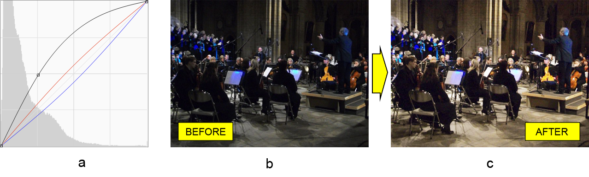

# JavaでのPhotoshopのカーブ調整レイヤーの操作

この記事の目的は、Adobe® Photoshop®ドキュメントでの**カーブ調整レイヤーの操作**時にAspose.PSD for Javaライブラリの機能を示すことです。このライブラリは完全に自律しており、Photoshop写真編集ソフトウェアをインストールしなくても動作します。[機能の完全なリスト](https://docs.aspose.com/psd/java/features/)は弊社のナレッジベースで見つけることができます。では、さて、カーブに戻りましょう。

## API概要

カーブツールは、ハイライトが右上隅に、影が右下隅にあるグラフ上の対角線（カーブ）として表現できます。

ライブラリは、カーブとの作業を提供するAPIを提供します。具体的には、[CurvesLayer](https://reference.aspose.com/psd/java/com.aspose.psd.fileformats.psd.layers.adjustmentlayers/CurvesLayer)クラスです。ただし、このクラスは**カーブとの作業には完全に異なる2つのアプローチ**を持っています。したがって、その時点で2つのモードのいずれかで編集することができます。

- 連続（カーブは曲げられる場所にポイントがあるパスとして表現されます）
- 離散（カーブは点線として表現されます）

そのため、このライブラリには、それぞれ[連続](https://reference.aspose.com/psd/java/com.aspose.psd.fileformats.psd.layers.layerresources/curvescontinuousmanager)と[離散](https://reference.aspose.com/psd/java/com.aspose.psd.fileformats.psd.layers.layerresources/CurvesDiscreteManager)マネージャーを使用して、カーブを修正する方法が2つあります。次に、それぞれの具体例でどのように使用するかを説明します。

## カーブ連続マネージャーを使用して色調調整する

[Curves Continuous Manager](https://reference.aspose.com/psd/java/com.aspose.psd.fileformats.psd.layers.layerresources/CurvesContinuousManager)は、連続カーブの曲げポイントを構成することができます。このコンポジットチャンネル（RGB）または各色チャンネルに対してです。デモンストレーション目的で、オーケストラの暗い画像に一部のカーブ調整（a）を適用して、暖かい色がさらに光り輝く画像（c）を取得します：

2つのマネージャーがあるため、使用するマネージャーを明示的に選択する必要があります（この場合は連続マネージャー）。その後、目的のカラーチャンネル（コンポジットRGB、赤、青）の特定の座標に曲線ポイントを直接追加して曲線の形を再現します：


    CurvesLayer curvesLayer = psdImage.addCurvesAdjustmentLayer();

    curvesLayer.setContinuousManagerUsed(true);
    CurvesContinuousManager curvesContinuousManager = (CurvesContinuousManager)curvesLayer.getCurvesManager();

    curvesContinuousManager.addCurvePoint(0, (byte)65, (byte)125);
    curvesContinuousManager.addCurvePoint(1, (byte)120, (byte)135);
    curvesContinuousManager.addCurvePoint(3, (byte)135, (byte)120);


座標の原点は左下隅にあります。ポイントの最大座標値はデータ型（バイト）で制限され、255（符号付きタイプで127）と等しいです。

他にもいくつかの[他の方法](https://reference.aspose.com/psd/java/com.aspose.psd.fileformats.psd.layers.layerresources/CurvesContinuousManager)があります。

## カーブ離散マネージャーを使用して音調を調整する

カーブ離散マネージャーは、カーブのポイント（実際に色と音調を変更する）を配置することもできますが、違いは異なります。第一に、**カーブはポイントまたは点（実線ではなく）で構成されます**。第二に、このマネージャーは**グラフ上のどこかにポイントを配置するのではなく**、**ポイントを上下に動かします**。範囲の値はそれぞれ255から0までです。点の値は、通常、45度の角度にあるカーブを形作るために段階的に増加しています。

このように考えると、「ネガティブ（RBG）」Photoshopのプリセット（a）を再現し、谷のグレースケール画像（b）に適用して最終的に谷のネガティブ表現（c）を得ることが簡単です。

 ますは、使用する対応するマネージャーを選択して使用できるようにし、255から0までの各カーブポイントのポイント値を降順に設定します：


    CurvesLayer curvesLayer = psdImage.addCurvesAdjustmentLayer();

    curvesLayer.setDiscreteManagerUsed(true);
    CurvesDiscreteManager curvesDiscreteManager = (CurvesDiscreteManager)curvesLayer.getCurvesManager();

    for (int i = 0; i < 255; i++)
    {
        curvesDiscreteManager.setValueInPosition(0, (byte)i, (byte)-i);
    }


このマネージャーは、カーブを操作するためのいくつかの[他の方法](https://reference.aspose.com/psd/java/com.aspose.psd.fileformats.psd.layers.layerresources/curvesdiscretemanager)も提供しています。

## 結論

この記事では、Aspose.PSD for Javaを使用してPhotoshopドキュメントでのカーブ調整レイヤーの操作方法（連続および離散マネージャー）を学びました。
