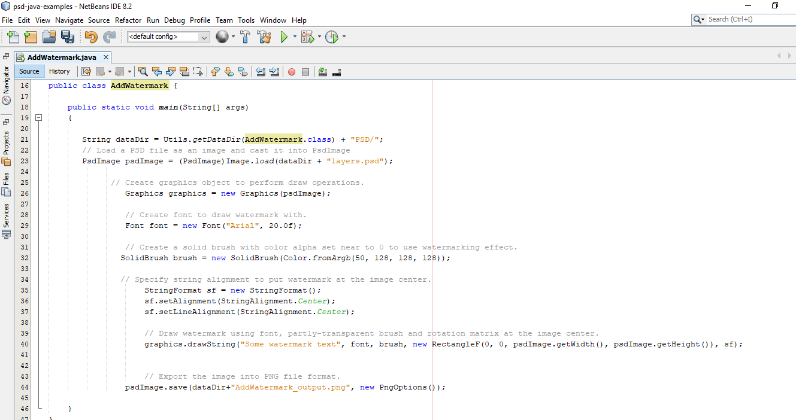

## **GitHub からダウンロード**
Aspose.PSD for Java のすべての例は [Github](https://github.com/aspose-psd/Aspose.PSD-for-Java) にホストされています。Github クライアントを使用してリポジトリをクローンするか、[こちら](https://github.com/aspose-psd/Aspose.PSD-for-Java/archive/master.zip) から ZIP ファイルをダウンロードすることができます。

ZIP ファイルの内容をコンピューターに展開します。**Examples** フォルダーが見つかります。全ての例は **Examples** フォルダーにあります。

これらの例はお好みの IDE で実行することができます。ただし、デモの目的で、**NetBeans** を使用しています。お好みの例をインポートするには、 **File -> Open** **Project** オプションを使用してパスを指定します。

プロジェクトに必要な jar ファイル（ライブラリ）を追加します。

**Resources** フォルダーには、例で参照される入力ドキュメント/ファイルが含まれています。

{} 

GitHub リポジトリから直接例をインポートすることもできます。

{} 

## **貢献**
例を追加または改善したい場合は、プロジェクトに貢献することをお勧めします。このリポジトリのすべての例とショーケースプロジェクトはオープンソースであり、自身のアプリケーションで自由に使用することができます。

貢献するには、リポジトリをフォークし、ソースコードを編集してプルリクエストを作成してください。変更内容を検討し、役立つと判断された場合はリポジトリに含めます。
