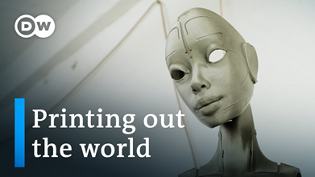

## **はじめに**
このドキュメントの目的は、実世界の例を使用して[Aspose.PSD for Java](https://products.aspose.com/psd/java)のいくつかの複合ツールのAPI使用をデモンストレーションすることです。この記事では、[DW Documentary](https://www.youtube.com/channel/UCW39zufHfsuGgpLviKh297Q)チャンネルのために**YouTubeサムネイルを生成するシンプルなJavaプログラム**を作成し、説明します。このチャンネルは、そのサムネイルがかなり標準的であり、Aspose.PSD for Javaのいくつかの人気のある複合ツールの使用例を示しています（例：[ドロップシャドウ効果](/psd/ja/java/manipulating-photoshop-formats/#manipulatingphotoshopformats-supportdropshadoweffect)、放射グラデーションの塗りつぶし、テキストや図形の描画）：


## **手順の概要**
シンプルなJavaプログラムは、キャプションと画像を入力として受け取ります。Aspose.PSD for Javaを使用して、その入力から**メモリ内のPhotoshopドキュメント（PSD）が生成**されます。その後、プログラムは**PSDドキュメントをPNGファイル形式に変換**して、サイズが1280x720ピクセルのYouTubeサムネイルを取得します。出力画像は以下のように見えます：



## **技術要件**
この記事のコードを実行するためには、以下の技術が必要です：

- Java 6以上
- [Aspose.PSD for Java](/psd/ja/java/installation/)（最新版）

## **はじめに**
既に述べたように、プログラムはメモリ内のPSDを使用してサムネイルを生成します。それではまず、**PSDドキュメントを作成**しましょう：

```java
PsdImage psdImage = new PsdImage(1280, 720);
```

上記のYouTubeサムネイルをよく見ると、**いくつかのコンポーネントで構成**されていることがわかります：

1. 背景画像（印刷されたマスク）
1. 放射状のpsdグラデーション（右上隅の領域を強調）
1. シャドウ効果のロゴタイプ
1. キャプションとシンプルな描画（青い四角形）

次のセクションでは、Aspose.PSD for Javaを使用してこれらのコンポーネントを実装する方法を詳しく見てみましょう。

## **1. 背景画像を追加**
レイヤーの順序が重要です。そのため、他のレイヤーと重ならないように、最初に背景画像を追加する必要があります。ただし、この時点ではラスターファイルフォーマットのみがサポートされています。

### **1.1. Photoshopレイヤーに背景画像を追加**
**PSDにラスター画像を追加**するには、レイヤーの構築中に入力ストリームを引数として渡す必要があります（ラスター画像のローディングの詳細については、[こちらの例](https://docs.aspose.com/display/psdnet/Creating%2C+Opening+and+Saving+Images)を参照）：

```java

```

### **1.2. 背景画像をキャンバスに合わせる**
次の2つのアクション（サイズ変更、配置）は、**画像のサイズがキャンバスのサイズと異なる場合**に便利ですが、この記事の画像はキャンバスのサイズと同じです（常にそうであるとは限りません）。

読み込まれた画像が**キャンバスサイズに適合**するようにしてください（サイズ変更の詳細については、[こちらの例](https://docs.aspose.com/display/psdnet/Crop%2C+Rotate+and+Resize+Images#Crop,RotateandResizeImages-ResizingImages)を参照）：

```java

```

サイズ変更後、画像の位置が変わります。したがって、画像の位置を**キャンバスの左上隅に戻す**には、リサイズされた画像を移動させてください：

```java

```

## **2. 放射状のグラデーションを追加**
放射状のグラデーションを追加するには、次の2つの方法があります。すでにあるレイヤーに**グラデーションオーバーレイ効果**を使用する（現在のレイヤーにバインドされ、そのコンテンツに適用されるグラデーション効果）；新しい**グラデーション塗りつぶしレイヤー**（グラデーションの独立構成を保持する別々のレイヤー）を使用することです。この例では、グラデーションオーバーレイ効果を使用するだけで十分です。しかし、この記事をもっと興味深く有用にするために、**グラデーション塗りつぶしレイヤーを使用**します。

### **2.1. 放射状のグラデーション塗りつぶしレイヤーを追加**
新しいグラデーション塗りつぶしレイヤーを追加するプロセスは、以下の2つのステップから構成されます：

1. **グラデーション塗りつぶしの設定を宣言**する必要があります。事前に定義された設定はないため、最小限必要な構成は次のようになります（グラデーションタイプ、スケール、色、透明ポイントが必要なプロパティとなります）：

```java

```

上記の設定は、端の透明な放射状グラデーションで、中心が濃い青色である放射状グラデーションを宣言しています。グラデーション位置はデフォルトでキャンバスの中央にあります。

グラデーション塗りを反転し、若干右上隅にシフトするには、対応するオプションプロパティを使用してください：

```java

```

2. 構成が完了したら、グラデーション塗りつぶしレイヤーとその設定をPSDに追加してください：

```java

```

## **ロゴタイプに影を付ける**
**ドロップシャドウ**は、オブジェクト（画像、テキストなど）の輪郭にカスタム影を追加する効果です。

### **3.1. ロゴタイプをPhotoshopレイヤーに追加**
セクション1.1.と同じアプローチを使用して、**ロゴタイプをPSDに追加**することができます：

```java

```

### **3.2. ロゴタイプの位置調整**
読み込まれた画像はデフォルトで左上隅に密着しています。しかし、チャンネルの元のYouTubeサムネイルのように見えるようにするには、端から離れたいくつかの**マージンを追加**する必要があります。そのため、画像の位置をレイヤーの端から離れた位置に移動させる必要があります：

```java

```

### **3.3. ロゴタイプにドロップシャドウ効果を追加**
ロゴタイプは、明るい背景画像が使用されていると見えなくなる場合があります。そのため、ロゴタイプに**ドロップシャドウ効果を追加**することが望ましいです。これは、ブレンディングオプションプロパティを介してロゴタイプに影を付けることを意味します（影の追加の詳細は、[こちらの例](/psd/ja/java/manipulating-photoshop-formats/#manipulatingphotoshopformats-supportdropshadoweffect)を参照）：

```java

```

デフォルトの設定により、ドロップシャドウ効果には必要なプロパティがありません（それはPhotoshopのように見えます）。しかし、上記の影は、周辺がぼかされた半透明の境界のように見えるように変更されています。

## **4. テキストと図形の描画を追加**
### **3.1. グラフィックレイヤーを作成**
通常のレイヤーでは直接描画をサポートしていないため、レイヤーの端に加えて、レイヤーの隣で**描画用のAPIを提供**するためにグラフィックエンジンが使用されます（描画の例は、[こちらの例](/psd/ja/java/drawing-images-using-graphics/)を参照）：

```java
Layer graphicLayer = psdImage.addRegularLayer();
Graphics graphics = **new** Graphics(graphicLayer);
```

### **3.2. 複数行のテキストを描画**
賢明な読者は尋ねるかもしれません：何故、テキストを追加するためにテキストレイヤーを使用しないのか？それにはいくつかの理由があります：この場合、テキストの編集は必要ではないため、PSDは常にゼロから生成されるたびに生成されます。フォントのカスタマイズはまだ[テキストAPI](https://docs.aspose.com/display/psdnet/Working+With+Text+Layers)でサポートされていません（執筆時点のv20.6では）。カスタマイズしたフォントで**テキストを描画**するには、好みのフォントをインスタンス化してから、グラフィックエンジンの対応メソッドを呼び出すだけです。ただし、次のセクションで詳細を確認する四角形を作成し、テキストの行数に応じて高さが自動的に変更される方法が少し難しいと言えます。すべての行の正確な高さを最初に計算する必要があります：

```java

```

ここで1.15は行の高さ、3はテキストの余白です。

### **3.3. 図形を描画**
四角形も簡単に描画できます（グラデーションブラシを使用して描画エリアを設定し、色域を設定するだけです）。テキストの高さが分かっている場合は、四角形のサイズと位置を計算します。**塗りつぶしのある四角形をPSDに描画**するには、すべてのメソッドを使用して、次のようにします：

```java

```

このうち、40, 15, 25はインデントです。

## **結果**
サムネイルの形状付けが完了しました。したがって、以降の配布のためにサムネイルをラスターファイル形式（たとえば、PNG）に**エクスポート**する時がきました：

```java

```

## **結論**
この記事では、DW Documentaryチャンネル用のYouTubeサムネイルジェネレーターを作成し、ドロップシャドウ効果、放射