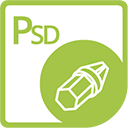

---
title: Aspose.PSD for .NET
type: docs
weight: 10
url: /ja/net/
is_root: true
keywords: Photoshop C# ライブラリ、PSD C# API
description: Photoshop C# APIまたはライブラリを使用すると、PSDファイル形式を広範囲に操作できます。Adobe Photoshopのインストールは必要ありません。PSDおよびPSBファイル形式を読み込み、操作してTIFF、JPEG、JPEG2000、PNG、GIF、BMPなどのさまざまなラスターファイル形式に変換することができます。
--- 

{} 

****

**Aspose.PSD for .NETへようこそ**

Aspose.PSD for .NETは、PSDファイル形式を広範囲に操作できる製品です。この製品にはAdobe Photoshopのインストールは必要ありません。Aspose.PSD for .NETを使用すると、PSDファイルを編集したり、レイヤーのプロパティを更新したり、透かしを追加したり、グラフィック操作を行ったり、ファイル形式を別の形式に変換したりすることができます。この製品には、開発者が役立つさまざまな自動化シナリオが用意されています。

現在のAspose.PSD for .NETは、PSDおよびPSBファイル形式を読み込みおよび操作することができます。将来のバージョンでは、さらに多くのPSDファイル形式を読み込むことができるようになります。Aspose.PSD for .NETでは、TIFF、JPEG、JPEG2000、PNG、GIF、BMPなどのさまざまなラスターファイル形式にエクスポートすることができます。エクポート対象の追加ファイル形式も追加されます。この製品は、PSDファイルの編集を効率的に行い、良好なパフォーマンスを維持するためのアルゴリズムを使用しています。この製品は積極的に開発されており、市場の需要をサポートするために多くの便利な機能が追加されます。たとえば、.NET Coreのサポートが積極的に開発されています。

{} 

{} 

****

**[Aspose.PSD Adapters](/psd/ja/net/adapters) for .NETをご確認ください。必要に応じて追加のフォーマットを処理する場合**

Aspose.PSD Adapters for .NETは、他のAspose製品との統合コードを簡略化する特別なNugetパッケージです。

たとえば、通常、Aspose.PSDでサポートされていないSVGやWEBPなどのフォーマットを開くには、これらのフォーマットをAspose.Imagingを使用して読み込んだ後、Aspose.PSDでサポートされている形式に変換するための統合コードを書く必要があります。アダプタは余分なコードの必要性を解消し、時間を節約できます。

{} 

## **Aspose.PSD for .NET リソース**

以下は、タスクを達成するために役立ついくつかのリソースへのリンクです。

- [Aspose.PSD for .NET オンラインドキュメント](/psd/ja/net/)
- [Aspose.PSD for .NET 機能](/psd/ja/net/features/)
- [Aspose.PSD for .NET リリースノート](/psd/ja/net/release-notes/)
- [Aspose.PSD for .NET 製品ページ](https://products.aspose.com/psd/net)
- [Aspose.PSD for .NET NuGetパッケージのインストール](https://www.nuget.org/packages/Aspose.PSD/)
- [Aspose.PSD for .NET APIリファレンスガイド](https://reference.aspose.com/net/psd)
- [GitHubリポジトリでの例のダウンロード](https://github.com/aspose-psd/Aspose.PSD-for-.NET)
- [Aspose.PSD for .NET 無償サポートフォーラム](https://forum.aspose.com/c/psd)
- [Aspose.PSD for .NET 有償サポートヘルプデスク](https://helpdesk.aspose.com/)

