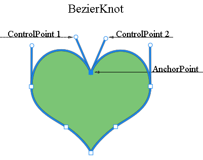

## **レイヤーベクトルマスク概要**
ベクトルマスクは、レイヤーの内容をクリップする解像度に依存しないパスです。ベクトルマスクは通常、ピクセルベースのツールで作成されたものよりも正確です。ペンやシェイプツールを使用してベクトルマスクを作成します。

Aspose.PSDは、ベクトルマスクのレンダリングと適用をサポートしています。ベクトルパスを編集することで、ベクトルマスクを編集できます。

## **Aspose.PSDにおけるベクトルパス**
Aspose.PSDにおけるベクトルパスへのアクセスは、[VsmsResouce](https://reference.aspose.com/psd/net/aspose.psd.fileformats.psd.layers.layerresources/vsmsresource)と[VmskResouce](https://reference.aspose.com/psd/net/aspose.psd.fileformats.psd.layers.layerresources/vmskresource)リソースを介して提供され、これらは[VectorPathDataResource](https://reference.aspose.com/psd/net/aspose.psd.fileformats.psd.layers.layerresources/vectorpathdataresource)の子クラスです。

## **ベクトルパスの編集方法**
### **ベクトルパス構造**
パスを操作する基本的な構造体は[VectorPathRecord.](https://reference.aspose.com/psd/net/aspose.psd.fileformats.core.vectorpaths/vectorpathrecord)ですが、利便性のために、以下のソリューションが提案されています。

ベクトルパスの簡単な編集には、[VectorPath](https://gist.github.com/aspose-com-gists/8a4c9d34ce856d1642fc7c0ce974175c#file-examples-csharp-aspose-workingwithvectorpaths-classestomanipulatevectorpathobjects-classestomanipulatevectorpathobjects-cs)クラスを使用すると便利で、これにはVectorPathDataResourceから派生したリソース内のベクトルデータを快適に編集するためのメソッドが含まれています。

VectorPath型のオブジェクトの作成を開始します。

便宜のために、入力レイヤー内のベクターリソースを見つけ、それに基づいてVectorPathオブジェクトを作成する静的メソッド[VectorDataProvider.CreateVectorPathForLayer](https://gist.github.com/aspose-com-gists/8a4c9d34ce856d1642fc7c0ce974175c#file-examples-csharp-aspose-workingwithvectorpaths-classestomanipulatevectorpathobjects-classestomanipulatevectorpathobjects-cs)を使用することができます。

すべての編集が完了したら、静的メソッド[VectorDataProvider.UpdateLayerFromVectorPath](https://gist.github.com/aspose-com-gists/8a4c9d34ce856d1642fc7c0ce974175c#file-examples-csharp-aspose-workingwithvectorpaths-classestomanipulatevectorpathobjects-classestomanipulatevectorpathobjects-cs)を使用して、変更を加えたVectorPathオブジェクトをレイヤーに戻すことができます。



VectorPath型には、1つ以上のシェイプで構成される全体のベクターイメージを記述する[PathShape](https://gist.github.com/aspose-com-gists/8a4c9d34ce856d1642fc7c0ce974175c#file-examples-csharp-aspose-workingwithvectorpaths-classestomanipulatevectorpathobjects-classestomanipulatevectorpathobjects-cs)要素のリストが含まれています。

各PathShapeは、別々のベジエノット（ポイント）のセットで構成されるベクター図形です。

ノットは、図形を構築するポイントである[BezierKnot](https://gist.github.com/aspose-com-gists/8a4c9d34ce856d1642fc7c0ce974175c#file-examples-csharp-aspose-workingwithvectorpaths-classestomanipulatevectorpathobjects-classestomanipulatevectorpathobjects-cs)型のオブジェクトです。

以下のコード例は、図形とポイントへのアクセス方法を示しています。


### **形状を作成する方法**
形状を編集するには、既存の形状を[VectorPath.Shapes](https://gist.github.com/aspose-com-gists/8a4c9d34ce856d1642fc7c0ce974175c#file-examples-csharp-aspose-workingwithvectorpaths-classestomanipulatevectorpathobjects-classestomanipulatevectorpathobjects-cs)リストから取得するか、[PathShape](https://gist.github.com/aspose-com-gists/8a4c9d34ce856d1642fc7c0ce974175c#file-examples-csharp-aspose-workingwithvectorpaths-classestomanipulatevectorpathobjects-classestomanipulatevectorpathobjects-cs)インスタンスを作成して[Shapes](https://gist.github.com/aspose-com-gists/8a4c9d34ce856d1642fc7c0ce974175c#file-examples-csharp-aspose-workingwithvectorpaths-classestomanipulatevectorpathobjects-classestomanipulatevectorpathobjects-cs)リストに追加します。


### **ノット（ポイント）を追加する方法**
形状のポイントを一般的なリストの要素として操作するには、PathShape.Pointsプロパティを使用します。たとえば、次のように形状のポイントを追加できます。



BezierKnotはアンカーポイントと2つの制御ポイントを含んでいます。

アンカーポイントと制御ポイントが同じ値を持っている場合、そのノードは鋭角になります。

フォトショップのように、アンカーポイントの位置を制御ポイントと一緒に変更するには、BezierKnotにShiftメソッドがあります。

次のコード例は、Y座標を上に移動させることでベジエノット全体を移動する方法を示しています。

形状のポイントを一般的なリストの要素として操作することができます。たとえば、形状ポイントを追加できます。



## **PathShapeプロパティ**
PathShapeの編集はノードの編集に制限されていません。この型には他のプロパティもあります。
### **パス操作（ブール演算）**
[PathOperations](https://reference.aspose.com/psd/net/aspose.psd.fileformats.core.vectorpaths/pathoperations)プロパティは、複数のシェイプが混合される方法を定義する、いわゆるブール演算です。

以下の可能な値があります:

- 0 = ExcludeOverlappingShapes（XOR演算）
- 1 = CombineShapes（OR演算）
- 2 = SubtractFrontShape（NOT演算）
- 3 = IntersectShapeAreas（AND演算）

### **IsClosedプロパティ**
また、PathShape.IsClosedプロパティを使用すると、形状の最初と最後のノットが接続されているかどうかを判断できます。

|**閉じた形状**|**開いた形状**|
| :- | :- |
|||
### **FillColorプロパティ**
どの図形も独自の色を持つことができるため、VectorPath.FillColorプロパティを使用して、ベクトルパス全体の色を変更できます。

形状のポイントを一般的なリストの要素として操作することができます。たとえば、形状ポイントを追加できます。



## **VectorDataProviderおよび関連クラスのソースコードはこちらです:**

