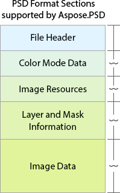

# **Aspose.PSD の機能**
Aspose.PSD は Adobe Photoshop PSD ファイル形式のすべてのセクションをサポートしています。PSD ファイル形式の[概要](/psd/ja/net/psd-format-overview/)とその機能を読むことができます。

||
Aspose.PSD は PSD フォーマットのすべてのセクションをサポートしています。

1. ファイルヘッダー内の PSD および PSB ヘッダー

2. 最も人気のあるカラーモード

3. 多くのグローバル画像リソース

4. すべてのレイヤーおよびマスク＊、それらの内部リソース、変更後の PSD ファイルのレンダリング

5. 異なる圧縮アルゴリズムを含む画像データの低レベル操作 API

 

Aspose.PSD は最も完全な PSD フォーマット操作 SDK です。

他の代わりに Aspose コンポーネントを使用するのがなぜ良いかについても読むことができます:

[なぜ Adobe Photoshop SDK ではないのか](/psd/ja/net/why-not-adobe-photoshop-sdk-html/)

 
| 
| :- | :- |
## **PSD フォーマットのドキュメンテーション**
ドキュメンテーションにはすべての PSD セクションの情報と例が含まれています。
### **ファイルヘッダー**
- [PSD および PSB ヘッダーの説明](/psd/ja/net/psd-and-psb-file-header/)
### **カラーモードデータ**
- [サポートされているカラーモード / ビット深度の組み合わせ](/psd/ja/net/supported-combination-of-color-modes-and-bit-depth-in-psd/)
- [Adobe Photoshop ファイル内で異なるカラーモード間の変換方法の例](/psd/ja/net/psd-convert-between-different-color-modes/)
- [ICC プロファイルの変換](https://docs.aspose.com/display/psdjava/Color+Space+Conversion+for+JPEG+through+ICC+Profiles)
### **画像リソース**
- [サポートされている PSD グローバル画像リソースの一覧](/psd/ja/net/list-of-the-supported-psd-global-image-resources/)
- 画像リソースの一般的な操作
### **レイヤーおよびマスク情報**
[レイヤーおよびマスク情報セクションの概要](/psd/ja/net/layers-and-mask-information-section-html/)

[ラスターレイヤーマスクの編集](/psd/ja/net/editing-raster-layer-masks-in-psd-file-via-api/)

[サポートされているレイヤーリソースの一覧](/psd/ja/net/list-of-psd-layer-resources/)

サポートされている PSD レイヤータイプ:

- ベース[PSD レイヤー](/psd/ja/net/psd-layer/)
- テキストレイヤー
- 調整レイヤー
- 塗りつぶしレイヤー
- スマートオブジェクト
### **画像データ**
このセクションには Adobe Photoshop レイヤーデータが含まれています

