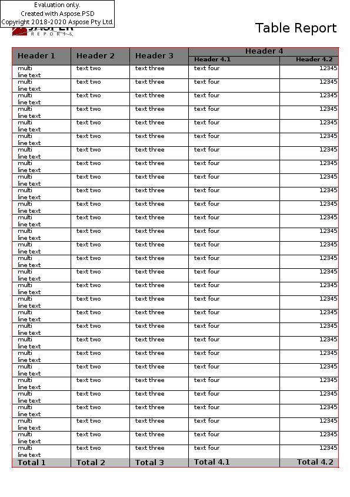

{}

You can easily download Aspose.PSD for JasperReports for evaluation from the [download page](https://downloads.aspose.com/psd/jasperreports). The evaluation download is same as the purchased download. The evaluation version simply becomes licensed after [applying a license](/psd/jasperreports/licensing/).

{}

Evaluation version of Aspose.PSD for JasperReports (without a license specified) provides product functionality to some extent not complete though. One limitation is that it always injects the evaluation watermark on output files.

**Figure:** Evaluation Warning

If you want to test Aspose.PSD for JasperReports without evaluation version limitations, you may [request a 30-day temporary license](https://purchase.aspose.com/temporary-license).
