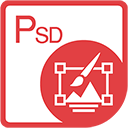

{} 

****

**Welcome to Aspose.PSD for Java**

Aspose.PSD for Java allows an extensive manipulation of PSD file formats. The product does not require Adobe Photoshop to be installed. Aspose.PSD for Java allows edit the PSD files, update layer properties, add watermarks, perform graphics operations and convert one file format into another. The product also supports different automation scenarios that help developers on their way.

Currently Aspose.PSD for Java supports PSD and PSB file formats for loading and manipulation. Future versions will allow loading of more PSD file formats. Aspose.PSD for Java allows export to various raster file formats such as TIFF, JPEG, JPEG2000, PNG, GIF and BMP. The product uses algorithms which allow perform editing of PSD files in an efficient way and maintain good performance. The product is actively being developed and many useful features will be added to meet the market demands.

{} 

## **Aspose.PSD for Java Resources**

Following are the links to some useful resources you may need to accomplish your tasks.

- [Aspose.PSD for Java Online Documentation](/psd/java/)
- [Aspose.PSD for Java Features](/psd/java/features/)
- [Aspose.PSD for Java Release Notes](/psd/java/release-notes/)
- [Aspose.PSD for Java Product Page](https://products.aspose.com/psd/java)
- [Download Aspose.PSD for Java](https://repository.aspose.com/webapp/#/artifacts/browse/tree/General/repo/com/aspose/aspose-psd)
- [Install Aspose.PSD for Java from Maven Repository](/psd/java/installation/)
- [Aspose.PSD for Java API Reference Guide](https://reference.aspose.com/java/psd)
- [Download Examples at GitHub Repository](https://github.com/aspose-psd/Aspose.PSD-for-Java)
- [Aspose.PSD for Java Free Support Forum](https://forum.aspose.com/c/psd)
- [Aspose.PSD for Java Paid Support Helpdesk](https://helpdesk.aspose.com/)
