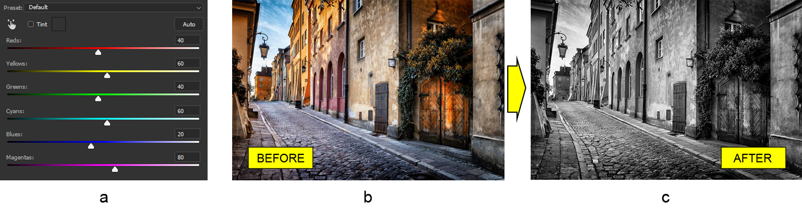

## **자바에서 포토샵 블랙 앤 화이트 조정 레이어 작업**
이 글에서는 Aspose.PSD를 사용하여 포토샵 문서에서 블랙 앤 화이트 조정 레이어를 다루는 방법을 보여줍니다. Aspose.PSD는 PSD 파일 형식을 조작하는 라이브러리입니다.

이 라이브러리에서 제공하는 블랙 앤 화이트 조정 레이어 API는 컬러 이미지를 그레이스케일 이미지로 변환합니다. 추가로 틴트를 사용하여 세피아와 같은 단색 효과를 얻을 수 있습니다. 블랙 앤 화이트 조정 레이어로 이미지를 흑백으로 만드는 데는 많은 작업이 필요하지 않습니다. 그러나 결과 이미지에 특정 색상의 영향을 유연하게 제어할 수 있습니다. 또한 파일에서 불러올 수 있는 프리셋도 지원됩니다.

## **컬러 이미지를 흑백으로 변환하기**
블랙 앤 화이트 조정 레이어는 컬러 이미지를 그레이스케일로 변환하는 가장 쉬운 방법입니다. 왜 이렇게 쉬울까요? 모든 속성이 이미 기본값을 갖고 있기 때문입니다. 따라서 컬러 이미지를 흑백으로 만들기 위해서는 단순히 블랙 앤 화이트 조정 레이어를 추가하는 것만으로 충분합니다. 예를 들어, 오래된 마을의 거리 이미지를 가져와서 흑백 효과를 추가해 봅시다 (b) 그리고 (c).

