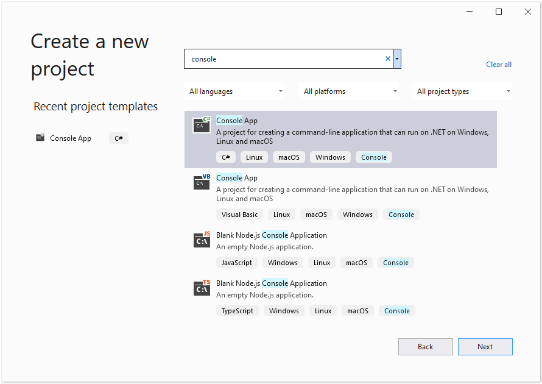

## 전제 조건

- 시스템에 Docker가 설치되어 있어야 합니다. Windows 또는 Mac에 Docker를 설치하는 방법에 대한 정보는 "참고 자료" 섹션의 링크를 참조하십시오.

- Visual Studio 2022.

- 예제에서는 NET 6 SDK를 사용합니다.

- 아래 링크에서 완전히 작동하는 샘플 프로젝트를 다운로드할 수 있습니다. https://github.com/aspose-psd/Aspose.PSD-Docker-Sample

## Hello World 애플리케이션

이 예에서는 PSD 파일을 열고, 텍스트 레이어를 업데이트하고, Graphics API를 사용하여 그리는 간단한 Hello World 콘솔 애플리케이션을 만듭니다. 설명된 애플리케이션은 도커에서 빌드 및 실행할 수 있습니다.

### 콘솔 애플리케이션 만들기

Hello World 프로그램을 만들려면 다음 단계를 따르십시오:
1. Docker를 설치하면 Linux 컨테이너(기본 설정)를 사용하는지 확인하세요. 필요한 경우 Docker Desktop 메뉴에서 Linux 컨테이너로 전환 옵션을 선택하십시오.
1. Visual Studio에서 NET 6 콘솔 애플리케이션을 만듭니다. 
 
1. NuGet에서 최신 Aspose.PSD 버전을 설치합니다. 
 
1. 애플리케이션이 Linux에서 실행될 예정이므로 추가 글꼴 설치가 필요할 수 있습니다. ttf-mscorefonts-installer를 선호할 수 있습니다.
1. Linux에서 텍스트 렌더링 기능을 사용하려면 다음 패키지를 추가해야 할 수 있습니다: apt-transport-https, libgdiplus, libc6-dev. 이러한 패키지를 추가하는 명령어는 도커파일에 찾을 수 있습니다.
1. 필요한 모든 종속성을 추가한 후, PSD 파일을 열고, 텍스트 레이어를 업데이트하고, 최종적으로 그림을 그리는 간단한 프로그램을 작성하여: 



텍스트 레이어를 편집하려면 라이센스가 필요합니다. 아래 문서를 참조하여 임시 라이센스를 받을 수 있습니다: https://purchase.aspose.com/temporary-license
 
### 도커파일 구성

다음 단계는 Dockerfile을 생성하고 구성하는 것입니다.

1. Dockerfile을 만들고 애플리케이션의 솔루션 파일 옆에 위치시킵니다. 이 파일 이름을 확장자 없이 유지하세요(기본 설정).
1. Dockerfile에 다음을 지정하세요:


# Visual Studio가 이미지를 더 빠르게 디버깅하기 위해 Dockerfile을 사용하는 방법을 이해하려면 https://aka.ms/containerfastmode를 참조하십시오.

FROM mcr.microsoft.com/dotnet/runtime:6.0 AS base
WORKDIR /app

# 텍스트 레이어 업데이트의 능력을 사용하려면 다음 패키지를 컨테이너에 추가해야 합니다
RUN apt-get update
RUN yes | apt-get install -y apt-transport-https
RUN yes | apt-get install -y libgdiplus
RUN yes | apt-get install -y libc6-dev

FROM mcr.microsoft.com/dotnet/sdk:6.0 AS build

WORKDIR /src
COPY ["AsposePsdDockerSample/AsposePsdDockerSample.csproj", "AsposePsdDockerSample/"]
RUN dotnet restore "AsposePsdDockerSample/AsposePsdDockerSample.csproj"
COPY . .
WORKDIR "/src/AsposePsdDockerSample"
RUN dotnet build "AsposePsdDockerSample.csproj" -c Release -o /app/build

FROM build AS publish
RUN dotnet publish "AsposePsdDockerSample.csproj" -c Release -o /app/publish

FROM base AS final
WORKDIR /app
COPY --from=publish /app/publish .
ENTRYPOINT ["dotnet", "AsposePsdDockerSample.dll"]


위는 간단한 Dockerfile로, 다음 지시사항이 포함되어 있습니다:

- 사용될 SDK 이미지입니다. 여기에는 Microsoft .Net 6 이미지가 있습니다. 빌드가 실행될 때 Docker가 다운로드합니다. SDK 버전은 태그로 지정합니다.
- 그런 다음 텍스트 렌더링을 추가합니다.
- 이후로 특정 글꼴을 설치해야 할 수도 있습니다. SDK 이미지에는 아주 적은 글꼴만 포함되어 있습니다. 또한 도커 이미지에 복사된 로컬 글꼴을 사용할 수 있습니다.
- 다음에는 지정된 작업 디렉터리입니다.
- 모든 것을 컨테이너로 복사하고, 애플리케이션을 게시하고, 엔트리 포인트를 지정하는 명령을 포함합니다.

### Docker에서 애플리케이션 빌드 및 실행하기

#### Visual Studio 사용

Aspose.PSD를 도커에서 시도하는 가장 간단한 방법은 Visual Studio를 열고 Docker 지원을 사용하여 앱을 시작하는 것입니다.

#### 명령 프롬프트 사용

관찰자의 취향에 따라 명령 프롬프트를 사용하여 도커에서 애플리케이션을 빌드하고 실행할 수 있습니다. 좋아하는 명령 프롬프트를 열고, 애플리케이션이 있는 폴더(솔루션 파일 및 Dockerfile이 있는 폴더)로 디렉토리를 변경하고 다음 명령을 실행하세요:


docker build -t asposepsddocker .


이 명령을 처음 실행하면 필요한 이미지를 다운로드해야 하기 때문에 시간이 오래 걸릴 수 있습니다. 이전 명령이 완료되면 다음 명령을 실행하세요:


docker run --name asposepsdcontainer asposepsddocker; docker cp asposepsddocker:/app/Output.psd .; docker cp asposepsddocker:/app/Output.png .; docker rm asposepsdcontainer


{} 

호스트 머신의 폴더가 컨테이너의 폴더로 마운트되어 응용 프로그램 실행 결과를 쉽게 볼 수 있도록하기 위해 mount 인수에 유의하십시오. 리눅스에서 경로는 대/소문자를 구분합니다.

{}

## 더 많은 예제

Aspose.PSD를 도커에서 사용하는 방법에 대한 더 많은 샘플을 보려면 [예제](https://github.com/aspose-psd/Aspose.PSD-for-.NET)를 참조하십시오.

## 관련 링크

- [Windows에 Docker Desktop 설치](https://docs.docker.com/docker-for-windows/install/)
- [Mac에 Docker Desktop 설치](https://docs.docker.com/docker-for-mac/install/)
- [Visual Studio 2022, NET 6 SDK](https://docs.microsoft.com/en-us/dotnet/core/install/windows?tabs=net60#dependencies)
- [Linux 컨테이너로 전환하기](https://docs.docker.com/docker-for-windows/#switch-between-windows-and-linux-containers) 옵션
- [.NET Core SDK에 대한 추가 정보](https://hub.docker.com/_/microsoft-dotnet-sdk)
