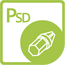

{} 

****

**Welcome to Aspose.PSD Adapters for .NET**

Aspose.PSD Adapters for .NET are the special Nuget Packages that allows you to write integration code with other Aspose Products less.

For example, usually, to open  not supported by Aspose.PSD for format like SVG of WEBP you need to load these formats using Aspose.Imaging and then write integration code to convert them to Aspose.PSD suppported format. Adapters fix necessity of extra code and help you save time.

Here is quick example of how to use adapters:



Please note, for using adapters without limitation you need both Aspose.PSD and Aspose.Imaging licenses. Adapter Nuget Package most valuable for the owner of Aspose.Total License.

For the additional description and examples please check:
- [Aspose.PSD Adapters how quick start guide](/psd/net/adapters/quick-start)
- [Aspose.PSD Adapters how setup license for products](/psd/net/adapters/license)
- [Aspose.PSD how to load unsupported formats](/psd/net/adapters/load-unsupported-formats)
- [Aspose.PSD Exporting to unsupported formats](/psd/net/adapters/export-to-unsupported-formats)
- [Aspose.PSD Adapters for Webp, SVG and other formats overview](/psd/net/adapters/working-with-webp-svg-formats-overview)
- [Aspose.PSD Loading Adapters Full Manual](/psd/net/adapters/full-manual)

{} 

## **Aspose.PSD for .NET Adapters Resources**

Following are the links to some useful resources you may need to accomplish your tasks.

- [Aspose.PSD for .NET Online Documentation](/psd/net/adapters)
- [Aspose.PSD for .NET Release Notes](/psd/net/adapters/release-notes/)
- [Aspose.PSD for .NET Product Page](https://products.aspose.com/psd/net)
- [Install Aspose.PSD for .NET NuGet Package](https://www.nuget.org/packages/Aspose.PSD.Adapters.Imaging/)
- [Download Examples at GitHub Repository](https://github.com/aspose-psd/Aspose.PSD-for-.NET)
- [Aspose.PSD for .NET Free Support Forum](https://forum.aspose.com/c/psd)
- [Aspose.PSD for .NET Paid Support Helpdesk](https://helpdesk.aspose.com/)
