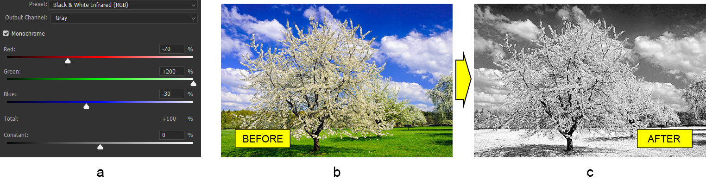

# Werken met Photoshop Kanaalmixer aanpassingslaag in Java

Vandaag gaan we kijken hoe we kanaalkleuren in Photoshop-documenten kunnen mengen via programmeerbaar in Java. Aangezien de Photoshop-editor geen Java-scripting ondersteunt, zullen we een speciale PSD-bestandsindelingsbibliotheek genaamd Aspose.PSD voor Java gebruiken.

De bibliotheek bevat **API om met kleurkanalen te werken**. Er zijn verschillende manieren om kleuren te mengen, maar in dit artikel zullen we ons concentreren op de Kanaalmixer aanpassingslaag.

De Kanaalmixer aanpassingslaag-API **maakt het mogelijk om te spelen met kleurkanalen** om getinte afbeeldingen te maken of verschillende creatieve kleureffecten te creëren of zelfs de afbeelding om te zetten in een zwart-witte afbeelding. Vervolgens bekijken we hoe we de Kanaalmixer aanpassingslaag kunnen toepassen op een bestaand Photoshop-document met behulp van Aspose.PSD voor Java, maar eerst moeten we het hebben over de algemene API-functies.

## API-overzicht

Er is niets bijzonders aan het maken van een Kanaalmixer aanpassingslaag. Het kan worden toegevoegd via [de standaard fabrieksmethode](https://reference.aspose.com/psd/java/com.aspose.psd.fileformats.psd/PsdImage#addChannelMixerAdjustmentLayer--) die een instantie van de ChannelMixerLayer-klasse retourneert. Deze klasse bevat algemene functionaliteiten zoals de Monochrome optie en een methode om een uitvoer-kanaal te verkrijgen. Een specifiek uitvoerkanaal kan een van twee typen zijn: [CmykMixerChannel](https://reference.aspose.com/psd/java/com.aspose.psd.fileformats.psd.layers.adjustmentlayers/CmykMixerChannel) of [RgbMixerChannel](https://reference.aspose.com/psd/java/com.aspose.psd.fileformats.psd.layers.adjustmentlayers/RgbMixerChannel). Het type van [MixerChannel](https://reference.aspose.com/psd/java/com.aspose.psd.fileformats.psd.layers.adjustmentlayers/mixerchannel) is afhankelijk van [de kleurmodus](https://reference.aspose.com/psd/java/com.aspose.psd.fileformats.psd/PsdImage#getColorMode--) van de afbeelding.

## Maak de afbeelding zwart-wit

Laten we nu een voorbeeld bekijken van het toepassen van een Kanaalmixer aanpassingslaag op een bestaand Photoshop-document. Aangezien dit soort aanpassingslaag nog geen presets ondersteunt, zullen we **het Black &amp; White Infrarood (RGB) Photoshop-presets opnieuw maken** (a). Het preset zal worden toegepast op de afbeelding van een bloeiende boom (b). Als resultaat willen we het effect van infraroodfotografie bereiken (c).

 Eerst is het nodig om het Monochrome-vlag in te schakelen en de juiste ruwe waarden in te stellen voor elke kleur (rood, groen en blauw) voor het Grijze uitvoerkanaal om het Black &amp; White Infrarood (RGB) Photoshop-presets opnieuw te maken:

    ChannelMixerLayer channelMixerLayer = psdImage.addChannelMixerAdjustmentLayer();
    channelMixerLayer.setMonochrome( **true** );
    RgbMixerChannel grayOutputChannel = (RgbMixerChannel)channelMixerLayer.getChannelByIndex(0);
    grayOutputChannel.setRed(( **short** )-70);
    grayOutputChannel.setGreen(( **short** )200);
    grayOutputChannel.setBlue(( **short** )-30);

De afbeelding moet in RGB-kleurmodus zijn om de code te laten werken (vanwege de cast naar de RgbMixerChannel-klasse). CMYK-kleurmodus wordt ook ondersteund, maar alleen voor afbeeldingen met de overeenkomstige kleurmodus.

Houd er rekening mee dat de waarde van elke kleur en ook de Constant-eigenschap zich in het bereik van -200 tot 200 moeten bevinden.

## Conclusie

In dit artikel hebben we besproken hoe we kunnen werken met de Kanaalmixer-API van Aspose.PSD voor Java om kleuren aan te passen in kleurkanalen en de afbeelding om te zetten in zwart-wit.
