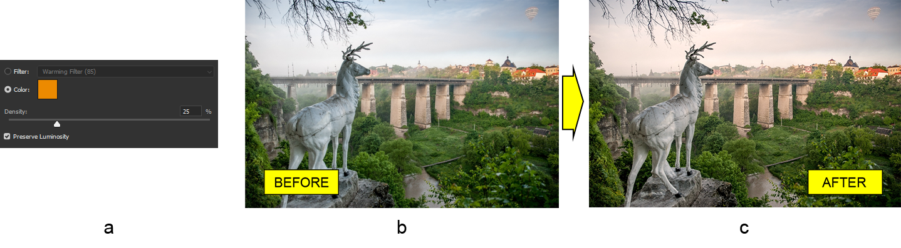

# Werken met de Photoshop Foto Filter aanpassingslaag in Java

Vandaag zullen we zien hoe je de Foto Filter aanpassingslaag kunt toepassen op een bestaand Photoshop document met behulp van Aspose.PSD voor Java, dat de bibliotheek is om het PSD-bestandsformaat te manipuleren.

**De Foto Filter aanpassingslaag API** verandert het kleurbalans van de afbeelding door tinting te gebruiken. De resulterende afbeelding ziet er hetzelfde uit als na het gebruik van een echte cameravilter. Merk op dat de Foto Filter aanpassingslaag API van de bibliotheek enigszins verschilt van die van Photoshop omdat er nog geen vooraf gedefinieerde filters zijn. Desalniettemin is het op alle andere gebieden hetzelfde. Dit betekent dat je een kleur van de tint kunt instellen en zijn intensiteit (dichtheid) kunt veranderen, en ook de optie Luminositeit Behouden kunt gebruiken.

## API-overzicht

De Foto Filter aanpassingslaag API is vrij eenvoudig te gebruiken. Er is de kern [PhotoFilterLayer](https://reference.aspose.com/psd/java/com.aspose.psd.fileformats.psd.layers.adjustmentlayers/photofilterlayer) klasse die dient als toegangspunt tot deze aanpassingslaag en bevat slechts drie openbare eigenschappen, namelijk, kleur, dichtheid en behoud luminositeit waarmee de aanpassing plaatsvindt.

## Pas kleurbalans aan

Aangezien er niet veel te bespreken is, laten we meteen **een voorbeeld van de aanpassing van de kleurbalans** met behulp van Foto Filter overwegen. We gaan direct een verwarmingsfilter (a) handmatig toevoegen aan de afbeelding van een hertsculptuur (b) om de afbeelding in warme tinten (c) te krijgen die prettiger is om naar te kijken.

Ten eerste, merk op dat [de fabrieksmethode](https://reference.aspose.com/psd/java/com.aspose.psd.fileformats.psd/PsdImage#addPhotoFilterLayer-com.aspose.psd.Color-) verschilt van die voor [andere aanpassingslagen](https://docs.aspose.com/display/psdjava/PSD+Adjustment+Layers) omdat er geen standaard methode (zonder argumenten) is. Daarom is een enkel argument vereist om een Foto Filter aanpassingslaag toe te voegen aan het geladen Photoshop document, dat [kleur](https://reference.aspose.com/psd/java/com.aspose.psd/Color) is. Dus, om het verwarmingseffect van het filter opnieuw te creëren, geef oranje door als argument aan de fabrieksmethode, stel dan de dichtheid in met bijbehorende setters:

    PhotoFilterLayer photoFilterLayer = psdImage.addPhotoFilterLayer(Color._fromArgb_(236, 138, 0));
    photoFilterLayer.setDensity(25);

Het is de moeite waard om toe te voegen dat de Dichtheid eigenschap de standaardwaarde heeft van 100, evenals dat waar is de standaardwaarde is voor de Behoud Luminositeit eigenschap (dit is de reden waarom we deze optie niet expliciet inschakelen).

## Conclusie

In dit artikel hebben we het gebruik van de Foto Filter aanpassingslaag API van Aspose.PSD voor Java besproken. Deze tool is eenvoudig te gebruiken en maakt het mogelijk om een tint aan een afbeelding toe te voegen met variabele dichtheid. Het is een snelle manier om de kleurbalans van de gehele afbeelding aan te passen.
