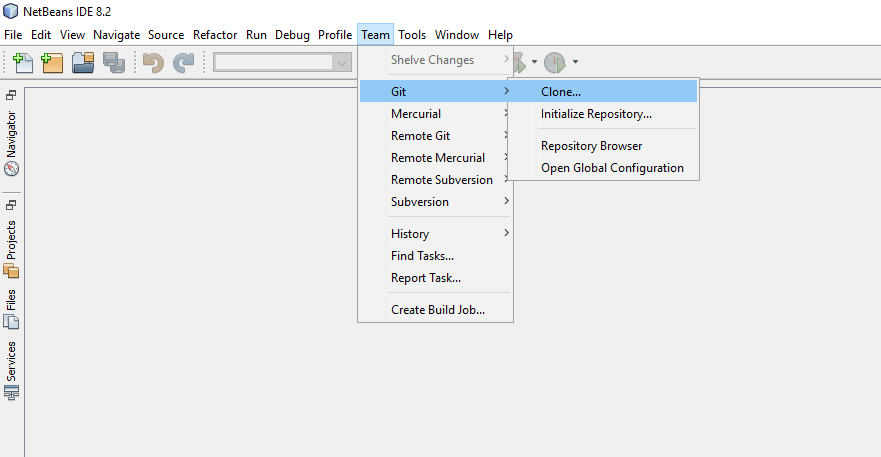

## **Downloaden vanaf GitHub**
Alle voorbeelden van Aspose.PSD voor Java staan ​​op [Github](https://github.com/aspose-psd/Aspose.PSD-for-Java). U kunt het repository klonen met de Github-client of het ZIP-bestand downloaden van [hier](https://github.com/aspose-psd/Aspose.PSD-for-Java/archive/master.zip).

Pak de inhoud van het ZIP-bestand uit op uw computer. U zult de map **Voorbeelden** vinden. Alle voorbeelden bevinden zich in de map **Voorbeelden**.

U kunt deze voorbeelden uitvoeren met een willekeurige IDE naar keuze, echter, ter demonstratie gebruiken we **NetBeans**. Gebruik de optie **Bestand -> Openen -> Project** om het voorbeeld van uw keuze te importeren en geef het pad aan.

Voeg de vereiste jar-bestanden (Libraries) toe aan het project.

De map **Resources** bevat invoerdocumenten/bestanden die in het voorbeeld worden gebruikt.

{} 

U kunt ook de voorbeelden rechtstreeks vanuit het GitHub-repository importeren.

{} 

## **Bijdragen**
Als u een voorbeeld wilt toevoegen of verbeteren, moedigen we u aan om bij te dragen aan het project. Alle voorbeelden en showcase-projecten in dit repository zijn open source en kunnen vrijelijk worden gebruikt in uw eigen toepassingen.

Om bij te dragen, kunt u het repository fork, de broncode bewerken en een pull-aanvraag maken. We zullen de wijzigingen beoordelen en deze in het repository opnemen als ze nuttig worden bevonden.
