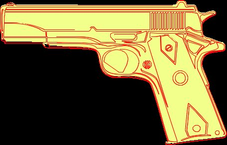

Aspose.PSD is een PSD Format SDK, waarmee ook AI-bestanden naar Jpg kunnen worden omgezet. U kunt Adobe Illustrator-bestand naar Jpg-bestand converteren. Voor Ai-export moet u de volgende codefragment gebruiken:

Het onderstaande voorbeeldcode toont hoe u het AI-bestand naar Jpg kunt exporteren met de [Bestandsformaat Manipulatie API](/psd/nl/net/manipulate-different-image-file-formats/)



U kunt de kwaliteit van het Jpeg-bestandsformaat specificeren, Jpeg Allowed Lossy Error.

Hier is een voorbeeld van exporteren naar Jpeg:

|**Ai exporteren met verschillende paden gewicht**|**Ai converteren met complex contourvoorbeeld**|
| :- | :- |
||

 
|
