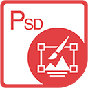

{} 

****

**Witaj w Aspose.PSD dla Javy**

Aspose.PSD dla Javy pozwala na rozległą manipulację formatami plików PSD. Produkt nie wymaga instalacji programu Adobe Photoshop. Aspose.PSD dla Javy umożliwia edycję plików PSD, aktualizację właściwości warstw, dodawanie znaków wodnych, wykonywanie operacji graficznych oraz konwertowanie jednego formatu pliku na inny. Produkt obsługuje różne scenariusze automatyzacji, które pomagają programistom w ich pracy.

Obecnie Aspose.PSD dla Javy obsługuje formaty plików PSD i PSB do ładowania oraz manipulacji. W przyszłych wersjach będzie możliwe ładowanie większej liczby formatów plików PSD. Aspose.PSD dla Javy pozwala na eksport do różnych formatów plików rastrowych, takich jak TIFF, JPEG, JPEG2000, PNG, GIF i BMP. Produkt korzysta z algorytmów, które umożliwiają efektywne edytowanie plików PSD i zachowanie dobrej wydajności. Produkt jest aktywnie rozwijany i wiele przydatnych funkcji zostanie dodanych, aby sprostać wymaganiom rynku.

{} 

## **Zasoby Aspose.PSD dla Javy**

Poniżej znajdują się linki do kilku przydatnych zasobów, które mogą być potrzebne do realizacji zadań.

- [Dokumentacja Online Aspose.PSD dla Javy](/psd/pl/java/)
- [Funkcje Aspose.PSD dla Javy](/psd/pl/java/features/)
- [Notatki Wydania Aspose.PSD dla Javy](/psd/pl/java/release-notes/)
- [Strona Produktu Aspose.PSD dla Javy](https://products.aspose.com/psd/java)
- [Pobierz Aspose.PSD dla Javy](https://repository.aspose.com/webapp/#/artifacts/browse/tree/General/repo/com/aspose/aspose-psd)
- [Instalacja Aspose.PSD dla Javy z Repozytorium Maven](/psd/pl/java/installation/)
- [Przewodnik po Interfejsie API Aspose.PSD dla Javy](https://reference.aspose.com/java/psd)
- [Pobierz Przykłady w Repozytorium GitHub](https://github.com/aspose-psd/Aspose.PSD-for-Java)
- [Darmowe Forum Wsparcia Aspose.PSD dla Javy](https://forum.aspose.com/c/psd)
- [Płatna Pomoc Techniczna Aspose.PSD dla Javy](https://helpdesk.aspose.com/)
