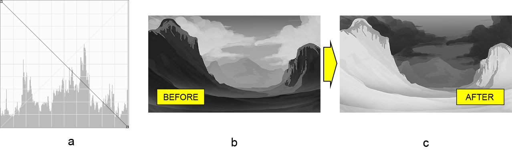

# Praca z warstwą regulacji krzywych w Photoshopie w języku Java

Celem tego artykułu jest przedstawienie możliwości biblioteki Aspose.PSD dla języka Java podczas **pracy z warstwami regulacji krzywych** w dokumentach Adobe® Photoshop®. Biblioteka ta działa w pełni autonomicznie, dlatego też działa bez konieczności instalacji edytora zdjęć Photoshop. [Pełna lista funkcji](https://docs.aspose.com/psd/java/features/) znajduje się w naszej bazie wiedzy. Tymczasem wracamy do krzywych.

## Przegląd API

Narzędzie Krzywe można przedstawić jako linię przekątną (krzywą) na wykresie z punktami jasności w prawym górnym rogu i cieniami w prawym dolnym rogu.

Biblioteka udostępnia API do pracy z krzywą, a mianowicie klasę [CurvesLayer](https://reference.aspose.com/psd/java/com.aspose.psd.fileformats.psd.layers.adjustmentlayers/CurvesLayer). Jednak ta klasa posiada **dwa całkowicie różne podejścia** do pracy z krzywą. Dlatego też krzywa może być edytowana w jednym z dwóch trybów na raz:

- Ciągły (krzywa przedstawiona jako ścieżka z punktami w miejscach zagięcia)
- Dyskretny (krzywa przedstawiona jako linia przerywana)

Dlatego też biblioteka posiada dwa sposoby modyfikacji krzywej za pomocą odpowiednio menedżera [ciągłego](https://reference.aspose.com/psd/java/com.aspose.psd.fileformats.psd.layers.layerresources/curvescontinuousmanager) i [dyskretnego](https://reference.aspose.com/psd/java/com.aspose.psd.fileformats.psd.layers.layerresources/CurvesDiscreteManager). Następnie wyjaśnimy, jak korzystać z każdego z nich na konkretnym przykładzie.

## Regulacja koloru i tonu za pomocą menedżera ciągłego krzywych

[Menedżer ciągłych krzywych](https://reference.aspose.com/psd/java/com.aspose.psd.fileformats.psd.layers.layerresources/CurvesContinuousManager) **konfiguruje punkty zagięcia ciągłej krzywej** dla kanału kompozytowego (RGB) oraz dla poszczególnych kanałów kolorów. Na potrzeby demonstracji, zostanie zastosowana regulacja krzywych (a) do przyciemnionego obrazu orkiestry (b), aby uzyskać rozjaśniony obraz z cieplejszymi kolorami (c):

Ponieważ istnieje dwa menedżery, konieczne jest wyraźne wybranie jednego z nich (w tym przypadku menedżera ciągłego), zanim można go otrzymać. Następnie można bezpośrednio dodać punkty krzywej o określonych współrzędnych dla pożądanych kanałów kolorów (kompozytowego RGB, czerwonego i niebieskiego odpowiednio), aby odtworzyć kształt krzywej:

    CurvesLayer curvesLayer = psdImage.addCurvesAdjustmentLayer();

    curvesLayer.setContinuousManagerUsed(true);
    CurvesContinuousManager curvesContinuousManager = (CurvesContinuousManager)curvesLayer.getCurvesManager();

    curvesContinuousManager.addCurvePoint(0, (byte)65, (byte)125);
    curvesContinuousManager.addCurvePoint(1, (byte)120, (byte)135);
    curvesContinuousManager.addCurvePoint(3, (byte)135, (byte)120);


Początek układu współrzędnych znajduje się w lewym dolnym rogu. Maksymalna wartość współrzędnej punktu jest ograniczona do typu danych (byte) i wynosi 255 (127 dla typu ze znakiem).

Istnieje również kilka [innych metod](https://reference.aspose.com/psd/java/com.aspose.psd.fileformats.psd.layers.layerresources/CurvesContinuousManager), które można wykorzystać.

## Regulacja tonu za pomocą menedżera dyskretnych krzywych

Menedżer dyskretnych krzywych również pozwala na pozycjonowanie punktów krzywej (w rzeczywistości zmianę koloru i tonu), ale różnica polega na tym, że robią to inaczej. Po pierwsze, **krzywa składa się z punktów** lub kropek (nie linię ciągłą). Po drugie, ten menedżer **nie umieszcza punktu w dowolnym miejscu** na wykresie. Zamiast tego **przesuwa punkt w górę lub w dół** w zakresie wartości między 255 a 0 odpowiednio. Domyślnie wartości punktów krzywej rosną inkrementalnie, aby utworzyć krzywą pod kątem 45 stopni.

Mając to na uwadze, łatwo jest odtworzyć predefiniowany w Photoshopie schemat kolorów „Negatywny (RBG)” (a) i zastosować go do obrazu w odcieniach szarości doliny (b), aby ostatecznie uzyskać negatywną reprezentację doliny (c).

 Przede wszystkim nie zapomnij wybrać odpowiedniego menedżera, aby móc go użyć, a następnie ustaw wartości punktów krzywej malejąco zaczynając od 255 do 0 dla każdego punktu krzywej (łącznie 255):


    CurvesLayer curvesLayer = psdImage.addCurvesAdjustmentLayer();

    curvesLayer.setDiscreteManagerUsed(true);
    CurvesDiscreteManager curvesDiscreteManager = (CurvesDiscreteManager)curvesLayer.getCurvesManager();

    for (int i = 0; i < 255; i++)
    {
        curvesDiscreteManager.setValueInPosition(0, (byte)i, (byte)-i);
    }


Menedżer udostępnia również kilka [innych metod](https://reference.aspose.com/psd/java/com.aspose.psd.fileformats.psd.layers.layerresources/curvesdiscretemanager) do zarządzania krzywą.

## Wnioski

W tym artykule nauczyliśmy się, jak pracować z warstwami regulacji krzywych w dokumentach Photoshopa za pomocą Aspose.PSD dla języka Java w dwóch zupełnie różnych sposobach (za pomocą menedżerów ciągłych i dyskretnych).
