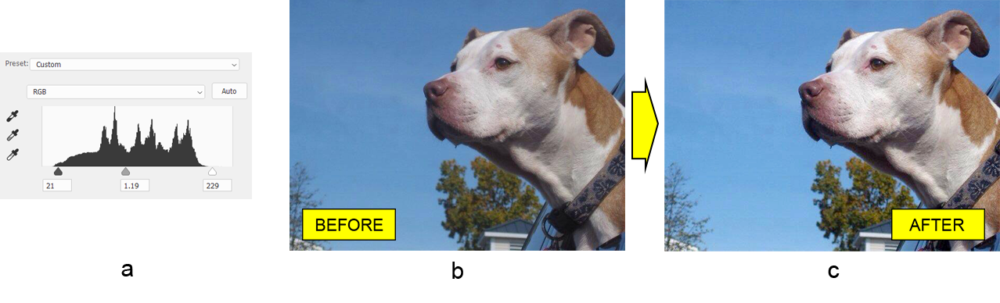

## Praca z warstwą regulacji poziomów w Photoshopie w Java

W tym artykule dowiemy się, jak dostosować zakres odcieni i balans kolorów zdjęcia w formacie [pliku PSD](/psd/pl/java/psd-format/) programistycznie w Javie. Nie korzystamy z samego edytora zdjęć Adobe® Photoshop®. Zamiast tego używamy biblioteki Aspose.PSD dla Javy, która działa samodzielnie w celu manipulowania dokumentem Photoshopa.

Mimo że Aspose.PSD dla Javy obsługuje więcej niż wystarczająco [narzędzi do edycji zdjęć](/psd/pl/java/manipulating-images/) takich jak chcemy, skupimy się **na API warstwy regulacji poziomów** , które jest jednym z najprostszych i najszybszych sposobów wykonania pracy.

## Przegląd API

Obecna implementacja (20.6 w momencie pisania) API warstwy regulacji poziomów **obsługuje wszystkie podstawowe funkcje Photoshopa Levels** , tj. dostosowywanie poziomów wejściowych i wyjściowych dla kanału kompozytowego (RGB) oraz dla każdego podstawowego kanału koloru (czerwony, zielony i niebieski).

API warstwy regulacji poziomów jest prosty. Klasa [LevelsLayer](https://reference.aspose.com/psd/java/com.aspose.psd.fileformats.psd.layers.adjustmentlayers/LevelsLayer) jest punktem wejścia do regulacji poziomów. Zawiera kilka metod dostępu do kanałów kolorów: getMasterChannel i getChannel(int). Obie metody zwracają [LevelChannel](https://reference.aspose.com/psd/java/com.aspose.psd.fileformats.psd.layers.layerresources/LevelChannel) , który posiada odpowiadające właściwości do manipulacji poziomami wejściowymi i wyjściowymi. Różnica polega na tym, że getMasterChannel służy do dostosowywania kanału koloru kompozytowego (RGB), podczas gdy getChannel dostęp do konkretnego kanału koloru (czerwony, zielony lub niebieski) na podstawie jego indeksu.

## Kompatybilność z trybami koloru

Warto dodać, że warstwa regulacji poziomów **jest kompatybilna z ogromną większością trybów kolorów** zgodnie z poziomami Photoshopa. Dlatego możliwe jest dostosowanie poziomów dla obrazów w skalach szarości (kanał szary), RGB (RGB, kanały czerwony, zielony i niebieski), CMYK (CMYK, kanały cyjan, magenta, żółty i czarny), Duotone (kanał monotoniczny) i LAB (jasność, a i b kanały).

## Dostosowanie zakresu odcieni

Mając na uwadze, korekta tonalna stosuje się do obrazu, aby przemapować cienie i światła w celu lepszego rozkładu pośrednich odcieni. Ogólnie rzecz biorąc, **to sprawia, że obraz wygląda bardziej kontrastowo** , jeśli zrobione jest to poprawnie. Na przykład, weźmy zdjęcie psa (b) i dostosujmy jego zakres tonalny (a – zrzut ekranu z okna poziomów Photoshopa dla klarowności) , aby zdjęcie wyglądało bardziej kontrastowo (c).

||

Aby **dostosować ogólny zakres tonalny** obrazu, poziomy wejściowe głównego kanału powinny zostać ustawione:

    LevelsLayer levelsLayer = psdImage.addLevelsAdjustmentLayer();

    LevelChannel masterChannel = levelsLayer.getMasterChannel();
    masterChannel.setInputShadowLevel(( **short** )21);
    masterChannel.setInputMidtoneLevel(( **float** )1.19);
    masterChannel.setInputHighlightLevel(( **short** )229);

Należy pamiętać, że poziomy wejściowe powinny mieć wartości z zakresu od 0 do 253 dla cieni, od 9.99 do 0.01 dla odcieni pośrednich i od 2 do 255 dla świateł. Zakres poziomów wyjściowych musi wynosić od 0 do 255.

Potrzebujesz jeszcze więcej przykładów? Możesz je znaleźć na [Githubie](https://github.com/aspose-psd/Aspose.PSD-for-Java) oraz w [bazie wiedzy](https://docs.aspose.com/display/psdjava/Manipulating+Photoshop+Formats#ManipulatingPhotoshopFormats-AddLevelAdjustmentLayers).

## Podsumowanie

Podsumowując, Aspose.PSD dla Javy oferuje wygodne i proste API do zmiany zakresu odcieni i balansu kolorów obrazu, które jest kompatybilne z niemal wszystkimi trybami kolorów. API warstwy regulacji poziomów biblioteki przypomina Photoshopowe poziomy, dlatego łatwo jest zacząć nawet jeśli nigdy wcześniej nie pracowano z tą biblioteką.
