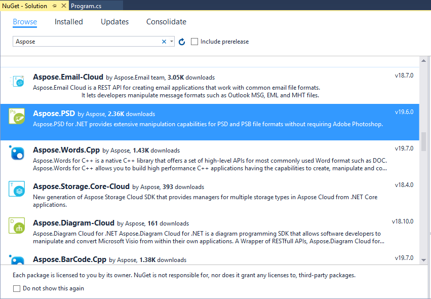

## **Instalowanie Aspose.PSD dla .NET za pomocą NuGet**
NuGet to najprostszy sposób pobierania i instalowania interfejsów API Aspose dla .NET. Otwórz Microsoft Visual Studio i menedżer pakietów NuGet. Wyszukaj "aspose", aby znaleźć wymagane API Aspose. Kliknij "Zainstaluj", wybrane API zostanie pobrane i dodane do twojego projektu.

## **Zainstaluj lub Zaktualizuj Aspose.PSD za pomocą Konsoli Menedżera pakietów**
Możesz postępować zgodnie z poniższymi krokami, aby odnieść się do [API Aspose.PSD](https://www.nuget.org/packages/Aspose.psd/) za pomocą konsoli menedżera pakietów:

1. Otwórz swoje rozwiązanie/projekt w Visual Studio.
1. Wybierz Narzędzia -> Menedżer pakietów bibliotek -> Konsola Menedżera pakietów z menu, aby otworzyć konsolę menedżera pakietów.

Wpisz polecenie "**Install-Package Aspose.Psd**" i naciśnij enter, aby zainstalować najnowszą pełną wersję w twojej aplikacji. Alternatywnie, możesz dodać sufiks "**-prerelease**" do polecenia, aby określić zainstalowanie najnowszego wydania z poprawkami również.

Zobaczysz, że w oknie pojawi się wskazówka **"Instalowanie Aspose.PSD"**, co oznacza, że proces pobierania jest w toku. 

Po pobraniu zobaczysz następujące komunikaty potwierdzające. Jeśli nie jesteś zaznajomiony/a z [Umową licencyjną Aspose](https://company.aspose.com/legal/eula), warto zapoznać się z licencją zamieszczoną pod podanym adresem URL. 

Powinieneś teraz zobaczyć, że Aspose.PSD został pomyślnie dodany i dołączony do twojej aplikacji.

W konsoli menedżera pakietów, możesz również użyć polecenia "**Update-Package Aspose.Psd**" i nacisnąć enter, aby sprawdzić aktualizacje pakietu Aspose.Psd i zainstalować je, jeśli są dostępne. Możesz także dodać sufiks "-prerelease" do aktualizacji najnowszego wydania.
## **Rozważenia przy Pracy w Środowisku Dzielonym na Serwerze**
Zaleca się uruchomienie wszystkich komponentów Aspose dla .NET z zestawem uprawnień pełnego zaufania. Jest to zalecane, ponieważ komponenty Aspose dla .NET czasami muszą uzyskać dostęp do ustawień rejestru i plików znajdujących się w innych miejscach niż katalog wirtualny, np. do odczytu czcionek itp. Ponadto, komponenty Aspose.NET opierają się na podstawowych klasach systemu .NET, z których niektóre również wymagają uprawnień pełnego zaufania do uruchomienia w niektórych przypadkach.

Dostawcy usług internetowych hostujący wiele aplikacji różnych firm zazwyczaj narzucają poziom bezpieczeństwa Medium Trust. W przypadku .NET 2.0, taki poziom bezpieczeństwa może ustawić następujące ograniczenia, które mogą wpłynąć na zdolność Aspose.Words do prawidłowego działania.

- **RegistryPermission** nie jest dostępny. Oznacza to, że nie można uzyskać dostępu do rejestru, co jest wymagane do wyliczenia zainstalowanych czcionek podczas renderowania dokumentów.
- **FileIOPermission** jest ograniczony. Oznacza to, że można uzyskać dostęp tylko do plików w hierarchii katalogów wirtualnego katalogu twojej aplikacji. Oznacza to potencjalnie, że czcionki nie mogą zostać odczytane podczas eksportowania.

Z powyższych powodów zaleca się uruchomienie Aspose.PSD z uprawnieniami pełnego zaufania. Może się okazać, że niektóre funkcje biblioteki będą działać przy wykonywaniu różnych zadań w środowisku Medium Trust, podczas gdy inne nie będą (na przykład renderowanie), co może wynikać z wywołań przetwarzania obrazów GDI+.

## **Praca z .NET Core DLLs zainstalowane za pośrednictwem pakietu MSI**

**Prosimy zauważyć:** Jeśli korzystasz z pliku dll .Net Standard zainstalowanego za pomocą pakietu MSI, powinieneś dodać niezbędne zależności, aby działać z wersją .Net Standard.

|**Zrzut ekranu zależności wizualnych studiów**|**Fragment pliku CsProj:**|
| :- | :- |
||<ItemGroup>

`    `<PackageReference Include="System.Drawing.Common" Version="4.5.1" />

`    `<PackageReference Include="System.Text.Encoding.CodePages" Version="4.5.0" />

</ItemGroup>|
## **Wymagania Systemowe**
### **Obsługiwane Systemy Operacyjne:**
- Microsoft Windows 2000 Professional i Server (zalecane SP2)
- Microsoft Windows XP Professional i Home Edition
- Microsoft Windows 2003 Server
- Microsoft Windows Vista
- Microsoft Windows 2008 Server
- Microsoft Windows 2008 Server R2
- Microsoft Windows 7
- Microsoft Windows 8
- Microsoft Windows 10
- Microsoft Windows 11
### **Obsługiwane Platformy:**
- Formularze okna
- Formularze sieciowe
- Visual Studio 2005
- Visual Studio 2008
- Visual Studio 2010
- Visual Studio 2012
- Visual Studio 2013
- Visual Studio 2015
- Visual Studio 2017
- Visual Studio 2019
- Visual Studio 2022

Aspose.PSD działa zarówno dla wersji x86, jak i x64 systemów operacyjnych wymienionych powyżej.
### **Obsługiwane Frameworki:**
Aspose.PSD dla .NET obsługuje framework .NET jak następuje:

- Wersja frameworku .NET 2.0 lub wyższa
- .NET Standard 2.0
