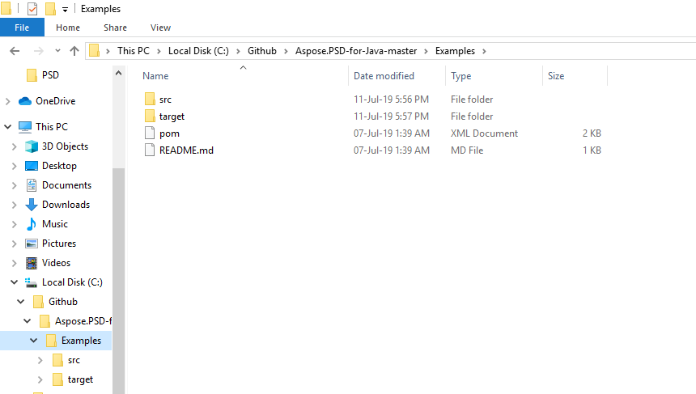

## **Baixar do GitHub**
Todos os exemplos do Aspose.PSD para Java estão hospedados no [Github](https://github.com/aspose-psd/Aspose.PSD-for-Java). Você pode clonar o repositório usando o cliente do Github ou baixar o arquivo ZIP da [qui](https://github.com/aspose-psd/Aspose.PSD-for-Java/archive/master.zip).

Extraia o conteúdo do arquivo ZIP em seu computador. Você encontrará a pasta **Exemplos**. Todos os exemplos estão localizados na pasta **Exemplos**.

Você pode executar esses exemplos com qualquer IDE de sua escolha, no entanto, para fins de demonstração, estamos usando o **NetBeans**. Use a opção **Arquivo -> Abrir Projeto** para importar o exemplo de sua escolha e especificar o caminho.

Adicione os arquivos jar necessários (Bibliotecas) no projeto.

A pasta **Recursos** contém documentos/arquivos de entrada referenciados no exemplo.

{} 

Você também pode importar os exemplos diretamente do repositório GitHub.

{} 

## **Contribuir**
Se você gostaria de adicionar ou melhorar um exemplo, incentivamos você a contribuir para o projeto. Todos os exemplos e projetos de demonstração neste repositório são de código aberto e podem ser livremente usados em suas próprias aplicações.

Para contribuir, você pode bifurcar o repositório, editar o código-fonte e criar uma solicitação de pull. Revisaremos as alterações e as incluiremos no repositório se forem consideradas úteis.

