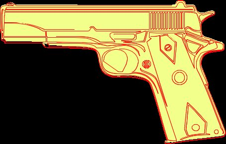

Aspose.PSD é um SDK de Formato PSD, que também pode converter arquivos AI para Jpg. Você pode converter o Arquivo Adobe Illustrator para arquivo Jpg. Para exportar Ai, você precisa usar o seguinte trecho de código:

O código de exemplo fornecido abaixo demonstra como exportar o arquivo AI para Jpg com a [API de Manipulação de Formato de Arquivo](/pt/psd/net/manipulate-different-image-file-formats/)



Você pode especificar a qualidade do Formato de Arquivo Jpeg, Erro Lossy Permitido em Jpeg.

Aqui está um exemplo de exportação para Jpeg:

|**Exportar Ai com diferente peso de caminhos**|**Converter Ai com exemplo de contorno complexo**|
| :- | :- |
||

 
|
