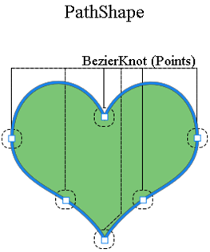
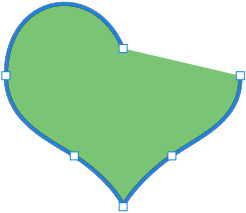

## **Visão Geral da Máscara de Vetor de Camada**
Uma máscara de vetor é um caminho independente da resolução que recorta o conteúdo da camada. As máscaras de vetor geralmente são mais precisas do que aquelas criadas com ferramentas baseadas em pixels. Você cria máscaras de vetor com as ferramentas de caneta ou formas.

O Aspose.PSD suporta a renderização e aplicação de máscaras de vetor. Você pode editar máscaras de vetor através da edição de Caminhos de Vetor.

## **Caminho de vetor no Aspose.PSD**
O acesso aos caminhos de vetor no Aspose.PSD é fornecido através dos recursos [VsmsResouce](https://reference.aspose.com/psd/net/aspose.psd.fileformats.psd.layers.layerresources/vsmsresource) e [VmskResouce](https://reference.aspose.com/psd/net/aspose.psd.fileformats.psd.layers.layerresources/vmskresource), que são classes filhas de [VectorPathDataResource](https://reference.aspose.com/psd/net/aspose.psd.fileformats.psd.layers.layerresources/vectorpathdataresource).

## **Como editar um caminho de vetor?**
### **Estrutura de um caminho de vetor**
A estrutura base para manipular caminhos é [VectorPathRecord](https://reference.aspose.com/psd/net/aspose.psd.fileformats.core.vectorpaths/vectorpathrecord). Mas para sua conveniência, a seguinte solução é sugerida.

Para facilitar a edição de caminhos de vetor, você pode usar a classe [VectorPath](https://gist.github.com/aspose-com-gists/8a4c9d34ce856d1642fc7c0ce974175c#file-examples-csharp-aspose-workingwithvectorpaths-classestomanipulatevectorpathobjects-classestomanipulatevectorpathobjects-cs), que contém métodos para edição confortável de dados de vetor em recursos derivados de VectorPathDataResource.

Comece criando um objeto do tipo VectorPath.

Para sua conveniência, você pode usar o método estático [VectorDataProvider.CreateVectorPathForLayer](https://gist.github.com/aspose-com-gists/8a4c9d34ce856d1642fc7c0ce974175c#file-examples-csharp-aspose-workingwithvectorpaths-classestomanipulatevectorpathobjects-classestomanipulatevectorpathobjects-cs), ele encontrará um recurso de vetor na camada de entrada e criará um objeto VectorPath com base nele.

Depois de todas as edições, você pode aplicar o objeto VectorPath com alterações de volta para a camada usando o método estático [VectorDataProvider.UpdateLayerFromVectorPath](https://gist.github.com/aspose-com-gists/8a4c9d34ce856d1642fc7c0ce974175c#file-examples-csharp-aspose-workingwithvectorpaths-classestomanipulatevectorpathobjects-classestomanipulatevectorpathobjects-cs).



O tipo VectorPath contém uma lista de elementos [PathShape](https://gist.github.com/aspose-com-gists/8a4c9d34ce856d1642fc7c0ce974175c#file-examples-csharp-aspose-workingwithvectorpaths-classestomanipulatevectorpathobjects-classestomanipulatevectorpathobjects-cs) e descreve uma imagem de vetor completa que pode consistir em uma ou várias formas.

Cada PathShape é uma figura de vetor que consiste em um conjunto separado de nós de bezier (ponto).

Os nós são objetos do tipo [BezierKnot](https://gist.github.com/aspose-com-gists/8a4c9d34ce856d1642fc7c0ce974175c#file-examples-csharp-aspose-workingwithvectorpaths-classestomanipulatevectorpathobjects-classestomanipulatevectorpathobjects-cs) que são essencialmente os pontos dos quais a figura está sendo construída.

O exemplo de código a seguir mostra como acessar uma figura e pontos.


### **Como criar uma forma?**
Para editar uma forma, você precisa obter uma existente na lista [VectorPath.Shapes](https://gist.github.com/aspose-com-gists/8a4c9d34ce856d1642fc7c0ce974175c#file-examples-csharp-aspose-workingwithvectorpaths-classestomanipulatevectorpathobjects-classestomanipulatevectorpathobjects-cs) ou adicionar uma nova forma criando uma instância de [PathShape](https://gist.github.com/aspose-com-gists/8a4c9d34ce856d1642fc7c0ce974175c#file-examples-csharp-aspose-workingwithvectorpaths-classestomanipulatevectorpathobjects-classestomanipulatevectorpathobjects-cs) e adicionando-a à lista [Shapes](https://gist.github.com/aspose-com-gists/8a4c9d34ce856d1642fc7c0ce974175c#file-examples-csharp-aspose-workingwithvectorpaths-classestomanipulatevectorpathobjects-classestomanipulatevectorpathobjects-cs).


### **Como adicionar nós (pontos)?**
Você pode manipular os pontos da forma como elementos de uma Lista regular usando a propriedade PathShape.Points, por exemplo, você pode adicionar pontos à forma:



O BezierKnot contém o ponto de âncora e dois pontos de controle.

Caso o ponto de âncora e os pontos de controle tenham os mesmos valores, então o nó terá um ângulo agudo.

Para alterar a posição do ponto de âncora junto com os pontos de controle (semelhante ao que acontece no Photoshop), o BezierKnot possui um método Shift.

O exemplo de código a seguir demonstra como mover todo o nó de bezier verticalmente para cima por coordenada Y:

Você pode manipular os pontos da forma como elementos de uma Lista regular usando a propriedade PathShape.Points, por exemplo, você pode adicionar pontos à forma:



## **Propriedades de PathShape**
A edição de PathShape não se limita à edição de nós, este tipo também possui outras propriedades.
### **Operações de Caminho (operações booleanas)**
A propriedade [PathOperations](https://reference.aspose.com/psd/net/aspose.psd.fileformats.core.vectorpaths/pathoperations) é uma chamada operação booleana, alterar o valor define como várias formas são combinadas.

Existem os seguintes valores possíveis:

- 0 = ExcludeOverlappingShapes (operação XOR).
- 1 = CombineShapes (operação OR).
- 2 = SubtractFrontShape (operação NOT).
- 3 = IntersectShapeAreas (operação AND).

### **Propriedade IsClosed**
Além disso, usando a propriedade PathShape.IsClosed, podemos determinar se o primeiro e o último nó de uma forma estão conectados.

|**Forma Fechada**|**Forma Aberta**|
| :- | :- |
|||
### **Propriedade FillColor**
Nenhuma figura pode ter sua própria cor, então você pode alterar a cor de todo o caminho de vetor com a propriedade VectorPath.FillColor.

Você pode manipular os pontos da forma como elementos de uma Lista regular usando a propriedade PathShape.Points, por exemplo, você pode adicionar pontos à forma:



## **Aqui você encontrará o código-fonte do VectorDataProvider e classes relacionadas:**

