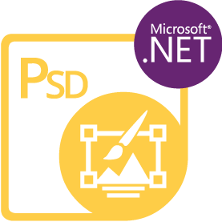

{} 

****

**Добро пожаловать в Aspose.PSD для .NET**

Aspose.PSD для .NET - это продукт, который позволяет обширное взаимодействие с форматами файлов PSD. Для работы с продуктом не требуется установка Adobe Photoshop. Aspose.PSD для .NET позволяет редактировать файлы PSD, обновлять свойства слоев, добавлять водяные знаки, выполнять графические операции или преобразовывать один формат файла в другой. Этот продукт позволяет использовать различные сценарии автоматизации, которые помогают разработчикам на пути к успеху.

В настоящее время Aspose.PSD для .NET поддерживает форматы файлов PSD и PSB для загрузки и взаимодействия. В будущих версиях будет возможность загружать больше форматов файлов PSD. Aspose.PSD для .NET позволяет экспортировать в различные растровые форматы файлов, такие как TIFF, JPEG, JPEG2000, PNG, GIF, BMP, и будут добавлены поддерживаемые для экспорта. В продукте используются алгоритмы, позволяющие редактировать файлы PSD эффективно и поддерживать хорошую производительность. Продукт активно развивается, и будут добавлены множество полезных функций для поддержки рыночных требований. Например, активно разрабатывается поддержка .NET Core.

{} 

## **Ресурсы Aspose.PSD для .NET**

Ниже приведены ссылки на некоторые полезные ресурсы, которые могут понадобиться для выполнения ваших задач.

- [Онлайн-документация по Aspose.PSD для .NET](/psd/ru/net/)
- [Возможности Aspose.PSD для .NET](/psd/ru/net/features/)
- [Примечания к выпуску Aspose.PSD для .NET](/psd/ru/net/release-notes/)
- [Страница продукта Aspose.PSD для .NET](https://products.aspose.com/psd/net)
- [Установить пакет NuGet Aspose.PSD для .NET](https://www.nuget.org/packages/Aspose.PSD/)
- [Руководство по API Aspose.PSD для .NET](https://reference.aspose.com/net/psd)
- [Примеры загрузки в репозитории GitHub](https://github.com/aspose-psd/Aspose.PSD-for-.NET)
- [Бесплатный форум поддержки Aspose.PSD для .NET](https://forum.aspose.com/c/psd)
- [Платный helpdesk поддержки Aspose.PSD для .NET](https://helpdesk.aspose.com/)

{} 

****

**Добро пожаловать в Aspose.PSD для Java**

Aspose.PSD для Java позволяет обширное взаимодействие с форматами файлов PSD. Для работы с продуктом не требуется установка Adobe Photoshop. Aspose.PSD для Java позволяет редактировать файлы PSD, обновлять свойства слоев, добавлять водяные знаки, выполнять графические операции и преобразовывать файлы из одного формата в другой. Продукт также поддерживает различные сценарии автоматизации, помогающие разработчикам на пути к успеху.

В настоящее время Aspose.PSD для Java поддерживает форматы файлов PSD и PSB для загрузки и взаимодействия. В будущих версиях будет возможность загрузки более форматов файлов PSD. Aspose.PSD для Java позволяет экспортировать в различные растровые форматы файлов, такие как TIFF, JPEG, JPEG2000, PNG, GIF, BMP. Продукт использует алгоритмы, позволяющие эффективно редактировать файлы PSD и поддерживать хорошую производительность. Продукт активно развивается, и будут добавлены множество полезных функций для удовлетворения рыночных требований.

{} 

## **Ресурсы Aspose.PSD для Java**

Ниже приведены ссылки на некоторые полезные ресурсы, которые могут понадобиться для выполнения ваших задач.

- [Онлайн-документация по Aspose.PSD для Java](/psd/ru/java/)
- [Возможности Aspose.PSD для Java](/psd/ru/java/features/)
- [Примечания к выпуску Aspose.PSD для Java](/psd/ru/java/release-notes/)
- [Страница продукта Aspose.PSD для Java](https://products.aspose.com/psd/java)
- [Загрузить Aspose.PSD для Java](https://repository.aspose.com/webapp/#/artifacts/browse/tree/General/repo/com/aspose/aspose-psd)
- [Установить Aspose.PSD для Java из репозитория Maven](/psd/ru/java/installation/)
- [Руководство по API Aspose.PSD для Java](https://reference.aspose.com/java/psd)
- [Примеры загрузки в репозитории GitHub](https://github.com/aspose-psd/Aspose.PSD-for-Java)
- [Бесплатный форум поддержки Aspose.PSD для Java](https://forum.aspose.com/c/psd)
- [Платный helpdesk поддержки Aspose.PSD для Java](https://helpdesk.aspose.com/)

{} 

**Добро пожаловать в Aspose.PSD для Python via .NET**

Aspose.PSD для Python via .NET предлагает полный набор функций для манипулирования форматами файлов PSD. При его использовании создается единая среда без необходимости установки Adobe Photoshop. С Aspose.PSD для Python via .NET вы можете легко редактировать файлы PSD, PSB и AI, обновлять свойства слоев, применять водяные знаки, выполнять различные графические операции и преобразовывать файлы из одного формата в другой. Продукт также поддерживает различные сценарии автоматизации, позволяя разработчикам оптимизировать свой рабочий процесс.

На данный момент Aspose.PSD для Python via .NET поддерживает загрузку и манипулирование форматами файлов PSD, PSB и AI. Однако будущие версии продукта расширят его возможности, включая поддержку дополнительных функций файлов PSD. Качество поддержки формата AI постоянно повышается. Aspose.PSD начал поддерживать современный формат AI. Кроме того, Aspose.PSD для Python via .NET позволяет экспортировать в различные растровые форматы файлов, включая TIFF, JPEG, JPEG2000, PNG, GIF и BMP. Продукт использует эффективные алгоритмы, гарантирующие оптимальную производительность при редактировании файлов PSD. Aspose.PSD для Python via .NET постоянно развивается, добавляя новые функции для удовлетворения потребностей рынка.

{} 

## **Ресурсы Aspose.PSD для Python via .NET**

Ниже приведены ссылки на некоторые полезные ресурсы, которые могут понадобиться для выполнения ваших задач.

- [Онлайн-документация по Aspose.PSD для Python](/psd/ru/python-net/)
- [Возможности Aspose.PSD для Python](/psd/ru/python-net/features/)
- [Примечания к выпуску Aspose.PSD для Python](/psd/ru/python-net/release-notes/)
- [Страница продукта Aspose.PSD для Python](https://products.aspose.com/psd/python-net)
- [Загрузить Aspose.PSD для Python](https://repository.aspose.com/webapp/#/artifacts/browse/tree/General/repo/com/aspose/aspose-psd)
- [Установить Aspose.PSD для Python из репозитория Maven](/psd/ru/python-net/installation/)
- [Руководство по API Aspose.PSD для Python](https://reference.aspose.com/python-net/psd)
- [Примеры загрузки в репозитории GitHub](https://github.com/aspose-psd/Aspose.PSD-for-Python-Net)
- [Бесплатный форум поддержки Aspose.PSD для Python](https://forum.aspose.com/c/psd)
- [Платный helpdesk поддержки Aspose.PSD для Python](https://helpdesk.aspose.com/)
