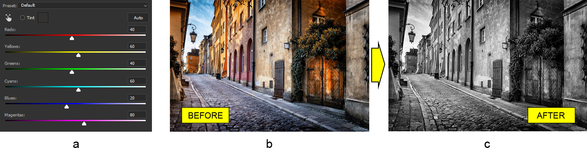

## **Работа с черно-белым слоем коррекции фотошопа на Java**
В этой статье мы покажем, как работать с черно-белым слоем коррекции в документах Photoshop, используя Aspose.PSD для Java, которая является библиотекой для манипуляции форматом файла PSD.

API черно-белого слоя коррекции, предоставленное библиотекой, преобразует цветное изображение в монохромное, которое по умолчанию является изображением в градациях серого. Также можно использовать оттенок, чтобы достичь монохромного эффекта, например, сепии. Не требуется много работы, чтобы сделать изображение черно-белым с помощью этого слоя коррекции. Однако есть гибкий контроль над влиянием определенного цвета на конечное изображение. Также поддерживаются предустановки, которые могут быть загружены из файла.

## **Преобразование цветного изображения в черно-белое**
Слой коррекции черного и белого является самым простым способом преобразовать цветное изображение в изображение в градациях серого. Почему это так легко? Ну, потому что все параметры уже имеют значения по умолчанию, следовательно, все, что вам нужно сделать, чтобы сделать цветное изображение черно-белым, это просто добавить слой коррекции черного и белого. Например, давайте возьмем изображение улицы в старом городе (b) и добавим к нему черно-белый эффект (c). 

