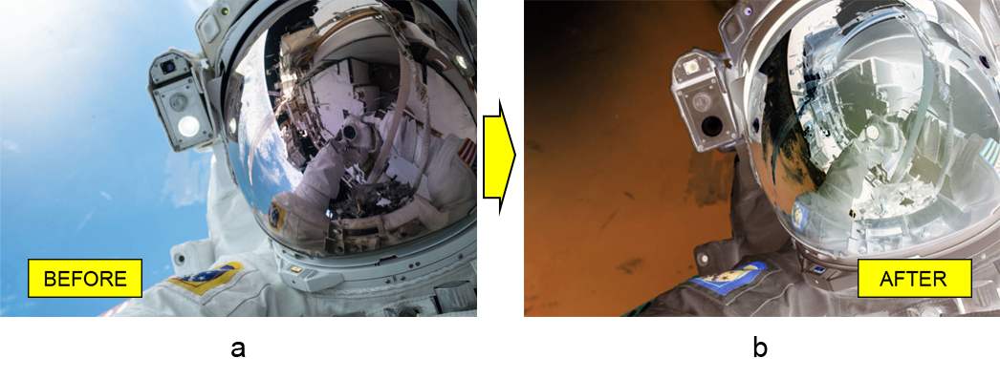

# Работа с слоем наложения инвертирования в Photoshop на Java

В этой статье мы покажем, как программно преобразовать изображение в документе Photoshop в негатив на Java. Для этого мы будем использовать библиотеку для манипулирования форматом файла PSD под названием Aspose.PSD для Java.

API инверсии цвета позволяет **добавить негативный эффект к изображению**. Возможно, вы уже видели, как [инвертировать цвета изображения с помощью слоя коррекции кривых](/ru/psd/java/layer-types/adjustment-layer/curves/). Однако сегодня мы рассмотрим более быстрый и простой способ сделать это с помощью слоя наложения Инвертировать.

## Обзор API

**API слоя наложения Инвертировать** состоит из самого класса слоя, который называется [InvertAdjustmentLayer](https://reference.aspose.com/psd/java/com.aspose.psd.fileformats.psd.layers.adjustmentlayers/InvertAdjustmentLayer). Этот класс не имеет собственных публичных членов, поскольку он наследует все публичные члены от родительского класса ([AdjustmentLayer](https://reference.aspose.com/psd/java/com.aspose.psd.fileformats.psd.layers.adjustmentlayers/AdjustmentLayer)). Этот факт упрощает его использование, поскольку все, что вам нужно сделать, это добавить его в файл PSD, и изображение станет негативным.

## Инвертировать цвета изображения

Итак, даже если кажется очевидным, давайте продемонстрируем для ясности, как **применить слой наложения "Инвертировать" к изображению** астронавта (a), чтобы создать негативный эффект для этого изображения (b).

Чтобы **инвертировать цвета изображения**, просто добавьте слой наложения Инвертировать в PSD:

    InvertAdjustmentLayer invertAdjustmentLayer = psdImage.addInvertAdjustmentLayer();

Вот и все! Нет конкретных свойств для настройки этого типа слоя коррекции.

## Заключение

В этой статье мы узнали о API слоя наложения Инвертировать в Aspose.PSD для Java. Это без труда работающий инструмент для получения негативных изображений, потому что API этого слоя коррекции не объявляет никаких публичных членов.
