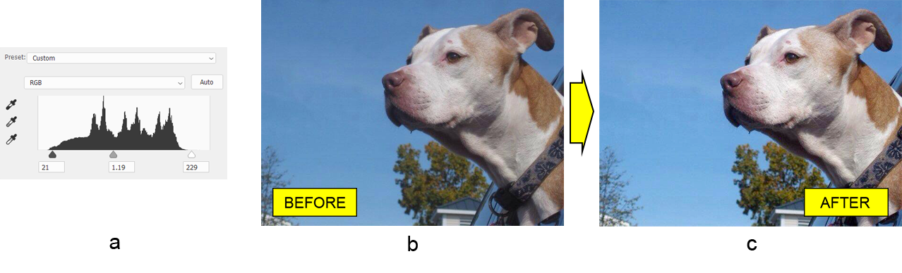

## Работа с коррекцией уровней Photoshop в Java

В этой статье мы узнаем, как программно настраивать тоновый диапазон и баланс цвета фотографии в формате файла [PSD](/ru/psd/java/psd-format/) с помощью Java. Мы не используем сам редактор фотографий Adobe® Photoshop®. Вместо этого мы используем библиотеку Aspose.PSD для Java, которая самостоятельно работает с документом Photoshop.

Хотя Aspose.PSD для Java поддерживает больше чем достаточно [инструментов для редактирования фотографий](/ru/psd/java/manipulating-images/) в нужном нам стиле, давайте **воспользуемся API слоя коррекции уровней**, который является одним из самых простых и быстрых способов выполнения работы.

## Обзор API

Текущая реализация (20.6 на момент написания) API слоя коррекции уровней **поддерживает все основные функции уровней Photoshop**, а именно – настройку входных и выходных уровней для композитного канала (RGB) а также для каждого основного цветового канала (красный, зелёный и синий).

API слоя коррекции уровней прямолинеен. Класс [LevelsLayer](https://reference.aspose.com/psd/java/com.aspose.psd.fileformats.psd.layers.adjustmentlayers/LevelsLayer) является точкой входа для коррекции уровней. Он содержит несколько методов для доступа к цветовым каналам: getMasterChannel и getChannel(int). Оба метода возвращают [LevelChannel](https://reference.aspose.com/psd/java/com.aspose.psd.fileformats.psd.layers.layerresources/LevelChannel), который имеет соответствующие свойства для манипулирования входными и выходными уровнями. Разница в том, что getMasterChannel служит для коррекции композитного цветового канала (RGB), в то время как getChannel обращается к определённому цветовому каналу (красный, зелёный или синий) по его индексу.

## Совместимость с цветовыми режимами

Следует отметить, что слой коррекции уровней **совместим с подавляющим большинством цветовых режимов** в соответствии с уровнями Photoshop. Поэтому возможна настройка уровней для изображений в режимах Чёрно-белый (серый канал), RGB (RGB, красный, зелёный и синий каналы), CMYK (CMYK, циан, маджента, жёлтый и черный каналы), Дуотон (монохромный канал) и LAB (яркость, a и b каналы).

## Настройка тонового диапазона

Простыми словами, коррекция тонов применяется к изображению для перераспределения теней и светов для лучшего равномерного распределения средних тонов. В общем, **это делает изображение более контрастным**, если выполнено правильно. Например, давайте возьмём фотографию собаки (b) и настроим её тоновый диапазон (a – скриншот взят из окна уровней Photoshop для наглядности), чтобы сделать фото более контрастным (c).

||

Для **настройки общего тонового диапазона** изображения, входные уровни мастер-канала должны быть установлены следующим образом:

    LevelsLayer levelsLayer = psdImage.addLevelsAdjustmentLayer();

    LevelChannel masterChannel = levelsLayer.getMasterChannel();
    masterChannel.setInputShadowLevel(( **short** )21);
    masterChannel.setInputMidtoneLevel(( **float** )1.19);
    masterChannel.setInputHighlightLevel(( **short** )229);

Следует помнить, что входные уровни должны находиться в диапазоне от 0 до 253 для теней, от 9.99 до 0.01 для средних тонов и от 2 до 255 для светов. Диапазон выходных уровней должен быть от 0 до 255.

Хотите ещё примеров? Вы можете найти их на [Github](https://github.com/aspose-psd/Aspose.PSD-for-Java) и в [базе знаний](https://docs.aspose.com/display/psdjava/Manipulating+Photoshop+Formats#ManipulatingPhotoshopFormats-AddLevelAdjustmentLayers).

## Заключение

В заключение, Aspose.PSD для Java имеет удобный и простой API для изменения тонового диапазона и баланса цвета изображения, который совместим с практически всеми цветовыми режимами. API слоя коррекции уровней библиотеки похож на уровни Photoshop, поэтому начать работу легко, даже если вы раньше не работали с этой библиотекой.
