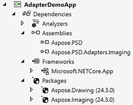

## Обзор

Это полное руководство о том, как работать с адаптерами Aspose.PSD для расширения возможностей Aspose.PSD. Адаптеры - это специальные пакеты Nuget, которые обеспечивают безшовную интеграцию Aspose.PSD с другими продуктами Aspose, позволяя вам экспортировать ваши файлы в различные форматы, которые не поддерживаются, с минимальными усилиями, без написания дополнительного кода интеграции.

## Применение лицензий

Пожалуйста, ознакомьтесь с полной [статьей о применении лицензий](/ru/psd/net/adapters/license) для адаптеров.

{}
Обратите внимание, для использования адаптеров вам понадобятся лицензии как Aspose.PSD, так и 'адаптеров'.
{}

Лицензию можно применить, используя этот пример:


Лучше всего применять лицензию один раз в инициализирующем модуле вашего проекта.

## Ссылка на адаптеры Aspose.PSD

Сначала вам необходимо ссылаться на Aspose.PSD.Adapters.Imaging из [Nuget](https://www.nuget.org/aspose.psd.adapters.imaging) или скачать их с [страницы выпусков Aspose](https://releases.aspose.com/psd/net/) (Адаптеры включены в основной артефакт выпуска в настоящий момент в качестве отдельного бинарного файла) в ваш проект.

Также возможно, что вам понадобится ссылаются на другие дополнительные пакеты

## Включение Загрузчиков и Экспортеров адаптеров

### Включение адаптеров
Когда вам нужно использовать адаптеры, просто используйте следующий код:


### Отключение адаптеров
В процессе разработки вы можете столкнуться с ситуацией, когда адаптеры должны быть отключены. Это распространенный случай, когда вам нужно использовать загрузчики Aspose.PSD в одной части кода и загрузчики Adaptees в другой. В этом случае просто используйте следующий код:


## Загрузка изображений с использованием адаптеров

Используя адаптеры, вы можете [загружать популярные форматы](/ru/net/adapters/load-unsupported-formats), не поддерживаемые Aspose.PSD, такие как SVG или WebP.

### Простое использование
Просто используйте следующий код для загрузки:


### Промежуточное использование для сложной обработки изображений
Если вам нужно указать дополнительные параметры, предоставляемые Adaptee, ознакомьтесь с следующим примером:


Вы можете работать с изображением SVG, используя все функции изображения, а затем экспортировать его одним вызовом метода.

## Экспорт изображений с использованием адаптеров

Часто возникают ситуации, когда необходимо не только [открывать неподдерживаемый формат](/ru/net/adapters/load-unsupported-formats), но и [экспортировать в него](/ru/net/adapters/export-to-unsupported-formats). В таких случаях вам следует включить экспортеры и использовать следующий код:


## Заключение

Использование адаптеров Aspose.PSD для загрузки и экспорта файлов становится игровым переворотом для разработчиков. Эти мощные пакеты Nuget позволяют без проблем интегрировать Aspose.PSD с другими продуктами Aspose, облегчая открытие и работу с не поддерживаемыми форматами файлов без написания дополнительного кода интеграции. С помощью адаптеров Aspose.PSD вы можете экономить время и усилия, избавившись от необходимости в дополнительном коде и ручных процессах преобразования. Независимо от того, загружаете ли вы файлы или экспортируете их, адаптеры Aspose.PSD предоставляют удобное и эффективное решение, открывая новые возможности для ваших проектов. Почувствуйте мощь адаптеров Aspose.PSD и поднимите свой процесс разработки на новый уровень.
