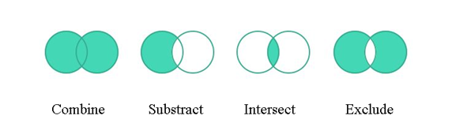

## **Обзор векторной маски слоя**
Векторная маска - это независимый от разрешения путь, который обрезает содержимое слоя. Векторные маски обычно более точные, чем созданные с помощью инструментов на основе пикселей. Векторные маски создаются с помощью инструментов пера или фигур.

Aspose.PSD поддерживает визуализацию и применение векторных масок. Вы можете редактировать векторные маски через редактирование векторных путей.

## **Векторный путь в Aspose.PSD**
Доступ к векторным путям в Aspose.PSD осуществляется через ресурсы [VsmsResouce](https://reference.aspose.com/psd/net/aspose.psd.fileformats.psd.layers.layerresources/vsmsresource) и [VmskResouce](https://reference.aspose.com/psd/net/aspose.psd.fileformats.psd.layers.layerresources/vmskresource), которые являются дочерними классами [VectorPathDataResource](https://reference.aspose.com/psd/net/aspose.psd.fileformats.psd.layers.layerresources/vectorpathdataresource).

## **Как редактировать векторный путь?**
### **Структура векторного пути**
Базовая структура для манипуляции с путями - [VectorPathRecord.](https://reference.aspose.com/psd/net/aspose.psd.fileformats.core.vectorpaths/vectorpathrecord) Однако для вашего удобства предлагается следующее решение.

Для удобного редактирования векторных путей следует использовать класс [VectorPath](https://gist.github.com/aspose-com-gists/8a4c9d34ce856d1642fc7c0ce974175c#file-examples-csharp-aspose-workingwithvectorpaths-classestomanipulatevectorpathobjects-classestomanipulatevectorpathobjects-cs), который содержит методы для удобного редактирования векторных данных в ресурсах, унаследованных от VectorPathDataResource

Начните с создания объекта типа VectorPath.

Для удобства вы можете использовать статический метод [VectorDataProvider.CreateVectorPathForLayer](https://gist.github.com/aspose-com-gists/8a4c9d34ce856d1642fc7c0ce974175c#file-examples-csharp-aspose-workingwithvectorpaths-classestomanipulatevectorpathobjects-classestomanipulatevectorpathobjects-cs), он найдет векторный ресурс во входном слое и создаст на его основе объект VectorPath.

После всех изменений можно применить объект VectorPath с изменениями обратно к слою с помощью статического метода [VectorDataProvider.UpdateLayerFromVectorPath](https://gist.github.com/aspose-com-gists/8a4c9d34ce856d1642fc7c0ce974175c#file-examples-csharp-aspose-workingwithvectorpaths-classestomanipulatevectorpathobjects-classestomanipulatevectorpathobjects-cs).



Тип VectorPath содержит список элементов [PathShape](https://gist.github.com/aspose-com-gists/8a4c9d34ce856d1642fc7c0ce974175c#file-examples-csharp-aspose-workingwithvectorpaths-classestomanipulatevectorpathobjects-classestomanipulatevectorpathobjects-cs) и описывает целое векторное изображение, которое может состоять из одной или нескольких фигур.

Каждая PathShape - это векторная фигура, состоящая из отдельного набора кривых Безье.

Кривые (knots) представляют объекты типа [BezierKnot](https://gist.github.com/aspose-com-gists/8a4c9d34ce856d1642fc7c0ce974175c#file-examples-csharp-aspose-workingwithvectorpaths-classestomanipulatevectorpathobjects-classestomanipulatevectorpathobjects-cs), которые, по сути, являются точками, из которых строится фигура.

В следующем примере кода показано, как получить доступ к фигуре и точкам.


### **Как создать фигуру?**
Для редактирования фигуры вам необходимо получить существующую фигуру из списка [VectorPath.Shapes](https://gist.github.com/aspose-com-gists/8a4c9d34ce856d1642fc7c0ce974175c#file-examples-csharp-aspose-workingwithvectorpaths-classestomanipulatevectorpathobjects-classestomanipulatevectorpathobjects-cs), или добавить новую фигуру, создав экземпляр [PathShape](https://gist.github.com/aspose-com-gists/8a4c9d34ce856d1642fc7c0ce974175c#file-examples-csharp-aspose-workingwithvectorpaths-classestomanipulatevectorpathobjects-classestomanipulatevectorpathobjects-cs) и добавив ее в список [Shapes](https://gist.github.com/aspose-com-gists/8a4c9d34ce856d1642fc7c0ce974175c#file-examples-csharp-aspose-workingwithvectorpaths-classestomanipulatevectorpathobjects-classestomanipulatevectorpathobjects-cs).


### **Как добавить узлы (точки)?**
Вы можете манипулировать точками фигуры как элементами обычного списка, используя свойство PathShape.Points, например, вы можете добавлять точки фигуры:



BezierKnot содержит опорную точку и две контрольные точки.

Если опорные и контрольные точки имеют одинаковые значения, то узел будет иметь острый угол.

Для изменения позиции опорной точки вместе с контрольными точками (аналогично тому, как это происходит в Photoshop), в BezierKnot есть метод Shift.

Следующий пример кода демонстрирует перемещение всей кривой Безье вертикально вверх по координате Y:

Вы можете манипулировать точками фигуры как элементами обычного списка, используя свойство PathShape.Points, например, вы можете добавлять точки фигуры:



## **Свойства PathShape**
Редактирование PathShape не ограничивается только редактированием узлов, у этого типа также есть другие свойства.
### **Операции над путями (булевы операции)**
Свойство [PathOperations](https://reference.aspose.com/psd/net/aspose.psd.fileformats.core.vectorpaths/pathoperations) представляет собой так называемую булеву операцию, изменение значения которой определяет, как объединяются несколько фигур.

Существуют следующие возможные значения:

- 0 = Исключить перекрывающиеся фигуры (операция XOR).
- 1 = Объединить фигуры (операция OR).
- 2 = Вычесть переднюю фигуру (операция NOT).
- 3 = Пересечь области фигур (операция AND).

### **Свойство IsClosed**
Также, используя свойство PathShape.IsClosed, мы можем определить, соединены ли первый и последний узлы фигуры.

|**Закрытая фигура**|**Открытая фигура**|
| :- | :- |
|||
### **Свойство FillColor**
Ни одна фигура не может иметь свой цвет, поэтому вы можете изменить цвет всего векторного пути с помощью свойства VectorPath.FillColor.

Вы можете манипулировать точками фигуры как элементами обычного списка, используя свойство PathShape.Points, например, вы можете добавлять точки фигуры:



## **Здесь вы найдете исходный код классов VectorDataProvider и связанных с ними:**

