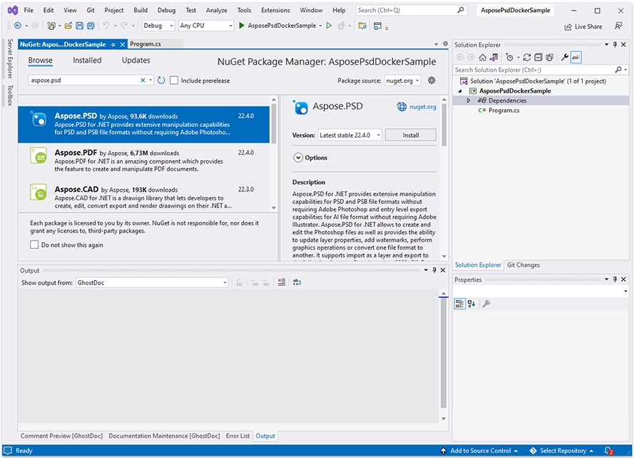

## Предварительные требования

- Docker должен быть установлен на вашей системе. Для получения информации о том, как установить Docker на Windows или Mac, обратитесь по ссылкам в разделе «См. также».

- Visual Studio 2022.

- NET 6 SDK используется в примере.

- Вы можете скачать полностью рабочий образец проекта по ссылке https://github.com/aspose-psd/Aspose.PSD-Docker-Sample

## Приложение Hello World

В этом примере вы создадите простое консольное приложение Hello World, которое открывает файл psd, обновляет текстовый слой и рисует с использованием API Graphics. Описанное приложение можно построить и запустить в Docker.

### Создание консольного приложения

Чтобы создать программу Hello World, выполните следующие действия:
1. После установки Docker убедитесь, что он использует контейнеры Linux (по умолчанию). При необходимости выберите опцию Switch to Linux containers из меню Docker Desktops.
1. В Visual Studio создайте консольное приложение NET 6. 
 
1. Установите последнюю версию Aspose.PSD из NuGet. 
 
1. Поскольку приложение будет работать на Linux, возможно, вам понадобится установить дополнительные шрифты. Вы можете предпочесть ttf-mscorefonts-installer.
1. Обратите внимание, что для использования функций рендеринга текста в Linux вам необходимо добавить следующие пакеты: apt-transport-https, libgdiplus, libc6-dev. Команды для добавления их можно найти в файле dcokerfile
1. После добавления всех необходимых зависимостей напишите простую программу, которая открывает файл PSD, обновляет текстовый слой, а затем рисует что-то с помощью графики: 



Обратите внимание, что для редактирования текстовых слоев вам нужно получить лицензию. Вы можете получить временную лицензию, используя следующую статью: https://purchase.aspose.com/temporary-license
 
### Настройка файла Dockerfile

Следующим шагом является создание и настройка файла Dockerfile.

1. Создайте Dockerfile и поместите его рядом с файлом решения вашего приложения. Не изменяйте это имя файла без расширения (по умолчанию).
1. В Dockerfile укажите:


#См. https://aka.ms/containerfastmode, чтобы понять, как Visual Studio использует этот Dockerfile для построения ваших образов для более быстрой отладки.

FROM mcr.microsoft.com/dotnet/runtime:6.0 AS base
WORKDIR /app

# Для использования возможности обновления текстовых слоев необходимо добавить следующие пакеты в контейнер
RUN apt-get update
RUN yes | apt-get install -y apt-transport-https
RUN yes | apt-get install -y libgdiplus
RUN yes | apt-get install -y libc6-dev

FROM mcr.microsoft.com/dotnet/sdk:6.0 AS build

WORKDIR /src
COPY ["AsposePsdDockerSample/AsposePsdDockerSample.csproj", "AsposePsdDockerSample/"]
RUN dotnet restore "AsposePsdDockerSample/AsposePsdDockerSample.csproj"
COPY . .
WORKDIR "/src/AsposePsdDockerSample"
RUN dotnet build "AsposePsdDockerSample.csproj" -c Release -o /app/build

FROM build AS publish
RUN dotnet publish "AsposePsdDockerSample.csproj" -c Release -o /app/publish

FROM base AS final
WORKDIR /app
COPY --from=publish /app/publish .
ENTRYPOINT ["dotnet", "AsposePsdDockerSample.dll"]


Вышеуказанный простой Dockerfile содержит следующие инструкции:

- Изображение SDK, которое будет использоваться. Здесь это изображение Microsoft .Net 6. Docker загрузит его при выполнении сборки. Версия SDK указана как тег.
- Затем добавляются зависимости для рендеринга текста.
- После этого возможно придется установить шрифты, потому что в изображении SDK содержится очень мало шрифтов. Кроме того, вы можете использовать локальные шрифты, скопированные в образ docker.
- Рабочий каталог, указанный в следующей строке.
- Команда для копирования всего в контейнер, публикации приложения и указания точки входа.

### Сборка и запуск приложения в Docker

#### Использование Visual Studio
Самым простым способом попробовать Aspose.PSD в Docker является открытие Visual Studio и запуск приложения с помощью поддержки Docker

#### Использование командной строки
Приложение можно построить и запустить в Docker с помощью командной строки. Откройте вашу любимую командную строку, измените каталог на папку с приложением (папка, где размещены файл решения и Dockerfile) и выполните следующую команду:


docker build -t asposepsddocker .


При первом выполнении этой команды это может занять больше времени, поскольку Docker должен загрузить необходимые образы. После завершения предыдущей команды выполните следующую команду:


docker run --name asposepsdcontainer asposepsddocker; docker cp asposepsddocker:/app/Output.psd .; docker cp asposepsddocker:/app/Output.png .; docker rm asposepsdcontainer


{} 

Обратите внимание на аргумент монтирования, так как, как было упомянуто ранее, папка на хост-машина монтируется в папку контейнера, чтобы легко видеть результаты выполнения приложения. Пути в Linux чувствительны к регистру.

{}

## Дополнительные примеры

Для получения дополнительных примеров того, как вы можете использовать Aspose.PSD в Docker, см. [примеры](https://github.com/aspose-psd/Aspose.PSD-for-.NET).

## См. также

- [Установка Docker Desktop на Windows](https://docs.docker.com/docker-for-windows/install/)
- [Установка Docker Desktop на Mac](https://docs.docker.com/docker-for-mac/install/)
- [Visual Studio 2022, .NET 6 SDK](https://docs.microsoft.com/en-us/dotnet/core/install/windows?tabs=net60#dependencies)
- Опция [Переключение на контейнеры Linux](https://docs.docker.com/docker-for-windows/#switch-between-windows-and-linux-containers)
- Дополнительная информация о [SDK .NET Core](https://hub.docker.com/_/microsoft-dotnet-sdk)

