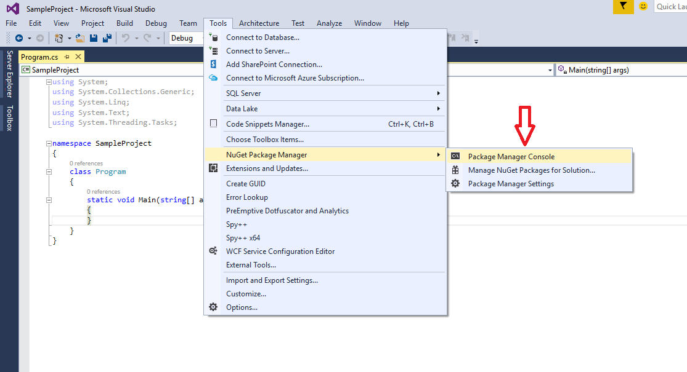
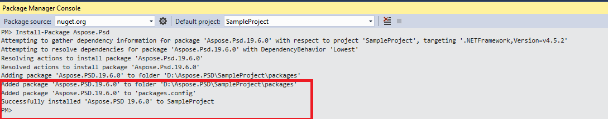

## **Установка Aspose.PSD для .NET через NuGet**
NuGet - самый простой способ загрузки и установки API Aspose для .NET. Откройте Microsoft Visual Studio и менеджер пакетов NuGet. Ищите "aspose" для поиска нужного API Aspose. Нажмите "Установить", выбранное API будет загружено и подключено к вашему проекту.

## **Установка или Обновление Aspose.PSD с помощью консоли диспетчера пакетов**
Вы можете следовать указанным ниже шагам, чтобы подключить [API Aspose.PSD](https://www.nuget.org/packages/Aspose.psd/) с помощью консоли диспетчера пакетов:

1. Откройте ваше решение/проект в Visual Studio.
1. Выберите Параметры -> Диспетчер пакетов библиотек -> Консоль диспетчера пакетов в меню для открытия консоли диспетчера пакетов.

Введите команду "**Install-Package Aspose.Psd**" и нажмите Enter, чтобы установить последний полный выпуск в ваше приложение. Кроме того, вы можете добавить суффикс "**-prerelease**" к команде, чтобы указать, что нужно установить также последний выпуск, включая исправления ошибок.

Вы увидите, что выскакивает подсказка **"Установка Aspose.PSD"** внизу окна, указывая на процесс загрузки.

После загрузки вы увидите следующие сообщения подтверждения. Если вам не знакома [Лицензионное Соглашение Пользователя от Aspose](https://company.aspose.com/legal/eula), то рекомендуется прочитать лицензию, на которую ссылается URL.

Теперь вы увидите, что Aspose.PSD успешно добавлен и подключен к вашему приложению.

В консоли диспетчера пакетов также можно использовать команду "**Update-Package Aspose.Psd**", а затем нажать Enter, чтобы проверить наличие обновлений пакета Aspose.PSD и установить их, если они есть. Можно также добавить суффикс "-prerelease" для обновления до последнего выпуска.

## **Аспекты при Запуске на Общем Сервере среды**
Всем рекомендуется запустить все компоненты .NET Aspose с установленным набором разрешений "Полный доступ". Это связано с тем, что компоненты .NET Aspose иногда нуждаются в доступе к настройкам реестра и файлам, находящимся в местах, отличающихся от виртуального каталога, например, для чтения шрифтов и т.д. Кроме того, компоненты Aspose.NET основаны на базовых классах системы .NET, часть из которых также требует пермиссии "Полный доступ" для правильного запуска в некоторых случаях.

Интернет-провайдеры, размещающие несколько приложений разных компаний, обычно применяют уровень безопасности "Средний уровень доверия". В случае .NET 2.0 такой уровень безопасности может установить следующие ограничения, которые могут повлиять на работоспособность Aspose.PSD.

- **RegistryPermission** недоступно. Это означает, что вы не можете получить доступ к реестру, что требуется для перечисления установленных шрифтов при рендеринге документов.
- **FileIOPermission** ограничен. Это означает, что вы можете получить доступ только к файлам в иерархии виртуального каталога вашего приложения. Это потенциально означает, что во время экспорта шрифты не могут быть прочитаны.

По вышеуказанным причинам рекомендуется запускать Aspose.PSD с разрешениями "Полный доступ". Вы можете обнаружить, что некоторые функции библиотеки будут работать при выполнении различных задач в режиме "Средний уровень доверия", а некоторые нет (например, рендеринг), что может быть связано с вызовами процессинга изображений GDI+.

## **Работа с DLL-файлами .NET Core, установленными через пакет MSI**

**Пожалуйста, обратите внимание:** если вы используете dll-файл формата .Net Standard, установленное через пакет MSI, вам следует добавить необходимые зависимости для работы с версией .Net Standard.

|**Скриншот зависимостей Visual Studio**|**Фрагмент файла CsProj:**|
| :- | :- |
||<ItemGroup>

`    `<PackageReference Include="System.Drawing.Common" Version="4.5.1" />

`    `<PackageReference Include="System.Text.Encoding.CodePages" Version="4.5.0" />

</ItemGroup>|

## **Системные Требования**
### **Поддерживаемые операционные системы:**
- Microsoft Windows 2000 Professional и Server (рекомендуется SP2)
- Microsoft Windows XP Professional и Home Edition
- Microsoft Windows 2003 Server
- Microsoft Windows Vista
- Microsoft Windows 2008 Server
- Microsoft Windows 2008 Server R2
- Microsoft Windows 7
- Microsoft Windows 8
- Microsoft Windows 10
- Microsoft Windows 11
### **Поддерживаемые Платформы:**
- Формы Window
- Веб-формы
- Visual Studio 2005
- Visual Studio 2008
- Visual Studio 2010
- Visual Studio 2012
- Visual Studio 2013
- Visual Studio 2015
- Visual Studio 2017
- Visual Studio 2019
- Visual Studio 2022

Aspose.PSD работает как для версий x86, так и x64 указанных выше операционных систем.
### **Поддерживаемые Фреймворки:**
Aspose.PSD для .NET поддерживает следующие версии .NET framework:

- Версия .NET Framework 2.0 и выше
- .NET Standard 2.0
