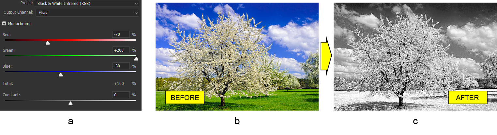

# การทำงานกับชั้นปรับปริมาณสี Channel Mixer ใน Photoshop ด้วย Java

วันนี้เราจะมาดูวิธีการผสมสีช่องในเอกสารของ Photoshop ในโปรแกรม Java โดยโปรแกรมแก้ไข Photoshop ไม่รองรับสคริปต์ Java ดังนั้นเราจะใช้ไลบรารีการจัดการรูปแบบไฟล์ PSD พิเศษที่ชื่อ Aspose.PSD for Java

ไลบรารีนี้ประกอบด้วย **API ในการทำงานกับช่องสี** มีหลายวิธีในการผสมสี แต่ในบทความนี้เราจะเน้นไปที่ชั้นปรับปริมานสีช่อง Channel Mixer

API ของชั้นปรับปริมานสี Channel Mixer **ช่วยในการประสานสีช่อง** เพื่อสร้างภาพที่มีสีขอบ หรือสร้างเอฟเฟ็กต์สีครีเอทีฟต่าง ๆ หรือแม้แต่แปลงรูปภาพเป็นรูปภาพขาวดำ ต่อไปเราจะพิจารณาวิธีการใช้ชั้นปรับปริมาสี Channel Mixer ในเอกสาร Photoshop ที่มีอยู่โดยใช้ Aspose.PSD for Java แต่ก่อนที่เราจะพูดถึงคุณสมบัติ API โดยรวม

## ภาพรวมของ API

ไม่มีอะไรพิเศษในการสร้างชั้นปรับปริมาดสี Channel Mixer มันสามารถเพิ่มผ่าน [วิธีการสร้างชั้นปรับปริมาสีดีฟอลต์](https://reference.aspose.com/psd/java/com.aspose.psd.fileformats.psd/PsdImage#addChannelMixerAdjustmentLayer--) ซึ่งจะคืนอินสแตนซ์ของคลาส ChannelMixerLayer คลาสนี้มีฟังก์ชันทั่วไป เช่น ตัวเลือกภาพขาวดำ และเมทอดสำหรับรับชอ่งเอาท์พุท ช่องออกของตัวเอง ช่องออกเฉพาะอดีต อาจเป็นหนึ่งในสองประเภท: [CmykMixerChannel](https://reference.aspose.com/psd/java/com.aspose.psd.fileformats.psd.layers.adjustmentlayers/CmykMixerChannel) หรือ [RgbMixerChannel](https://reference.aspose.com/psd/java/com.aspose.psd.fileformats.psd.layers.adjustmentlayers/RgbMixerChannel) ประเภทของ [MixerChannel](https://reference.aspose.com/psd/java/com.aspose.psd.fileformats.psd.layers.adjustmentlayers/mixerchannel) ขึ้นอยู่กับ [โหมดสี](https://reference.aspose.com/psd/java/com.aspose.psd.fileformats.psd/PsdImage#getColorMode--) ของภาพ

## ทำให้ภาพเป็นขาวดำ

ตอนนี้เราจะพิจารณาตัวอย่างการใช้ชั้นปรับปริมาณสี Channel Mixer กับเอกสาร Photoshop ที่มีอยู่ โดยเพราะชั้นปรับปริมานสีช่องนี้ยังไม่สนับสนุนโปรเซท ต้องให้ใช้การสร้างใหม่เหมือน **Black &amp; White Infrared (RGB) Photoshop preset** (a) โปรเซทจะถูกใช้กับภาพต้นไม้แตกใบแต่ยอด (b) ผลลัพธ์ที่ต้องการคือเอฟเฟ็กต์ของการถ่ายภาพอินฟราเรด (c)

 ก่อนทุกอย่าง เพื่อสร้างเอฟเฟ็กต์ Black &amp; White Infrared (RGB) Photoshop preset จำเป็นต้องเปิดธงขาวดำ และตั้งค่าไว้สำหรับแต่ละสี (สีแดง เขียว และน้ำเงิน) สำหรับช่องออกเทา:

    ChannelMixerLayer channelMixerLayer = psdImage.addChannelMixerAdjustmentLayer();
    channelMixerLayer.setMonochrome( **true** );
    RgbMixerChannel grayOutputChannel = (RgbMixerChannel)channelMixerLayer.getChannelByIndex(0);
    grayOutputChannel.setRed(( **short** )-70);
    grayOutputChannel.setGreen(( **short** )200);
    grayOutputChannel.setBlue(( **short** )-30);

ภาพจำเป็นต้องอยู่ในโหมดสี RGB เพื่อให้โค้งงาน (เนื่องจากการถ่วงกับชั้นคลาส RgbMixerChannel) โหมดสี CMYK ก็สนับสนุนแต่เฉพาะรูปภาพที่มีโหมดสีที่ตรงกัน

จำไว้ว่าระยะคุณค่าของแต่ละสีและเซตค่าคงที่ต้องอยู่ในช่วง -200 ถึง 200

## สรุป

ในบทความนี้เราได้พิจารณาวิธีการทำงานกับ Channel Mixer API ของ Aspose.PSD for Java เพื่อปรับสีในช่องสี และแปลงภาพเป็นขาวดำ
