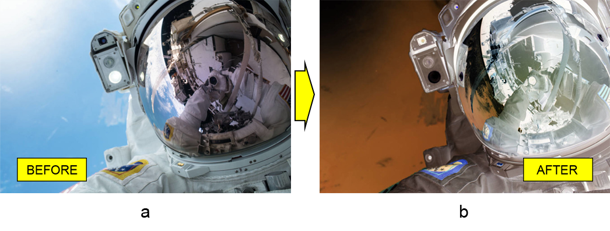

# การทำงานกับชั้นเลเยอร์ปรับแต่ง Invert ใน Photoshop ด้วย Java

ในบทความนี้ เราจะแสดงวิธีการทำให้ภาพในเอกสาร Photoshop กลายเป็นภาพลบโปรแกรมตามที่ต้องการด้วย Java สำหรับวัตถุประสงค์นี้ เราจะใช้ไลบรารีสำหรับการจัดการรูปแบบไฟล์ PSD ที่ชื่อ Aspose.PSD for Java

API การสลับสีชั้นปรับแต่งให้กับภาพถ่าย **ช่วยให้เกิดเอฟเฟ็กต์ลบ** คุณอาจเห็นวิธีการ [สลับสีภาพโดยใช้ชั้นปรับแต่งเส้นแบ่งสี](/psd/th/java/layer-types/adjustment-layer/curves/) แล้ว อย่างไรก็ตาม วันนี้เราจะพิจารณาวิธีที่รวดเร็วและง่ายในการทำงานนั้นคือ ใช้ชั้นปรับแต่ง Invert

## ภาพรวมของ API

**API ของชั้นปรับแต่ง Invert** ประกอบด้วยคลาสของชั้นเองที่ชื่อว่า [InvertAdjustmentLayer](https://reference.aspose.com/psd/java/com.aspose.psd.fileformats.psd.layers.adjustmentlayers/InvertAdjustmentLayer) คลาสนี้ไม่มีสมาชิกสาธารณะเอง เนื่องจากมันมีคุณสมบัติสาธารณะทั้งหมดจากคลาสหลัก ([AdjustmentLayer](https://reference.aspose.com/psd/java/com.aspose.psd.fileformats.psd.layers.adjustmentlayers/AdjustmentLayer)) การเรียกใช้จึงง่ายเพราะทั้งที่คุณต้องทำคือเพิ่มไปยังไฟล์ PSD และภาพก็กลายเป็นลบ

## สลับสีภาพ

ดังนั้น แม้ว่าดูเหมือนจะชัดเจน แต่เราจะแสดงเพื่อความชัดเจนว่า **ใส่ชั้นปรับแต่ง Invert เข้าไปในภาพของนักบินอวกาศ** (a) เพื่อทำเอฟเฟกลบสำหรับภาพนั้น (b)

เพื่อ **สลับสีของภาพ** แค่เพิ่มชั้นปรับแต่ง Invert เข้าไปใน PSD:

    InvertAdjustmentLayer invertAdjustmentLayer = psdImage.addInvertAdjustmentLayer();

นั่นเอง! ไม่มีคุณสมบัติที่เฉพาะเจาะจากเพื่อปรับแต่งชนิดนี้

## สรุป

ในบทความนี้ เราได้เรียนรู้เกียวกับ API ของชั้นปรับแต่ง Invert ของ Aspose.PSD for Java มันเป็นเครื่องมือที่ง่ายมากในการได้ภาพลบ เพราะ API ของชั้นปรับแต่งชนิดนี้ไม่ระบุสมาชิกสาธารณชายแล้ว
