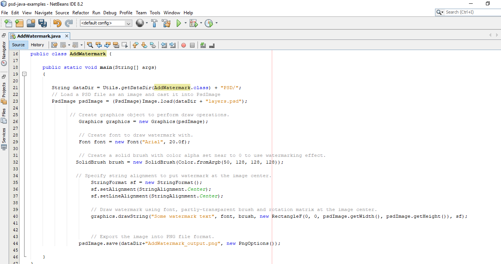

## **ดาวน์โหลดจาก GitHub**
ตัวอย่าง Aspose.PSD สำหรับ Java ทั้งหมดถูกโฮสต์บน [Github](https://github.com/aspose-psd/Aspose.PSD-for-Java) คุณสามารถคลังที่เก็บได้โดยใช้ Github client หรือดาวน์โหลดไฟล์ ZIP จาก [ที่นี่](https://github.com/aspose-psd/Aspose.PSD-for-Java/archive/master.zip) 

แตกไฟล์ ZIP บนคอมพิวเตอร์ของคุณ คุณจะพบโฟลเดอร์ **Examples** ตัวอย่างทั้งหมดจะตั้งอยู่ในโฟลเดอร์ **Examples**

คุณสามารถรัน/ดำเนินการตัวอย่างเหล่านี้ด้วย IDE ของคุณ, อย่างไรก็ตาม, เพื่อจำลองเราใช้ **NetBeans** ให้ใช้ **File -> Open** **Project** ตัวเลือกเพื่อนำเข้าตัวอย่างของคุณและระบุเส้นทาง

เพิ่มไฟล์ jar ที่จำเป็น (Libraries) ในโปรเจค

โฟลเดอร์ **Resources** ประกอบไปด้วยเอกสาร/ไฟล์นำเข้าที่ถูกอ้างถึงในตัวอย่าง

{}

คุณยังสามารถนำเข้าตัวอย่างโดยตรงจากคลังที่เก็บของ GitHub

{}

## **มีส่วนร่วม**
หากคุณต้องการเพิ่มหรือปรับปรุงตัวอย่าง เราขอเชิญให้มีส่วนร่วมในโครงการ ตัวอย่างและโปรเจคที่แสดงในคลังเก็บของนี้เปิดเผยและสามารถใช้ได้อย่างอิสระในแอปพลิเคชันของคุณเอง

เพื่อมีส่วนร่วม, คุณสามารถ fork คลังเก็บ, แก้ไขโค้ดต้นฉบับและสร้าง pull request พวกเราจะตรวจสอบการเปลี่ยนแปลงและรวมด้วยกรณีที่มีประโยชน์
