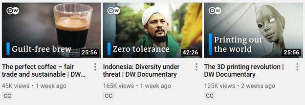

## **บทนำ**
วัตถุประสงค์ของเอกสารนี้คือการสาธิตใช้ API ของเครื่องมือผสมบางส่วนของ [Aspose.PSD สำหรับ Java](https://products.aspose.com/psd/java) ในตัวอย่างจริงๆ ในบทความนี้ **โปรแกรม Java ที่เรียบง่ายที่สร้างภาพตัวอย่าง YouTube thumbnails** สำหรับช่อง [DW Documentary](https://www.youtube.com/channel/UCW39zufHfsuGgpLviKh297Q) จะถูกเขียนและอธิบาย. ช่องนี้ได้ถูกเลือกมาจากโลกของจริงเพราะภาพนี้มีมาตรฐานเป็นพิเศษ และพวกเขาสาธิตการใช้งานของเครื่องมือผสมที่ได้รับความนิยมของ Aspose.PSD สำหรับ Java บางตัว (เช่นการให้การแสงเงา, การเติมสีไล่วงและการวาดข้อความและรูปร่าง):

## **วิธีการทำงานโดยสรุป**
โปรแกรม Java เรียบง่ายนำอาร์กีวเม้นต์สองจำนวนเข้ามา: คำอธิบายและภาพ มีการสร้าง **เอกสารภาพสเกียร์ (PSD) ในหน่วยความจำ** จากอาร์กีวเมนต์นั้นโดยใช้ Aspose.PSD สำหรับ Java. จากนั้น โปรแกรม **แปลงเอกสารจาก PSD เป็นรูปแบบไฟล์ PNG** เพื่อให้ได้ thumbnail ของ YouTube ขนาด 1280x720 พิกเซล. ภาพผลลัพท์มีลักษณะเป็นดังนี้:

## **ข้อกำหนดทางเทคนิค**
เทคโนโลยีต่อไปนี้จำเป็นต้องสำเร็จในการรันโค้ดของบทความนี้:

- Java 6+
- [Aspose.PSD สำหรับ Java](/psd/th/java/installation/) (ล่าสุด)

## **เริ่มต้นทำงาน**
เนื่องจากได้แสดงไว้แล้วว่าโปรแกรมใช้ PSD ในหน่วยความจำเพื่อสร้างภาพขนาดเล็ก ดังนั้น เริ่มต้นโดยเรา **สร้างเอกสาร PSD** กัน:

PsdImage psdImage = new PsdImage(1280, 720);

หากคุณมองอย่างใกล้ชิดที่ภาพยูทูปทั้งสองด้านข้าง คุณอาจสังเกต **ว่ามีส่วนประกอบหลายอย่าง**:

1. รูปภาพพื้นหลัง (หน้ากากที่พิมพ์)
1. การไล่ระบายรูปเร้ทัน (เน้นที่ตำแหน่งบนขวาของด้านบน)
1. โลโกทัพพีลพัฒน์ที่มีเอฟเฟคเงา
1. คำอธิบายและการวาดเร็กเทงเกิ้ล (สี่เหลี่ยมสีน้ำเงิน)

ขอให้เราทำการศึกษาลึก ๆ เพื่อดูว่าจะสามารถทำการภาพประกอบแต่ละส่วนได้อย่างไรโดยใช้ Aspose.PSD สำหรับ Java ในส่วนถัดไป

## **1. เพิ่มรูปภาพพื้นหลัง**
ลำดับของเลเยอร์เป็นสิ่งสำคัญ เพราะว่าควรเพิ่มรูปภาพพื้นหลังก่อนเพื่อไม่ให้ทับกันด้วยเลเยอร์อื่น ๆ ควรสังเกตว่าในขณะนี้รองรับเฉพาะ [รูปแบบไฟล์ราสเตอร์](/psd/th/java/supported-file-formats/) เท่านั้นในตอนนี้
### **1.1. เพิ่มรูปภาพพื้นหลังใส่เลเยอร์ฟอร์โต้ชอป**
เพื่อ **เพิ่มรูปภาพชนิดราสเตอร์เข้าไปใน PSD** จะต้องส่งสตรีมอินพุตเป็นอาร์กีวเมนต์ขณะสร้างเลเยอร์ (ดูเพิ่มเติม [ตัวอย่างของการโหลดรูปภาพราสเตอร์](https://docs.aspose.com/display/psdnet/Creating%2C+Opening+and+Saving+Images)):



1.2. ทำให้รูปภาพพื้นหลังพอดีกับแคนวาส

การทำการขยาย, และตำแหน่งเป็นประโยชน์สำหรับกรณีที่ **ขนาดของรูปภาพแตกต่างจากขนาดแคนวาส**, ถึงแม้รูปภาพในบทความนี้จะมีขนาดเดียวกับแคนวาส (ถือว่าจะไม่เสมอตลอดชีวิต)

ตรวจสอบว่ารูปภาพที่โหลดมีขนาดที่พอดีกับแคนวาสว่า(ดูเพิ่มเติม [ตัวอย่างของการเปลี่ยนขนาด](https://docs.aspose.com/display/psdnet/Crop%2C+Rotate+and+Resize+Images#Crop,RotateandResizeImages-ResizingImages)):



หลังจากทำการเปลี่ยนขนาด ตำแหน่งของรูปภาพก็ถือว่าเปลี่ยนแปลงไปด้วย ด้วยเหตุนี้ ให้ **รีเซ็ตตำแหน่งของรูปภาพใหม่**, เคลื่อนย้ายรูปภาพที่เปลี่ยนขนาดแล้วไปยังมุมบนซ้ายตาม:



## **2. เพิ่มการไล่ระบายเร้ทัน**
มี **วิธีการสองแบบในการเพิ่มการไล่ระบายเร้ทัน**, โดยใช้:

- การใช้ [เอฟเฟคฝ้า](/psd/th/java/aspose-psd-for-java-20-4-release-notes/#-~-text=psdjava-163) บนเลเยอร์ที่มีอยู่ (เอฟเฟคไล่ระบายที่ผูกติดกับเลเยอร์ปัจจุบันและใช้กับเนื้อหาของมัน)
- ชั้นการเติมลูกเล่นย้อนกลบสีจาก [การสนับสนุนของชั้นการเติมลูกเล่นแบบไล่ระบาย](/psd/th/java/support-of-fill-layers/#supportoffilllayers-supportoffilllayerswithgradientfill) เลเยอร์ใหม่(ชั้นโดยแยกที่เก็บการกำหนดค่าของการไล่ระบายเท่านั้น)

มีข้อเพียงพอที่ใช้เอฟเฟคฝ้าปกติสำหรับตัวอย่างนี้ อย่างไรก็ตาม เพื่อให้บทความนี้มีความสนุกและสมควร **ชั้นการเติมลูกเล่นไล่ระบาย ถูกใช้** เนื่องจากเอฟเฟคทุกชั้นที่ใช้ในลักษณะเดียวกันและเอฟเฟคชั้นอื่น ๆ จะถูกใช้ในส่วนถัดไป

### **2.1. เพิ่มชั้นการเติมลูกเล่นไล่ระบายเร้ทัน**
กระบวนการการเพิ่มชั้นการเติมลูกเล่นใหม่ประกอบด้วยขั้นตอนต่อไปนี้:

\1. จำเป็นต้อง **ประกาศการกำหนดค่าการเติมลูกเล่น** เนื่องจากไม่มีการกำหนดไว้ล่วงหนับ การกำหนดค่าขั้นต่ำมีลักษณะดังนี้ (หมายถึงค่าคงที่ที่จำเป็นรวมถึงชนิดของการไล่ระบาย, มาตราสเกล, สี และจุดโปร่งใส):



การกำหนดค่าข้างต้นระบายหมุนได้ที่ส่วนของการเทียบเติมลูกเล่นลักษณะโปร่งใสและสีน้ำเงินในศูนย์กลาง ตำแหน่งของการไล่ระบายอยู่ตรงกลางของแคนวาสโดยปราศจาก

เมื่อการกำหนดค่าเสร็จแล้ว เพิ่มชั้นการเติมลูกเล่นไล่ระบายพร้อมกับการกำหนดค่าของมันเข้าไปใน PSD:



## **เพิ่มโลโกทัพพีลพัฒน์พร้อมกับเอฟเฟคเงา**
เอฟเฟคเงาเป็นเอฟเฟคที่ช่วยในการเพิ่มเงาที่กำหนดเองตามเส้นเขตของวัตถุ (รูปภาพ, ข้อความ เป็นต้น)
### **3.1. เพิ่มโลโกทัพพีลพัฒน์ใส่เลเยอร์ฟอร์โต้ชอป**
วิธีการเดียวกันกับในส่วน 1.1. สามารถใช้ได้เพื่อ **เพิ่มโลโกทัพพีลพัฒน์ใน PSD**:



### **3.2. ตำแหน่งโลโกทัพพีลพัฒน์**
รูปภาพที่โหลดมีการติดสุดติดกับมุมบนซ้ายโดยค่าเริ่มต้น. แต่ก็ต้อง **เพิ่มระยะขอบ** เพื่อให้ดูเหมือนที่มุมกระดาษโชว์ภาพวิดีโอบนช่อง ดังนั้น ตำแหน่งของรูปภาพต้องการที่ออกจากขอบเส้นของเ