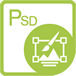

{} 

****

**ยินดีต้อนรับสู่ Aspose.PSD สำหรับ .NET**

Aspose.PSD สำหรับ .NET เป็นสินค้าที่ช่วยให้เราสามารถทำการปรับแต่งไฟล์รูปแบบ PSD ได้อย่างครอบคลุม โดยไม่ต้องติดตั้ง Adobe Photoshop เครื่องที่ใช้ Aspose.PSD สำหรับ .NET สามารถแก้ไขไฟล์ PSD, อัปเดตคุณสมบัติเลเยอร์, เพิ่มลายน้ำ, ดำเนินการกราฟิก หรือแปลงรูปแบบไฟล์จากอันหนึ่งไปสู่อีกอันหนึ่งได้ ผลิตภัณฑ์นี้สามารถใช้งานในสถานการณ์อัตโนมัติต่าง ๆ ที่ช่วยให้นักพัฒนาบนทางเดินของพวกเขา

ในปัจจุบัน Aspose.PSD สำหรับ .NET รองรับรูปแบบไฟล์ PSD และ PSB สำหรับการโหลดและการปรับแต่ง ในอนาคต จะมีเวอร์ชันอื่นที่จะช่วยให้ได้โหลดรูปแบบไฟล์ PSD เพิ่มเติม Aspose.PSD สำหรับ .NET ช่วยให้สามารถส่งออกไปยังรูปแบบไฟล์ราสเตอร์ต่าง ๆ เช่น TIFF, JPEG, JPEG2000, PNG, GIF, BMP และรูปแบบไฟล์อื่น ๆ ที่รองรับการส่งออกจะถูกเพิ่มเติมผลิตภัณฑ์ใช้อัลกอริทึมซึ่งช่วยในการดำเนินการแก้ไขไฟล์ PSD อย่างมีประสิทธิภาพและรักษาประสิทธิภาพที่ดี ผลิตภัณฑ์นี้ถูกพัฒนาอย่างใกล้ชิดและจะเพิ่มคุณลักษณะที่มีประโยชน์มากมายเพื่อรองรับความต้องการในตลาด ตัวอย่างเช่น การพัฒนาการรองรับ .NET Core อย่างใกล้ชิด

{} 

{} 

****

**กรุณาเช็ค [เอ็ดาปเตอร์ Aspose.PSD](/th/psd/net/adapters) สำหรับ .NET หากคุณต้องการประมวลผลรูปแบบเพิ่มเติมใน Aspose.PSD**

เอ็ดาปเตอร์ Aspose.PSD สำหรับ .NET เป็นหนึ่งในนูเก็ตแพคเกจพิเศษที่ช่วยให้คุณเขียนรหัสการผสานกับผลิตภัณฑ์ Aspose อื่น ๆ ได้น้อยลง

เช่น เช่น ภายในปกติ เพื่อเปิดไฟล์รูปแบบที่ Aspose.PSD ไม่รองรับ เช่น SVG หรือ WEBP คุณจะต้องโหลดรูปแบบเหล่านี้โดยใช้ Aspose.Imaging แล้วเขียนรหัสการผสานเพื่อแปลงเป็นรูปแบบที่ Aspose.PSD รองรับ เอ็ดาปเตอร์ช่วยแก้ไขความจำเป็นของรหัสเพิ่มเติมและช่วยคุณประหยัดเวลา

{} 

## **ทรัพยากร Aspose.PSD สำหรับ .NET**

ต่อไปนี้คือลิงก์ที่คุณอาจต้องการไปยังทรัพยากรบางส่วนที่ช่วยให้คุณสามารถทำงานของคุณสำเร็จ

- [เอกสารออนไลน์ Aspose.PSD สำหรับ .NET](/th/psd/net/)
- [คุณสมบัติ Aspose.PSD สำหรับ .NET](/th/psd/net/features/)
- [บันทึกการอัพเดท Aspose.PSD สำหรับ .NET](/th/psd/net/release-notes/)
- [หน้าผลิตภัณฑ์ Aspose.PSD สำหรับ .NET](https://products.aspose.com/psd/net)
- [ติดตั้ง pachage NuGet Aspose.PSD สำหรับ .NET](https://www.nuget.org/packages/Aspose.PSD/)
- [คู่มือโครงสร้าง API Aspose.PSD สำหรับ .NET](https://reference.aspose.com/net/psd)
- [ดาวน์โหลดตัวอย่างที่เก็บที่เก็บ GitHub](https://github.com/aspose-psd/Aspose.PSD-for-.NET)
- [ฟอรั่มสนับสนุนฟรี Aspose.PSD สำหรับ .NET](https://forum.aspose.com/c/psd)
- [ฮีลเดสก์สนับสนุนกับการจ่ายค่า Aspose.PSD สำหรับ .NET](https://helpdesk.aspose.com/)
