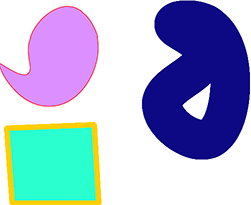

ใช้ Aspose.PSD คุณสามารถแปลงไฟล์รุ่นที่รองรับของ AI เป็นรูปแบบ Png ได้ Png เป็นรูปแบบไฟล์กราฟิกแบบราสเตอร์ที่สนับสนุนการบีบอัดข้อมูลโดยไม่สูญเสีย นอกจากนี้ Png ยังสนับสนุนความโปร่งใส [การแสดงภาพแบบราสเตอร์ของไฟล์ Ai](/psd/th/net/converting-ai-image-to-raster-format/) บนเซิร์ฟเวอร์สามารถถูกอัตโนมัติ สำหรับการส่งออก Ai คุณต้องใช้ส่วนโค้ดต่อไปนี้:

โค้ดตัวอย่างที่ให้ด้านล่างนี้แสดงวิธีการส่งออกไฟล์ AI เป็นรูปแบบ Png โปรแกรมเมอร์ได้โดยโปรแกรม



ด้วย Aspose.PSD คุณสามารถกำหนดระดับบีบอัด Png คุณสามารถใช้การบีบอัด Png แบบ Progressive และเปลี่ยน [ประเภทสี](https://reference.aspose.com/psd/net/aspose.psd.imageoptions/pngoptions/properties/colortype) ของไฟล์ Png [Png Options](https://reference.aspose.com/psd/net/aspose.psd.imageoptions/pngoptions) มีคุณสมบัติต่าง ๆ สำหรับทุกกรณีของการส่งออก AI

รูปแบบ AI สนับสนุนการเปลี่ยนความใโปร่งใสสำหรับข้อมูลเวกเตอร์ และ Png สนับสนุนความโปร่งใส ดังนั้นการผสมรูปแบบสองแบบนี้สามารถช่วยคุณในการทำระบบอ้อมไฟล์ได้อย่างอัตโนมัติ
## **ตัวอย่างของความสามารถในการส่งออกไฟล์ AI เป็น Png ปัจจุบัน**
-----

|**ตัวอย่าง**|**รายละเอียด**|
| :- | :- |
||
การส่งออกของไฟล์ AI รวมถึงความสามารถ

ในการแสดงภาพเบื้องต้น

ด้วยพื้นหลังและเส้นกรอบที่แตกต่าง

ด้วยน้ำหนักที่กำหนดเอง
|
||
การแสดงเส้นทางที่ซับซ้อนจากไฟล์ AI

โดยใช้ C# API โดยไม่ต้องใช้ Adobe Illustrator
|
