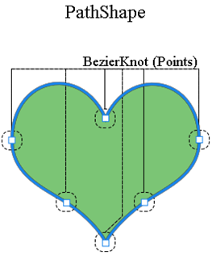

## **ภาพรวมของ Vector Mask ในเลเยอร์**
Vector mask เป็นเส้นทางที่ไม่ขึ้นอยู่กับความละเอียดที่ตัดข้อความของเลเยอร์ออกไป การใส่ vector mask มักจะแม่นยำกว่าการสร้างด้วยเครื่องมือที่ใช้ pixel คุณสร้าง vector mask ด้วยเครื่องมือด้ามหรือรูปร่าง

Aspose.PSD รองรับการเรนเดอร์และการใช้ vector mask คุณสามารถแก้ไข vector mask โดยการแก้ไขของ Vector Paths

## **เส้นทาง Vector ใน Aspose.PSD**
การเข้าถึงเส้นทาง vector ใน Aspose.PSD ได้ผ่าน [VsmsResouce](https://reference.aspose.com/psd/net/aspose.psd.fileformats.psd.layers.layerresources/vsmsresource) และ [VmskResouce](https://reference.aspose.com/psd/net/aspose.psd.fileformats.psd.layers.layerresources/vmskresource) ที่เป็นคลาสลูกของ [VectorPathDataResource](https://reference.aspose.com/psd/net/aspose.psd.fileformats.psd.layers.layerresources/vectorpathdataresource)

## **วิธีแก้ไขเส้นทาง vector?**
### **โครงสร้างเส้นทาง vector**
โครงสร้างหลักในการจัดการเส้นทางคือ [VectorPathRecord.](https://reference.aspose.com/psd/net/aspose.psd.fileformats.core.vectorpaths/vectorpathrecord) แต่เพื่อความสะดวกของคุณ โครงสร้างต่อไปนี้ถูกแนะนำ

สำหรับการแก้ไขเส้นทาง vector อย่างสะดวก คุณควรใช้คลาส [VectorPath](https://gist.github.com/aspose-com-gists/8a4c9d34ce856d1642fc7c0ce974175c#file-examples-csharp-aspose-workingwithvectorpaths-classestomanipulatevectorpathobjects-classestomanipulatevectorpathobjects-cs) ซึ่งมีเมทอดสำหรับการแก้ไขข้อมูล vector ในทรัพยากรที่ได้มาจาก VectorPathDataResource

เริ่มต้นด้วยการสร้างออบเจ็กต์ของประเภท VectorPath

สำหรับความสะดวก คุณสามารถใช้เมทอดแบบสแตติก [VectorDataProvider.CreateVectorPathForLayer](https://gist.github.com/aspose-com-gists/8a4c9d34ce856d1642fc7c0ce974175c#file-examples-csharp-aspose-workingwithvectorpaths-classestomanipulatevectorpathobjects-classestomanipulatevectorpathobjects-cs) มันจะค้นหาทรัพยากร vector ในเลเยอร์นำเข้าและสร้างออบเจ็กต์ VectorPath จากนั้น

หลังจากการแก้ไขทั้งหมด คุณสามารถปรับใช้ออบเจ็กต์ VectorPath กับการเปลี่ยนแปลงกลับไปยังเลเยอร์โดยใช้เมทอดแบบสแตติก [VectorDataProvider.UpdateLayerFromVectorPath](https://gist.github.com/aspose-com-gists/8a4c9d34ce856d1642fc7c0ce974175c#file-examples-csharp-aspose-workingwithvectorpaths-classestomanipulatevectorpathobjects-classestomanipulatevectorpathobjects-cs)



ประเภท VectorPath มีรายการของ [PathShape](https://gist.github.com/aspose-com-gists/8a4c9d34ce856d1642fc7c0ce974175c#file-examples-csharp-aspose-workingwithvectorpaths-classestomanipulatevectorpathobjects-classestomanipulatevectorpathobjects-cs) องค์ประกอบและระบุภาพเวกเตอร์ทั้งหมดที่สามารถประกอบด้วยรูปร่างหรือหลายรูปร่าง

แต่ละ PathShape เป็นรูปร่างเวกเตอร์ที่ประกอบด้วยเซ็ตอิสระของจุดเบเซียร์

จุดเบเซียร์คือวัตถุของประเภท [BezierKnot](https://gist.github.com/aspose-com-gists/8a4c9d34ce856d1642fc7c0ce974175c#file-examples-csharp-aspose-workingwithvectorpaths-classestomanipulatevectorpathobjects-classestomanipulatevectorpathobjects-cs) ซึ่งพื้นฐานของรูปตัวลูกปัจจุบัน

ตัวอย่างโค้ดต่อไปนี้แสดงถึงวิธีเข้าถึงเรขาภิคตาและจุด


### **วิธีสร้างรูปร่าง?**
เพื่อแก้ไขรูปร่าง ต้องเรียกมาร์กเจ็ตที่มีอยู่จาก [VectorPath.Shapes](https://gist.github.com/aspose-com-gists/8a4c9d34ce856d1642fc7c0ce974175c#file-examples-csharp-aspose-workingwithvectorpaths-classestomanipulatevectorpathobjects-classestomanipulatevectorpathobjects-cs) ลิสต์ หรือเพิ่มรูปร่างใหม่โดยการสร้างอินสแตนซ์ [PathShape](https://gist.github.com/aspose-com-gists/8a4c9d34ce856d1642fc7c0ce974175c#file-examples-csharp-aspose-workingwithvectorpaths-classestomanipulatevectorpathobjects-classestomanipulatevectorpathobjects-cs) และเพิ่มลงใน [Shapes](https://gist.github.com/aspose-com-gists/8a4c9d34ce856d1642fc7c0ce974175c#file-examples-csharp-aspose-workingwithvectorpaths-classestomanipulatevectorpathobjects-classestomanipulatevectorpathobjects-cs) ลิสต์


### **วิธีเพิ่มจุด (ข้อความ)?**
คุณสามารถจัดการจุดของรูปร่างเป็นสมาชิกของรายการปกติโดยใช้คุณสมบัติ PathShape.Points เช่น คุณสามารถเพิ่มจุดรูปร่าง:



BezierKnot ประกอบด้วยจุด Anchor และจุด Control สองประการ

ถ้าจุด Anchor และจุด Control มีค่าเดียวกัน แล้วโหนดนั้นจะมีมุมแห้ง

เพื่อเปลี่ยนตำแหน่งจุด Anchor พร้อมกับจุดควบคุม (คล้ายกับวิธีที่เกิดขึ้นใน Photoshop) BezierKnot มีเมทอด Shift

ตัวอย่างโค้ดต่อไปนี้แสดงการเลื่อนเบเซียร์น็อตทั้งหมดขึ้นตามแนวตั้งโดยพิกยอด Y

คุณสามารถจัดการจุดของรูปร่างเป็นสมาชิกของรายการปกติโดยใช้คุณสมบัติ PathShape.Points เช่น คุณสามารถเพิ่มจุดรูปร่าง:



## **คุณสมบัติของ PathShape**
การแก้ไข PathShape ไม่จำกัดในการแก้ไขหลัก ประเภทนี้ยังมีคุณสมบัติอื่น ๆ อีก

### **PathOperations (การปฏิบัติ Boolean)**
คุณสมบัติ [PathOperations](https://reference.aspose.com/psd/net/aspose.psd.fileformats.core.vectorpaths/pathoperations) เป็นการปฏิบัติบูลีเลียน การเปลี่ยนค่าในการกำหนดว่ารูปร่างหลาย ๆ ชิ้นถูกผสมเข้าด้วยกันอย่างไร

มีค่าผลเลือกต่อไปนี้:

- 0 = ไม่รวมรูปร่างทับกัน (การปฏิบัติ XOR)
- 1 = รวมรูปร่าง (การปฏิบัติ OR)
- 2 = ลบรูปร่างด้านหน้า (การปฏิบัติ NOT)
- 3 = ตัดพื้นที่รูปร่าง (การปฏิบัติ AND)

### **คุณสมบัติ IsClosed**
นอกจากนี้ ใช้อินสแตนซ์ของคุณสมบัติ PathShape.IsClosed เราสามารถกำหนดว่าจุดเริ่มและจุดสุดท้ายของรูปร่างเชื่อมกันหรือไม่

| **รูปร่างที่ปิด** | **รูปร่างที่เปิด** |
| :- | :- |
|  |  |

### **FillColor Property**
รูปร่างใดก็สามารถมีสีของตัวเอง ดังนั้นคุณสามารถเปลี่ยนสีสตรีมทั้งหมดของเส้นทางเวกเตอร์ด้วยคุณสมบัติ VectorPath.FillColor

คุณสามารถจัดการจุดของรูปร่างเป็นสมาชิกของรายการปกติโดยใช้คุณสมบัติ PathShape.Points เช่น คุณสามารถเพิ่มจุดรูปร่าง:



## **ที่นี่คุณจะพบรหัสต้นฉบับของ VectorDataProvider และคลาสที่เกี่ยวข้อง:**

