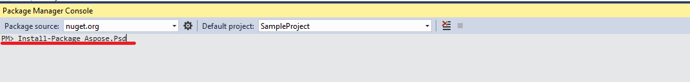

## **การติดตั้ง Aspose.PSD สำหรับ .NET ผ่าน NuGet**
NuGet เป็นวิธีที่ง่ายที่สุดในการดาวน์โหลดและติดตั้ง Aspose APIs สำหรับ .NET ใน Microsoft Visual Studio และ NuGet package manager โปรดค้นหา "aspose" เพื่อค้นหา Aspose API ที่ต้องการคลิกที่ "Install", API ที่เลือกจะถูกดาวน์โหลดและทำการอ้างอิงในโปรเจกต์ของคุณ

## **ติดตั้งหรืออัพเดท Aspose.PSD ด้วย Package Manager Console**
คุณสามารถทำตามขั้นตอนด้านล่างเพื่ออ้างอิง [Aspose.PSD API](https://www.nuget.org/packages/Aspose.psd/) โดยใช้ package manager console:

1. เปิดโซลูชัน/โปรเจคของคุณใน Visual Studio
1. เลือก Tools -> Library Package Manager -> Package Manager Console จากเมนูเพื่อเปิด package manager console

พิมพ์คำสั่ง “**Install-Package Aspose.Psd**” และกด enter เพื่อติดตั้งเวอร์ชันเต็มล่าสุดลงในแอปพลิเคชั่นของคุณ สำหรับกรณีอื่น ๆ คุณสามารถเพิ่มคำส่วนต่อท้าย "**-prerelease**" ในคำสั่งเพื่อระบุว่าต้องการติดตั้งเวอร์ชันล่าสุดพร้อมกับการแก้ไขปัญหาร้อนเหล่านั้นด้วย

คุณจะเห็นว่าเคล็ดลับ **"Installing Aspose.PSD"** ปรากฏด้านล่างหน้าต่างชี้วัตถุนี้ต่อไป ระบุว่าขั้นตอนการดาวน์โหลดกำลังดำเนินการ

เมื่อดาวน์โหลดเสร็จแล้ว คุณจะเห็นข้อความยืนยันต่อไปนี้ หากคุณไม่คุ้นเคยกับ [Aspose EULA](https://company.aspose.com/legal/eula) คุณควรอ่านใบอนุญาตที่อ้างถึงใน URL นั้น

คุณควรพบว่า Aspose.PSD ได้ถูกเพิ่มและอ้างอิงอย่างประสบความสำเร็จในแอปพลิเคชั่นของคุณแล้ว

ใน package manager console, คุณยังสามารถใช้คำสั่ง “**Update-Package Aspose.Psd**” และกด enter เพื่อตรวจสอบการอัปเดต Aspose.Psd package และติดตั้งแก้ไขให้มีอยู่หากมี
## **ข้อคิณะเมื่อใช้บนระบบเซิร์ฟเวอร์ร่วมแบ่ง**
ทุกอย่างที่อยู่ใน Aspose .NET component แนะนำให้ใช้กับที่คุณละ Permission แบบ full trust นี้เพราะ Aspose .NET component บางครั้งต้องการเข้าถึงการตั้งค่าวงจรมีล็อก และไฟล์ที่ตั้งอยู่ที่สถานที่อื่นๆนอกจากไดเร็คทอรี่เสมือน เช่น สำหรับการอ่านฟ้อนต่าง ๆ อย่างนี้ นอกจากนี้ Aspose.NET components จะอิงจากคลาสระบบ .NET ในรหัสหลักบางภาคต้องการใบอนุญาตเดียวกันกันเช่น 

ผู้ให้บริการอินเทอร์เน็ตที่ให้บริการหลากหลายแอปพลิเคชั่นจากบริษัทต่าง ๆ ส่วนมาก บังคับใช้ระดับความปลอดภัยของด้านผลิตธุรกิจ ในกรณีของ .NET 2.0 ระดับความปลอดภัยดังกล่าวอาจกำหนดข้อจำกัดต่อไปนี้ซึ่งอาจส่งผลกระทบต่อความสามารถของ Aspose.Words เมื่อปฏิบัติอย่างถูกต้อง

- **RegistryPermission** ไม่สามารถใช้ได้ นั้นหมายความว่าคุณไม่สามารถเข้าถึงทะเบียน ซึ่งจำเป็นต้องนับไฟล์บนเครื่องตอนนำไปแสดงผลบันทึก
- **FileIOPermission** ถูก จำกัด หมายความว่าคุณสามารถเข้าถึงไฟล์ในโครมไดเรโครทอรีของแอพพลิเคชั่นของคุณเท่านั้น นี่อาจจะหมายถึงฟ้อต ไมอาจมีการอ่านในขณะที่ส่งออก

เพื่อเหตุผ่านที่ได้ระบุไว้ข้างต้น ขอแนะนำให้ Aspose.PSD ที่หลีกเลี่ยงให้รันด้วยสิทธิ์การอนุญาตแบบเต็ม Full Trust อาจพบว่าหลายลักษณะของไลบรารีจะทำงานเมื่อปฏิบัติหลากหลายงานใน Medium trust ในขณะที่บางอย่า (เช่น การแสดงตัวอย่าง) ที่อาจเกิดการโทรเข้าออกไารายการกระบวมู่คำสั่ง GDI+ image processing.

## **การใช้งาน .NET Core DLLs ที่ติดตั้งผ่านแพ็กเกจ MSI**

**โปรดทราบ:** หากคุณใช้ .Net Standard dll ที่ติดตั้งผ่านแพ็คเกจ MSI คุณควรเพิ่มข้อจำเป็นเพื่อที่จะทำงานด้วยเวอร์ชัน .Net Standard

|**ภาพถ่ายความที่ความ่**|**片段ไฟล์ CsProj:**|
| :- | :- |
||<ItemGroup>

`    `<PackageReference Include="System.Drawing.Common" Version="4.5.1" />

`    `<PackageReference Include="System.Text.Encoding.CodePages" Version="4.5.0" />

</ItemGroup>|

## **ความต้องการของระบบ**
### **ระบบปฏิบัติการที่รองรับ:**
- Microsoft Windows 2000 Professional และ Server (แนะนำ SP2)
- Microsoft Windows XP Professional และ Home Edition
- Microsoft Windows 2003 Server
- Microsoft Windows Vista
- Microsoft Windows 2008 Server
- Microsoft Windows 2008 Server R2
- Microsoft Windows 7
- Microsoft Windows 8
- Microsoft Windows 10
- Microsoft Windows 11
### **แพลตฟอร์มที่รองรับ:**
- แบบฟอร์มหน้าต่าง
- แบบฟอร์มเว็บ
- Visual Studio 2005
- Visual Studio 2008
- Visual Studio 2010
- Visual Studio 2012
- Visual Studio 2013
- Visual Studio 2015
- Visual Studio 2017
- Visual Studio 2019
- Visual Studio 2022

Aspose.PSD ทำงานสำหรับเวอร์ชัน x86 และ x64 ของระบบปฏิบัติการที่ระบุไว้ข้างต้น
### **Framework ที่รองรับ:**
Aspose.PSD for .NET รองรับ .NET framework ดังนี้:

- .NET Framework เวอร์ชัน 2.0 หรือสูงกว่า
- .NET Standard 2.0
