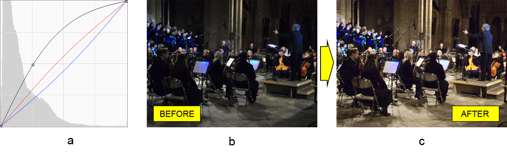

# Java'da Photoshop Eğriler Ayarlama Katmanı ile Çalışmak

Bu makalenin amacı, Adobe® Photoshop® belgelerinde **eğriler ayarlama katmanları ile çalışırken** Aspose.PSD kütüphanesinin Java kullanım yeteneklerini göstermektir. Kütüphane tamamen otonomdur. Dolayısıyla, Photoshop fotoğraf düzenleyicisi kurulmadan çalışır. [Özelliklerin tam listesi](https://docs.aspose.com/psd/java/features/) bilgi tabanımızda bulunabilir. Şimdi tekrar Eğriler konusuna dönelim.

## API Genel Bakış

Eğriler aracı, grafiğin en üst sağ köşesinde vurgularla ve en alt sağ köşede gölgelerle temsil edilen bir çizgi (eğri) olarak temsil edilebilir.

Kütüphane, eğriyle çalışmak için API sağlar, yani, [CurvesLayer](https://reference.aspose.com/psd/java/com.aspose.psd.fileformats.psd.layers.adjustmentlayers/CurvesLayer) sınıfı. Ancak, bu sınıfın eğriyle çalışmak için **tamamen farklı iki yaklaşımı** vardır. Bu nedenle, eğriyi aynı anda bir kez düzenlenebilir iki moddan birinde düzenleyebilir:

- Sürekli (eğri, eğilmenin olduğu yerlerde noktalarla bir yol olarak temsil edilir)
- Ayrık (eğri, noktalı bir çizgi olarak temsil edilir)

Bu nedenle, kütüphanenin [sürekli](https://reference.aspose.com/psd/java/com.aspose.psd.fileformats.psd.layers.layerresources/curvescontinuousmanager) ve [ayrık yöneticileri](https://reference.aspose.com/psd/java/com.aspose.psd.fileformats.psd.layers.layerresources/CurvesDiscreteManager) kullanarak eğriyi nasıl değiştireceğimizi bir örnekle açıklayacağız.

## Eğriler Sürekli Yöneticisini Kullanarak Renk ve Tonu Ayarlama

[Eğriler Sürekli Yöneticisi](https://reference.aspose.com/psd/java/com.aspose.psd.fileformats.psd.layers.layerresources/CurvesContinuousManager) ile, kompozit kanal (RGB) ve her bir renk kanalı için sürekli bir eğrinin bükülmelerini **ayarlar**. Gösterim amacıyla, bazı Eğriler ayarları (a), orkestranın karartılmış görüntüsüne uygulanacak ve daha sıcak renklere sahip aydınlanmış bir görüntü elde etmek için (c) kullanılacaktır:

İki yönetici olduğundan, belirli birini seçmek gerekir (bu durumda sürekli yöneticiyi), daha sonra istenen renk kanalları için belirli koordinatlardaki eğri noktalarını doğrudan ekleyebiliriz (kompozit RGB, sırasıyla kırmızı ve mavi için) eğri şeklini yeniden oluşturmak için:


CurvesLayer curvesLayer = psdImage.addCurvesAdjustmentLayer();

curvesLayer.setContinuousManagerUsed(true);
CurvesContinuousManager curvesContinuousManager = (CurvesContinuousManager)curvesLayer.getCurvesManager();

curvesContinuousManager.addCurvePoint(0, (byte)65, (byte)125);
curvesContinuousManager.addCurvePoint(1, (byte)120, (byte)135);
curvesContinuousManager.addCurvePoint(3, (byte)135, (byte)120);


Koordinatların kökeni, alt sol köşededir. Bir noktanın maksimum koordinat değeri, veri türü (byte) ile sınırlıdır ve 255'e (işaretli tür için 127) eşittir.

Kullanılabilecek başka birkaç [yöntem](https://reference.aspose.com/psd/java/com.aspose.psd.fileformats.psd.layers.layerresources/CurvesContinuousManager) de vardır.

## Ton Ayarlama için Eğriler Ayrık Yöneticisi

Eğriler Ayrık Yöneticisi, eğri noktalarını (aslında rengi ve tonu değiştirir) konumlandırmaya izin verir, ancak farklı şekilde yaparlar. İlk olarak, **eğri noktalardan** veya noktalardan (sabit bir çizgi değil) oluşur. İkinci olarak, bu yönetici, **hiçbir yere nokta yerleştirmez**. Bunun yerine, noktayı 255 ile 0 arasındaki değerler aralığında yukarıya veya aşağıya **hareket ettirir**. Varsayılan olarak, eğri noktalarının değerleri 45 derece açılı bir eğri oluşturacak şekilde artan artışla artar.

Bu bilgiyle, 'Negatif (RBG)' Photoshop öntanımını (a) yeniden oluşturmak ve sonunda bir vadide olumsuz bir temsilini (c) elde etmek için, ayrı katmanı seçmeyi ve ardından eğri noktalarının değerlerini sırasıyla 255'ten 0'a azalan şekilde ayarlamayı unutmayın (toplam 255):


CurvesLayer curvesLayer = psdImage.addCurvesAdjustmentLayer();

curvesLayer.setDiscreteManagerUsed(true);
CurvesDiscreteManager curvesDiscreteManager = (CurvesDiscreteManager)curvesLayer.getCurvesManager();

for (int i = 0; i < 255; i++)
{
    curvesDiscreteManager.setValueInPosition(0, (byte)i, (byte)-i);
}


Yönetici, eğriyi yönetmek için birkaç [başka yöntem](https://reference.aspose.com/psd/java/com.aspose.psd.fileformats.psd.layers.layerresources/curvesdiscretemanager) daha sağlar.

## Sonuç

Bu makalede, Aspose.PSD kütüphanesi kullanılarak Photoshop belgelerinde Eğriler ayarlama katmanlarıyla çalışmanın iki tamamen farklı yolunu (sürekli ve ayrık yöneticiler) nasıl kullanacağımızı öğrendik.
