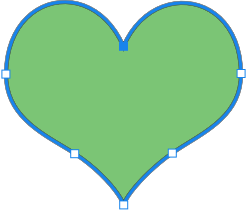

## **Katman Vektör Maskesi Genel Bakış**
Bir vektör maskesi, katmanın içeriğini kırpacak olan çözünürlüksüz bir yoludur. Vektör maskeler genellikle piksel tabanlı araçlarla oluşturulanlardan daha doğru olabilir. Vektör maskeleri, kalem veya şekil araçları ile oluşturulur.

Aspose.PSD, vektör maskelerin oluşturulmasını ve uygulanmasını destekler. Vektör maskelerini Düzenleme Vektör Yolu aracılığıyla düzenleyebilirsiniz.

## **Aspose.PSD'de Vektör Yolu**
Aspose.PSD'de vektör yollarına [VsmsResouce](https://reference.aspose.com/psd/net/aspose.psd.fileformats.psd.layers.layerresources/vsmsresource) ve [VmskResouce](https://reference.aspose.com/psd/net/aspose.psd.fileformats.psd.layers.layerresources/vmskresource) kaynakları aracılığıyla erişim sağlanır. Bu kaynaklar, [VectorPathDataResource](https://reference.aspose.com/psd/net/aspose.psd.fileformats.psd.layers.layerresources/vectorpathdataresource) sınıfının alt sınıflarıdır.

## **Bir vektör yolunu nasıl düzenlersiniz?**
### **Vektör yol yapısı**
Yolları manipüle etmek için temel yapı [VectorPathRecord.](https://reference.aspose.com/psd/net/aspose.psd.fileformats.core.vectorpaths/vectorpathrecord) Ancak kolaylık sağlamak için aşağıdaki çözüm önerilir.

Vektör yollarını kolayca düzenlemek için, vektör verilerinin rahatça düzenlenmesi için metotlar içeren [VectorPath](https://gist.github.com/aspose-com-gists/8a4c9d34ce856d1642fc7c0ce974175c#file-examples-csharp-aspose-workingwithvectorpaths-classestomanipulatevectorpathobjects-classestomanipulatevectorpathobjects-cs) sınıfını kullanmalısınız.

VectorPath türünde bir nesne oluşturmaya başlayın.

Kolaylık için [VectorDataProvider.CreateVectorPathForLayer](https://gist.github.com/aspose-com-gists/8a4c9d34ce856d1642fc7c0ce974175c#file-examples-csharp-aspose-workingwithvectorpaths-classestomanipulatevectorpathobjects-classestomanipulatevectorpathobjects-cs) statik yöntemini kullanabilirsiniz; bu, giriş katmanında bir vektör kaynağını bulacak ve ona dayalı olarak bir VectorPath nesnesi oluşturacaktır.

Tüm düzenlemelerden sonra, değişikliklerle birlikte VectorPath nesnesini katmana geri uygulayabilirsiniz, bunu yapmak için statik yöntemi [VectorDataProvider.UpdateLayerFromVectorPath](https://gist.github.com/aspose-com-gists/8a4c9d34ce856d1642fc7c0ce974175c#file-examples-csharp-aspose-workingwithvectorpaths-classestomanipulatevectorpathobjects-classestomanipulatevectorpathobjects-cs) kullanabilirsiniz.



VectorPath türü, [PathShape](https://gist.github.com/aspose-com-gists/8a4c9d34ce856d1642fc7c0ce974175c#file-examples-csharp-aspose-workingwithvectorpaths-classestomanipulatevectorpathobjects-classestomanipulatevectorpathobjects-cs) öğelerini içeren bir listeyi ve bir veya daha fazla şekilden oluşabilen genel bir vektör resmini tanımlar.

Her PathShape, ayrı bir dizi Bezier düğümden oluşan bir vektör figürüdür.

Düğümler, figürün oluşturulduğu noktalar olan [BezierKnot](https://gist.github.com/aspose-com-gists/8a4c9d34ce856d1642fc7c0ce974175c#file-examples-csharp-aspose-workingwithvectorpaths-classestomanipulatevectorpathobjects-classestomanipulatevectorpathobjects-cs) türünden nesnelerdir.

Aşağıdaki kod örneği, bir şekle ve noktalara nasıl erişileceğini göstermektedir.


### **Bir şekil nasıl oluşturulur?**
Bir şekli düzenlemek için, mevcut bir şekli [VectorPath.Shapes](https://gist.github.com/aspose-com-gists/8a4c9d34ce856d1642fc7c0ce974175c#file-examples-csharp-aspose-workingwithvectorpaths-classestomanipulatevectorpathobjects-classestomanipulatevectorpathobjects-cs) listesinden almalı veya [PathShape](https://gist.github.com/aspose-com-gists/8a4c9d34ce856d1642fc7c0ce974175c#file-examples-csharp-aspose-workingwithvectorpaths-classestomanipulatevectorpathobjects-classestomanipulatevectorpathobjects-cs) örneği oluşturarak oluşturulan yeni bir şekil ekleyerek [Shapes](https://gist.github.com/aspose-com-gists/8a4c9d34ce856d1642fc7c0ce974175c#file-examples-csharp-aspose-workingwithvectorpaths) listesine eklemelisiniz.


### **Düğümler (noktalar) nasıl eklenir?**
Shape noktalarını PathShape.Points özelliği aracılığıyla düzenli bir List'in elemanları olarak manipüle edebilirsiniz, örneğin şekil noktaları ekleyebilirsiniz:



BezierKnot, Kancalı nokta ve iki Kontrol noktası içerir.

Eğer kancalı ve kontrol noktaları aynı değerlere sahipse, o zaman bu düğüm bir akut açıya sahip olacaktır.

Kancalı noktanın konumunu kontrol noktalarıyla birlikte değiştirmek (Photoshop'ta olduğu gibi) için BezierKnot'un bir Shift metodu bulunmaktadır.

Aşağıdaki kod örneği, bir bezel düğümünün tamamını Y koordinatına göre dikey olarak yukarı taşımayı göstermektedir:

Shape noktalarını PathShape.Points özelliği aracılığıyla düzenli bir List'in elemanları olarak manipüle edebilirsiniz, örneğin şekil noktaları ekleyebilirsiniz:



## **PathShape özellikleri**
PathShape düzenleme yalnızca düğümleri düzenlemekle sınırlı değildir, bu tür aynı zamanda başka özelliklere de sahiptir.
### **PathOperations (Boolean işlemler)**
[PathOperations](https://reference.aspose.com/psd/net/aspose.psd.fileformats.core.vectorpaths/pathoperations) özelliği, birden fazla şeklin nasıl karıştırıldığını tanımlayan bir boolean işlem olarak adlandırılır ve değer değişikliğiyle bu işlem değiştirilir.

Aşağıdaki olası değerler vardır:

- 0 = Örtüşen Şekilleri Hariç Tut (XOR işlemi).
- 1 = Şekilleri Birleştir (VEYA işlemi).
- 2 = Önceki Şekli Çıkar (DEĞİL işlemi).
- 3 = Şekil Alanlarını Kesiştir (VEYA işlemi).

### **IsClosed Özelliği**
PathShape.IsClosed özelliğini kullanarak bir şeklin ilk ve son düğümünün birleşik olup olmadığını belirleyebiliriz.

|**Kapalı şekil**|**Açık şekil**|
| :- | :- |
|||
### **FillColor Özelliği**
Hiçbir şeklin kendi rengi olamaz, bu nedenle VectorPath.FillColor özelliğini kullanarak tüm vektör yolunun rengini değiştirebilirsiniz.

Shape noktalarını PathShape.Points özelliği aracılığıyla düzenli bir List'in elemanları olarak manipüle edebilirsiniz, örneğin şekil noktaları ekleyebilirsiniz:



## **VectorDataProvider ve ilgili sınıfların kaynak kodunu burada bulacaksınız:**

