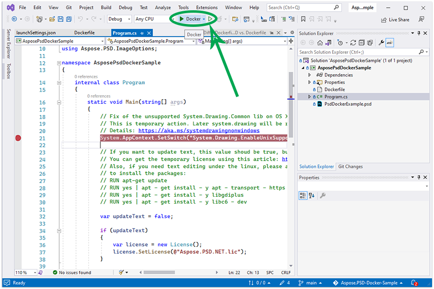

## Ön Koşullar

- Sisteminizde Docker yüklü olmalıdır. Windows veya Mac üzerinde Docker'ı nasıl yükleyeceğiniz konusunda bilgi almak için "Ayrıca Bakınız" bölümündeki bağlantılara başvurun.

- Visual Studio 2022.

- Örnekte .NET 6 SDK kullanılmaktadır.

- Tamamen çalışan örnek bir projeyi [şu adresten indirebilirsiniz](https://github.com/aspose-psd/Aspose.PSD-Docker-Sample)

## Merhaba Dünya Uygulaması

Bu örnekte, bir psd dosyasını açan, metin katmanını güncelleyen ve Grafikler API'sını kullanarak çizim yapan basit bir Merhaba Dünya konsol uygulaması oluşturursunuz. Anlatılan uygulama Docker'da oluşturulabilir ve çalıştırılabilir.

### Konsol Uygulaması Oluşturma

Merhaba Dünya programını oluşturmak için aşağıdaki adımları izleyin:
1. Docker yüklendikten sonra, Linux Konteynerlerini (varsayılan olarak) kullandığından emin olun. Gerekirse, Docker Desktop menüsünden Linux konteynerlerine geçiş yapmak için Linux konteynerlerine geçiş yapın.
1. Visual Studio'da bir .NET 6 konsol uygulaması oluşturun. 
 
1. En son Aspose.PSD sürümünü NuGet'ten yükleyin. 
 
1. Uygulama Linux üzerinde çalışacaksa, ek yazı tipleri yüklemeniz gerekebilir. ttf-mscorefonts-installer'ı tercih edebilirsiniz.
1. Lütfen not edin, Linux'ta Metin Rendeleme Özelliklerini kullanmak için şu paketlere ihtiyacınız olacaktır: apt-transport-https, libgdiplus, libc6-dev. Bu paketleri eklemek için gereken komutlar dcokerfile'da bulunabilir
1. Gerekli tüm bağımlılıklar eklendikten sonra, PSD Dosyasını açan, Metin Katmanını güncelleyen ve ardından Grafikler kullanarak bir şeyler çizen basit bir program yazınız: 



Metin katmanlarını düzenlemek için lisans almanız gerektiğini unutmayın. Geçici lisansı aşağıdaki makaleyi kullanarak elde edebilirsiniz: [Geçici lisans al](https://purchase.aspose.com/temporary-license)
 
### Bir Docker Dosyasını Yapılandırma

Bir sonraki adım, Docker dosyası oluşturmak ve yapılandırmaktır.

1. Docker dosyasını oluşturun ve uygulamanızın çözüm dosyasının yanına yerleştirin. Bu dosya adını varsayılan uzantısız olarak tutun.
1. Docker dosyasınızda aşağıdakileri belirtin:


#Visual Studio'nun bu Docker dosyasını hızlı hata ayıklama için nasıl kullandığını anlamak için https://aka.ms/containerfastmode adresine bakın.

FROM mcr.microsoft.com/dotnet/runtime:6.0 AS base
WORKDIR /app

# Metin katmanlarını güncelleyebilme özelliğini kullanmak için aşağıdaki paketleri konteynerinize eklemeniz gerekecek
RUN apt-get update
RUN yes | apt-get install -y apt-transport-https
RUN yes | apt-get install -y libgdiplus
RUN yes | apt-get install -y libc6-dev

FROM mcr.microsoft.com/dotnet/sdk:6.0 AS build

WORKDIR /src
COPY ["AsposePsdDockerSample/AsposePsdDockerSample.csproj", "AsposePsdDockerSample/"]
RUN dotnet restore "AsposePsdDockerSample/AsposePsdDockerSample.csproj"
COPY . .
WORKDIR "/src/AsposePsdDockerSample"
RUN dotnet build "AsposePsdDockerSample.csproj" -c Release -o /app/build

FROM build AS publish
RUN dotnet publish "AsposePsdDockerSample.csproj" -c Release -o /app/publish

FROM base AS final
WORKDIR /app
COPY --from=publish /app/publish .
ENTRYPOINT ["dotnet", "AsposePsdDockerSample.dll"]


Yukarıdaki, aşağıdaki komutları içeren basit bir Docker dosyasıdır:

- Kullanılacak SDK görüntüsü. Burada Microsoft .Net 6 görüntüsüdür. Docker çalıştığında SDK sürümü bir etiket olarak belirtilmiştir.
- Daha sonra metinleri işlemek için bağımlılıkları eklersiniz.
- Sonrasında Yazı tipleri yüklemeniz gerekebilir çünkü SDK görüntüsü çok az yazı tipi içerir. Ayrıca, Docker görüntüsüne kopyalanan yerel yazı tiplerini kullanabilirsiniz.
- Belirtilen çalışma dizini.
- Her şeyi konteynere kopyalamak, uygulamayı yayınlamak ve giriş noktasını belirlemek için komut.

### Uygulamanın Docker'da Derlenmesi ve Çalıştırılması

#### Visual Studio Kullanarak
Aspose.PSD'yi Docker'da denemek için en basit yol, Visual Studio'yu açmak ve uygulamayı Docker desteği kullanarak başlatmaktır

#### Komut İstemini Kullanarak
Uygulama, komut istemini kullanarak Docker'da oluşturulabilir ve çalıştırılabilir. Favori komut isteminizi açın, uygulamanın bulunduğu klasöre (çözüm dosyası ve Docker dosyasının bulunduğu klasör) değiştirin ve aşağıdaki komutu çalıştırın:


docker build -t asposepsddocker .


Bu komut ilk kez çalıştırıldığında daha uzun sürebilir, çünkü Docker'ın gereken görüntüleri indirmesi gerekir. Önceki komut tamamlandığında, aşağıdaki komutu çalıştırın:


docker run --name asposepsdcontainer asposepsddocker; docker cp asposepsddocker:/app/Output.psd .; docker cp asposepsddocker:/app/Output.png .; docker rm asposepsdcontainer


{} 

Bir klasör, ev sahibi bilgisayarın bir klasörünü, uygulama çalıştırımının sonuçlarını kolayca görmek için konteynerin klasörüne bağlamak için dikkat edin. Linux'taki yolların harf duyarlı olduğunu unutmayın.

{}

## Daha Fazla Örnek

Aspose.PSD'yi Docker'da nasıl kullanabileceğinizle ilgili daha fazla örneği görmek için [örnekler](https://github.com/aspose-psd/Aspose.PSD-for-.NET) bölümüne bakın.

## Ayrıca Bakınız

- [Windows için Docker Desktop'un Yüklenmesi](https://docs.docker.com/docker-for-windows/install/)
- [Mac için Docker Desktop'un Yüklenmesi](https://docs.docker.com/docker-for-mac/install/)
- [Visual Studio 2022, .NET 6 SDK](https://docs.microsoft.com/en-us/dotnet/core/install/windows?tabs=net60#dependencies)
- [Linux konteynerlerine geçiş yap](https://docs.docker.com/docker-for-windows/#switch-between-windows-and-linux-containers) seçeneği
- [.NET Core SDK](https://hub.docker.com/_/microsoft-dotnet-sdk) hakkında ek bilgiler
