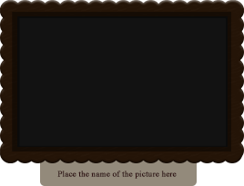

### **Genel Bakış**
Bu makale, [PSD Dosyası](https://wiki.fileformat.com/image/psd/) içinde bazı bilinen şablon benzeri yapılara sahip olan katmanları programlı olarak güncellemeniz gerektiğinde sıkça kullanılan durumları anlatmaktadır. Bu, farklı insanlar için (İş Kartları Örneği için) birçok İş Kartı oluşturmak için veya PSD dosyasını farklı dillere çevirmeniz ve içindeki grafik materyallerini değiştirmeniz gerektiğinde kullanılabilir.

Bu makaleyi okuduktan sonra şunları nasıl yapabileceğinizi öğreneceksiniz:

## **Basit bir durum**
Örneğin, bilinen Katman Adlarına sahip bazı PSD Şablonunuz var. Bu yüzden C# aracılığıyla PSD Katmanını değiştirmeniz, güncellemeniz veya değiştirmeniz gerekiyor. İlk olarak, Aspose.PSD ile şablon dosyasını açmanız gerekmektedir.

PSD Dosyasını C# ile nasıl açarsınız?



Daha sonra değiştirmek istediğimiz bir katmanı adına göre bulmamız gerekmektedir. İşte bu için basit bir uygulama örneği.

PSD dosyasındaki katmanı adına göre nasıl bulabiliriz



Katman bulunduğunda, grafikleri kullanarak genel bir şekilde güncelleyebiliriz, [Graphics](https://reference.aspose.com/psd/net/aspose.psd/graphics) kullanarak:

PSD katmanında Grafik çizme



Bu durumda, yeni bir [PNG resmi](https://wiki.fileformat.com/image/png/) yükleyerek mevcut PSD katmanına çizim yaparız, böylece eski veriler yeni dosyada kaybolur.

Ancak metni de güncellememiz gerekiyorsa ne yapacağız? Süreç benzer olacaktır. Metin Katmanını adına göre bulun, ardından Photoshop Dosyasının metin katmanını programlı olarak [güncelleyin](/psd/tr/net/metin-katmaninda-farkli-renklerle-metin-gosterme/) .

Metin Katmanını C# ile Photoshop'ta nasıl güncelleyebiliriz



Son olarak değişikliklerimizi kaydetmemiz gerekmektedir:

Değiştirilmiş PSD dosyasını [Aspose.PSD](https://products.aspose.com/psd/net) kullanarak nasıl kaydedebiliriz



Sonuç resim:

## **Ek özelliklerle karmaşık bir durum**
Yukarıda, PSD Dosyasının bir katmanındaki resmi değiştirmenin en basit yolunu gösterdik.

Ancak Aspose.PSD, yeni bir katman eklemenin, eski katmanları kaldırmanın ve çoklu satırlı metinde farklı stiller kullanarak metin katmanını güncellemenin gibi daha karmaşık ek özellikler sunabilir.

Değiştirmek istediğimiz [Katmanı](https://reference.aspose.com/psd/net/aspose.psd/fileformats/psd/layers/layer) buluyoruz, ardından Katmanlar Listesindeki indeksini buluyoruz, onu kaldırıyoruz ve aynı yere [Jpeg Dosyasından](https://wiki.fileformat.com/image/jpeg/) oluşturduktan sonra yeni bir Katman ekliyoruz.

Dosyadan yeni bir katman oluşturup onu [Aspose.PSD](https://products.aspose.com/psd/net) kullanarak PSD Görüntüsüne eklemek



Bu dosya kod parçacığının sonunda, katman pozisyonunu düzeltiyoruz ve yeni Katman dizisini Psd Görüntüsüne kaydediyoruz.

[PsdImage ](https://reference.aspose.com/imaging/net/aspose.imaging.fileformats.psd/psdimage) Katman özelliklerini kopyalamanın yolu



Ve en önemlisi, mevcut PSD görüntüsündeki metin katmanlarını C# ile güncellememiz gerekmektedir. Aspose.PSD, [Metin Katmanını Satırlar Halinde Güncelleme](/psd/tr/net/metin-katmanlari-ile-calisma/) konusunda destek verir. Her [metin parçasının](https://reference.aspose.com/psd/net/aspose.psd/fileformats/psd/layers/texttextportion) benzersiz bir Stil ve Paragraf özellikleri kombinasyonu vardır.

[PsdImage ](https://reference.aspose.com/imaging/net/aspose.imaging.fileformats.psd/psdimage) Katman özelliklerini kopyalamanın yolu



Sonuç olarak, Jpeg, Png, J2k, Bmp, Gif veya Tiff dosyasından yeni bir Katmanla PSD şablonunu kod aracılığıyla değiştirdik ve her satırda farklı stillerde çoklu satırlı [metin](https://gist.github.com/aspose-com-gists/8a4c9d34ce856d1642fc7c0ce974175c#file-examples-csharp-aspose-modifyingandconvertingimages-psd-renderingofdifferentstylesinonetextlayer-renderingofdifferentstylesinonetextlayer-cs) güncelledik.

