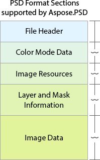

## **Формат PSD**
Aspose.PSD для Java підтримує всі розділи файлу формату Adobe Photoshop PSD.

||
Aspose.PSD підтримує всі розділи формату PSD.

1. Заголовки PSD та PSB у заголовку файлу

2. Найпопулярніші режими кольору

3. Велика кількість глобальних ресурсів зображення

4. Усі типи шарів та маски* та їх внутрішні ресурси та відтворення файлу PSD після змін

5. API низькорівневих операцій з даними зображення, включаючи різні алгоритми стиснення

 

Aspose.PSD - це найбільш повний набір засобів для маніпулювання форматом PSD.

Ви також можете дізнатися, чому варто використовувати компоненти Aspose замість інших:

[Чому не Adobe Photoshop SDK](/uk/java/why-not-adobe-photoshop-sdk-html/)

 
|
| :- | :- |
## **Документація формату PSD**
Документація містить інформацію і приклади для всіх розділів PSD.

## **Підтримані [Типи Шарів PSD](/uk/java/layer-types/)**

- Базовий
- Текстові шари
- [Шари коригування](/uk/java/layer-types/adjustment-layer/)
- Шари заливки
- Розумні об'єкти
