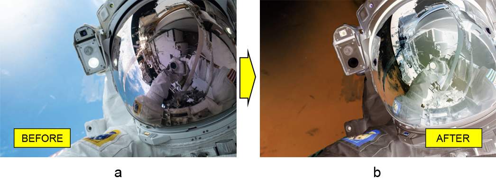

# Робота з шариковим шариковим слоєм Invert у Java

У цій статті ми покажемо, як програмно перетворити зображення в документі Photoshop на негативне за допомогою Java. Для цього ми використаємо бібліотеку для маніпулювання файлами PSD, яка називається Aspose.PSD для Java.

API інверсії кольорів дозволяє **додати негативний ефект до зображення**. Можливо, ви вже бачили, як [інвертувати кольори зображення за допомогою шару налаштувань кривих](/psd/uk/java/layer-types/adjustment-layer/curves/). Однак сьогодні ми розглянемо швидший та простіший спосіб виконання завдання за допомогою шару налаштувань Invert.

## Огляд API

**API шару налаштувань Invert** складається з самого класу шару, який називається [InvertAdjustmentLayer](https://reference.aspose.com/psd/java/com.aspose.psd.fileformats.psd.layers.adjustmentlayers/InvertAdjustmentLayer). Цей клас не має власних публічних членів, оскільки він успадковує всі публічні члени від батьківського класу ([AdjustmentLayer](https://reference.aspose.com/psd/java/com.aspose.psd.fileformats.psd.layers.adjustmentlayers/AdjustmentLayer)). Цей факт спрощує його використання, оскільки все, що вам потрібно зробити, - це додати його до файлу PSD, і зображення стане негативним.

## Інвертування кольорів зображення

Отже, навіть якщо воно здається очевидним, дозвольте нам продемонструвати для ясності, як **застосовувати шар налаштувань Invert до зображення** астронавта (a), щоб створити негативний ефект для цього зображення (b).

Для **інвертування кольорів зображення** просто додайте шар налаштувань Invert в PSD:

    InvertAdjustmentLayer invertAdjustmentLayer = psdImage.addInvertAdjustmentLayer();

Ось і все! Немає жодних конкретних властивостей для налаштування для цього типу шару налаштувань.

## Висновок

У цій статті ми дізналися про API шару налаштувань Invert Aspose.PSD для Java. Це беззусильний інструмент для отримання негативних зображень, оскільки API цього шару налаштувань не оголошує жодних публічних членів.
