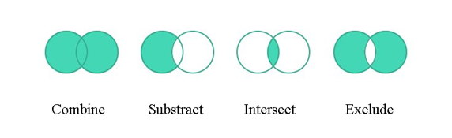

## **Огляд векторної маски шару**
Векторна маска - це безвтратний шлях, який обрізає вміст шару. Векторні маски, як правило, є більш точними, ніж ті, що створені засобами на основі пікселів. Ви створюєте векторні маски за допомогою інструментів "ручка" або "форми".

Aspose.PSD підтримує відтворення й застосування векторних масок. Ви можете редагувати векторні маски за допомогою редагування векторних шляхів.

## **Векторний шлях в Aspose.PSD**
Доступ до векторних шляхів в Aspose.PSD забезпечується за допомогою ресурсів [VsmsResouce](https://reference.aspose.com/psd/net/aspose.psd.fileformats.psd.layers.layerresources/vsmsresource) та [VmskResouce](https://reference.aspose.com/psd/net/aspose.psd.fileformats.psd.layers.layerresources/vmskresource), які є дочірніми класами [VectorPathDataResource](https://reference.aspose.com/psd/net/aspose.psd.fileformats.psd.layers.layerresources/vectorpathdataresource).

## **Як редагувати векторний шлях?**
### **Структура векторного шляху**
Базова структура для маніпулювання шляхами - [VectorPathRecord.](https://reference.aspose.com/psd/net/aspose.psd.fileformats.core.vectorpaths/vectorpathrecord) Проте для вашої зручності пропонується наступний розв'язок.

Для легкого редагування векторних шляхів вам слід використовувати клас [VectorPath](https://gist.github.com/aspose-com-gists/8a4c9d34ce856d1642fc7c0ce974175c#file-examples-csharp-aspose-workingwithvectorpaths-classestomanipulatevectorpathobjects-classestomanipulatevectorpathobjects-cs), який містить методи для зручного редагування векторних даних в ресурсах, що походять від VectorPathDataResource.

Почніть з створення об'єкта типу VectorPath.

Для зручності ви можете використовувати статичний метод [VectorDataProvider.CreateVectorPathForLayer](https://gist.github.com/aspose-com-gists/8a4c9d34ce856d1642fc7c0ce974175c#file-examples-csharp-aspose-workingwithvectorpaths-classestomanipulatevectorpathobjects-classestomanipulatevectorpathobjects-cs), який знайде векторний ресурс від вхідного шару і створить об'єкт VectorPath на його основі.

Після всіх редагувань ви можете застосувати об'єкт VectorPath із змінами назад до шару, використовуючи статичний метод [VectorDataProvider.UpdateLayerFromVectorPath](https://gist.github.com/aspose-com-gists/8a4c9d34ce856d1642fc7c0ce974175c#file-examples-csharp-aspose-workingwithvectorpaths-classestomanipulatevectorpathobjects-classestomanipulatevectorpathobjects-cs).



Тип VectorPath містить список елементів [PathShape](https://gist.github.com/aspose-com-gists/8a4c9d34ce856d1642fc7c0ce974175c#file-examples-csharp-aspose-workingwithvectorpaths-classestomanipulatevectorpathobjects-classestomanipulatevectorpathobjects-cs) та описує цілий векторний зображення, яке може складатися з одного або декількох форм.

Кожна PathShape - це векторна фігура, яка складається з окремого набору беїсерних вузлів.

Вузли - це об'єкти типу [BezierKnot](https://gist.github.com/aspose-com-gists/8a4c9d34ce856d1642fc7c0ce974175c#file-examples-csharp-aspose-workingwithvectorpaths-classestomanipulatevectorpathobjects-classestomanipulatevectorpathobjects-cs), які являють собою точки, з яких побудована фігура.

Наведений нижче приклад коду показує, як отримати фігуру та точки.


### **Як створити форму?**
Для редагування форми вам потрібно отримати існуючу з [VectorPath.Shapes](https://gist.github.com/aspose-com-gists/8a4c9d34ce856d1642fc7c0ce974175c#file-examples-csharp-aspose-workingwithvectorpaths-classestomanipulatevectorpathobjects-classestomanipulatevectorpathobjects-cs) списку, або додайте нову форму, створивши екземпляр [PathShape](https://gist.github.com/aspose-com-gists/8a4c9d34ce856d1642fc7c0ce974175c#file-examples-csharp-aspose-workingwithvectorpaths-classestomanipulatevectorpathobjects-classestomanipulatevectorpathobjects-cs) і додаючи її до списку [Shapes](https://gist.github.com/aspose-com-gists/8a4c9d34ce856d1642fc7c0ce974175c#file-examples-csharp-aspose-workingwithvectorpaths-classestomanipulatevectorpathobjects-classestomanipulatevectorpathobjects-cs).


### **Як додати вузли (точки)?**
Ви можете маніпулювати точками форми як елементами звичайного списку, використовуючи властивість PathShape.Points, наприклад, ви можете додати точки форми:



BezierKnot містить точку Anchor та дві точки Control.

Якщо якість точок Anchor і Control співпадає, то цей вузол матиме гострий кут.

Щоб змінити положення точки Anchor разом з контрольними точками (схоже на те, як це відбувається в Photoshop), у BezierKnot є метод Shift.

У наведеному нижче прикладі коду показано, як перемістити весь беїсерний вузол вертикально вгору за координатою Y:

Ви можете маніпулювати точками форми як елементами звичайного списку, використовуючи властивість PathShape.Points, наприклад, ви можете додати точки форми:



## **Властивості PathShape**
Редагування PathShape не обмежується лише редагуванням вузлів, у цьому типі є й інші властивості.
### **Операції над шляхами (Булеві операції)**
Властивість [PathOperations](https://reference.aspose.com/psd/net/aspose.psd.fileformats.core.vectorpaths/pathoperations) є так званою булевою операцією, зміна значення якої визначає те, як змішуються кілька фігур.

Є наступні можливі значення:

- 0 = Виключити накладеніФігури (операція XOR).
- 1 = Поєднати фігури (операція OR).
- 2 = Відняти передню фігуру (операція NOT).
- 3 = Перетин областей фігур (операція AND).

### **Властивість IsClosed**
Також, використовуючи властивість PathShape.IsClosed, ми можемо визначити, чи з'єднані перший та останній вузол в формі.

|**Закрита фігура**|**Відкрита фігура**|
| :- | :- |
|||
### **Властивість FillColor**
Жодна фігура не може мати власний колір, тому ви можете змінити колір всього векторного шляху за допомогою властивості VectorPath.FillColor.

Ви можете маніпулювати точками форми як елементами звичайного списку, використовуючи властивість PathShape.Points, наприклад, ви можете додати точки форми:



## **Тут ви знайдете вихідний код VectorDataProvider та пов'язаних класів:**

