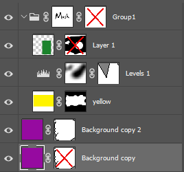

## **Огляд**
**Для автоматизації редагування формату PSD та зміни файлу PSD без Adobe® Photoshop®, ви можете використовувати наведене нижче API Aspose.PSD. Є фрагменти коду C# та .NET, які можуть допомогти вам змінювати файл PSD.**

За допомогою PSD масок шарів та векторних масок ми здатні приховати та показувати пікселі шару без остаточного їх видалення. Растрові маски також називають маскою шару або користувацькою маскою. Доступ до растрових та векторних масок в Aspose.PSD забезпечується через властивість шару [LayerMaskData](https://reference.aspose.com/psd/net/aspose.psd.fileformats.psd.layers/layer/properties/layermaskdata), яка може бути екземпляром класів '[LayerMaskDataShort](https://reference.aspose.com/psd/net/aspose.psd.fileformats.psd.layers/layermaskdatashort)' та '[LayerMaskDataFull](https://reference.aspose.com/psd/net/aspose.psd.fileformats.psd.layers/layermaskdatafull)', які є дочірніми класами абстрактного класу 'LayerMaskData'. Якщо шар має як растрові, так і векторні маски, то надається екземпляр [LayerMaskDataFull](https://reference.aspose.com/psd/net/aspose.psd.fileformats.psd.layers/layermaskdatafull). Якщо шар має лише растрову або векторну маску, то надається екземпляр [LayerMaskDataShort ](https://reference.aspose.com/psd/net/aspose.psd.fileformats.psd.layers/layermaskdatashort). Якщо властивість LayerMaskData дорівнює null, то у шару немає масок або тільки вимкнута векторна маска.

||
Растрова маска та вимкнена векторна маска LayerMaskDataShort

Вимкнена растрова маска LayerMaskDataShort

Растрова маска та векторна маска LayerMaskDataFull

Растрова маска LayerMaskDataShort

Векторна маска LayerMaskDataShort

Вимкнена векторна маска null (Але векторний ресурс присутній)
|
| :- | :- |
## **Як отримати растрову маску шару в файлі PSD?**
Спочатку ми повинні визначити, чи у шару є як векторні, так і растрові маски:

Нижче наведений прикладний код демонструє, як отримати растрову маску шару



У протилежному випадку, тип властивості шару LayerMaskData є LayerMaskDataShort. У цьому випадку давайте перевіримо, чи у шару є лише растрова маска, перевіривши властивість Flags. Вона не повинна містити [LayerMaskFlags](https://reference.aspose.com/psd/net/aspose.psd.fileformats.psd.layers/layermaskflags). UserMaskFromRenderingOtherData флаг, в іншому випадку маска є кешем векторної маски.

Отримання фрагмента коду маски:



Якщо вам потрібно **витягти растрову маску** як LayerMaskDataShort (для подальших маніпуляцій) навіть коли присутні обидві маски, LayerMaskDataFull повинна бути видобута та перетворена на LayerMaskDataShort. Для обох випадків можна використовувати наступний код:

Вилучення растрової маски з PSD


## **Як перевірити, чи у шару файлу PSD є растрова маска?**
Наступний код C# може допомогти вам перевірити, чи у шарі є растрова маска:

Як дізнатися, чи застосована растрова маска до [PSD-шару](/psd/uk/net/psd-layer/)


## **Як видалити / додати / оновити растрову маску шару в файлі PSD?**
Просто видалення / додавання / оновлення LayerMaskData недостатньо для правильного збереження, оскільки канали не оновлюються; хоча воно може забезпечити правильне відображення. Це не змінює канали маски:



Ми повинні використовувати метод AddLayerMask шару для видалення / додавання / оновлення.

Це додасть/оновить як маску, так і канали:



Це видалить як маску, так і канали:


## **Видалення растрової маски шару в зображенні PSD**
Спочатку ми перевіряємо, чи маска має короткий формат, і якщо це не векторний тип, ми можемо просто викликати метод AddLayerMask з null для видалення растрової маски. Але якщо вона в повному форматі, ми повинні перетворити її в короткий формат, залишаючи тільки векторну маску. Для видалення маски шару можна використовувати наступний фрагмент коду C# .NET:

Фрагмент коду про те, як видалити маску шару з файлу PSD.


## **Оновлення растрової маски шару в зображенні PSD**
Це простий процес: якщо маска є в короткому форматі, нам слід змінити ImageData та MaskRectangle за потреби, інакше [UserMaskData ](https://reference.aspose.com/psd/net/aspose.psd.fileformats.psd.layers/layermaskdatafull/properties/usermaskdata)та [UserMaskRectangle ](https://reference.aspose.com/psd/net/aspose.psd.fileformats.psd.layers/layermaskdatafull/properties/usermaskrectangle)слід змінити. Для оновлення маски шару можна використати наступний фрагмент коду C# .NET:

Оновлення маски шару PSD за допомогою C#



Ось приклад можливих дій, які змінюють растрову маску. Цей код інвертує маску користувача шару:

Оновлення маски шару PSD за допомогою C#


## **Оновлення векторної маски в файлі PSD, коли присутня растрова маска шару**
Припускається, що користувач вже змінив векторний ресурс шляху. Потім можна оновити векторну маску, просто викликавши метод [AddLayerMask ](https://reference.aspose.com/psd/net/aspose.psd.fileformats.psd.layers/layer/methods/addlayermask)шару:

Оновлення [векторної маски шару PSD](/psd/uk/net/layer-vector-mask/) за допомогою C#


## **Додавання растрової маски шару в файл PSD**
Якщо у шарі немає маски, ми можемо додати задану растрову маску просто викликавши метод додавання AddLayerMask шару.

Якщо маска не має прапорця [UserMaskFromRenderingOtherData** ](https://reference.aspose.com/psd/java/com.aspose.psd.fileformats.psd.layers/LayerMaskFlags), то вона вже має растрову маску, яку ми повинні оновити, як описано вище. Інакше, якщо ця маска у короткому форматі, ми перетворюємо її на повний формат. Якщо ні, ми використовуємо її як є. Потім оновлюємо UserMaskData, UserMaskRectangle та інші властивості за допомогою заданих властивостей маски. Для додавання (оновлення) маски шару можна використати наступний фрагмент коду C# .NET:

Додавання нової растрової маски до PSD



## **Як перевірити, чи у шару маска ввімкнена?**
Для визначення стану увімкненості растрової маски шару ми можемо перевірити стан прапорця LayerMaskFlags.Disabled властивості для LayerMaskDataShort або в RealFlags для LayerMaskDataFull. Для отримання стану увімкненості маски шару можна скористатися наступним фрагментом коду C# .NET:

Перевірка, чи маска увімкнена:


## **Як увімкнути або вимкнути растрову маску шару?**
Для увімкнення або вимкнення растрової маски шару ми можемо змінити стан прапорця LayerMaskFlags.Disabled властивості для LayerMaskDataShort або в RealFlags для LayerMaskDataFull. Для зміни стану увімкненості маски шару можна скористатися наступним фрагментом коду C# .NET:

Увімкнути або вимкнути растрову маску шару:



