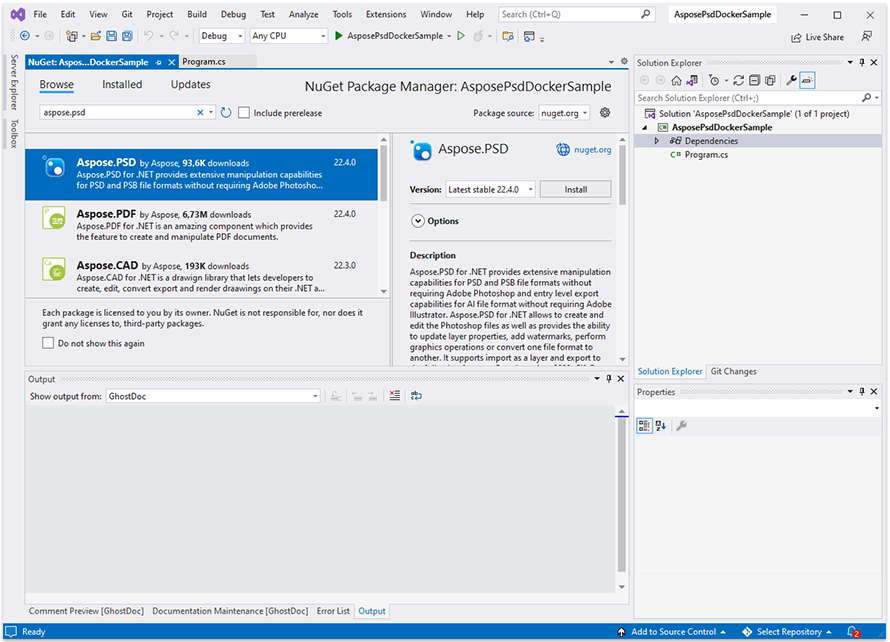

## Передумови

- Docker повинен бути встановлений на вашій системі. Щоб отримати інформацію про те, як встановити Docker на Windows чи Mac, перегляньте посилання у розділі "Див. також".

- Visual Studio 2022.

- В прикладі використовується NET 6 SDK.

- Ви можете завантажити повністю робочий зразок проекту за посиланням https://github.com/aspose-psd/Aspose.PSD-Docker-Sample

## Додаток Hello World

У цьому прикладі ви створюєте просте консольне додаток Hello World, який відкриває файл psd, оновлює текстовий шар та малює за допомогою API графіки. Описаний додаток можна збудувати та запустити в Docker.

### Створення консольного додатку

Щоб створити програму Hello World, дотримуйтесь таких кроків:
1. Після встановлення Docker, переконайтеся, що він використовує контейнери Linux (за замовчуванням). Якщо потрібно, виберіть опцію "Переключитися на контейнери Linux" у меню Docker Desktops.
1. У Visual Studio створіть консольний додаток NET 6. 
 
1. Встановіть останню версію Aspose.PSD з NuGet. 
 
1. Оскільки додаток буде виконуватись на Linux, можливо, вам знадобиться встановити додаткові шрифти. Ви можете вибрати ttf-mscorefonts-installer.
1. Зверніть увагу, що для використання функцій рендерингу тексту на Linux необхідно додати наступні пакети: apt-transport-https, libgdiplus, libc6-dev. Команди для їх додавання можна знайти в dockerfile
1. Коли всі необхідні залежності додано, напишіть просту програму, яка відкриває файл PSD, оновлює текстовий шар, а потім щось малює за допомогою графіки: 



Зауважте, що для редагування текстових шарів потрібно отримати ліцензію. Ви можете отримати тимчасову ліцензію, скориставшись наступною статтею: https://purchase.aspose.com/temporary-license

### Налаштування файлу Dockerfile

Наступним кроком буде створення та налаштування Dockerfile.

1. Створіть Dockerfile та розмістіть його поряд з файлом рішення вашої програми. Зберігайте цей файл без розширення (за замовчуванням).
1. У файлі Dockerfile вказуються:


#Див. https://aka.ms/containerfastmode, щоб зрозуміти, як Visual Studio використовує цей Dockerfile для збирання зображень для швидкого налагодження.

FROM mcr.microsoft.com/dotnet/runtime:6.0 AS base
WORKDIR /app

# Щоб використовувати можливість оновлення текстових шарів, вам потрібно додати наступні пакети до вашого контейнера
RUN apt-get update
RUN yes | apt-get install -y apt-transport-https
RUN yes | apt-get install -y libgdiplus
RUN yes | apt-get install -y libc6-dev

FROM mcr.microsoft.com/dotnet/sdk:6.0 AS build

WORKDIR /src
COPY ["AsposePsdDockerSample/AsposePsdDockerSample.csproj", "AsposePsdDockerSample/"]
RUN dotnet restore "AsposePsdDockerSample/AsposePsdDockerSample.csproj"
COPY . .
WORKDIR "/src/AsposePsdDockerSample"
RUN dotnet build "AsposePsdDockerSample.csproj" -c Release -o /app/build

FROM build AS publish
RUN dotnet publish "AsposePsdDockerSample.csproj" -c Release -o /app/publish

FROM base AS final
WORKDIR /app
COPY --from=publish /app/publish .
ENTRYPOINT ["dotnet", "AsposePsdDockerSample.dll"]


Передбачений вище Dockerfile є простим і містить такі інструкції:

- Зображення SDK для використання. Тут це зображення Microsoft .Net 6. Docker завантажить його при виконанні збудови. Версія SDK вказується як тег.
- Потім додаються залежності для відтворення тексту.
- Після цього можливо знадобиться встановити шрифти, тому що зображення SDK містить дуже небагато шрифтів. Також ви можете використовувати локальні шрифти, скопійовані у зображення Docker.
- Робочий каталог, який вказується у наступному рядку.
- Команда для копіювання всього в контейнер, публікація додатку та вказування точки входу.

### Збірка та запуск додатоку в Docker

#### Використання Visual Studio
Найпростіший спосіб спробувати Aspose.PSD в Docker - відкрити Visual Studio та запустити додаток з підтримкою Docker

#### Використання командного рядка
Додаток можна збудувати та запустити в Docker за допомогою командного рядка. Відкрийте улюблений командний рядок, змініть каталог на теку з додатком (течія, де розміщені файл рішення та Dockerfile) й запустіть наступну команду:


docker build -t asposepsddocker .


При першому запуску цієї команди вона може працювати довше, оскільки Docker повинен завантажити необхідні зображення. Як тільки завершиться попередня команда, запустіть таку команду:


docker run --name asposepsdcontainer asposepsddocker; docker cp asposepsddocker:/app/Output.psd .; docker cp asposepsddocker:/app/Output.png .; docker rm asposepsdcontainer


{} 

Зверніть увагу на аргумент mount, оскільки, як зазначено раніше, теку на обладнанні хоста монтується в теку контейнера, щоб легко бачити результати виконання додатку. Шляхи в Linux Чутливі до регістру.

{}

## Додаткові Приклади

Для отримання додаткових прикладів того, як можна використовувати Aspose.PSD у Docker, див. [приклади](https://github.com/aspose-psd/Aspose.PSD-for-.NET).

## Див. також

- [Встановлення Docker Desktop на Windows](https://docs.docker.com/docker-for-windows/install/)
- [Встановлення Docker Desktop на Mac](https://docs.docker.com/docker-for-mac/install/)
- [Visual Studio 2022, NET 6 SDK](https://docs.microsoft.com/en-us/dotnet/core/install/windows?tabs=net60#dependencies)
- Опція [Переключитися на контейнери Linux](https://docs.docker.com/docker-for-windows/#switch-between-windows-and-linux-containers)
- Додаткова інформація про [.NET Core SDK](https://hub.docker.com/_/microsoft-dotnet-sdk)
