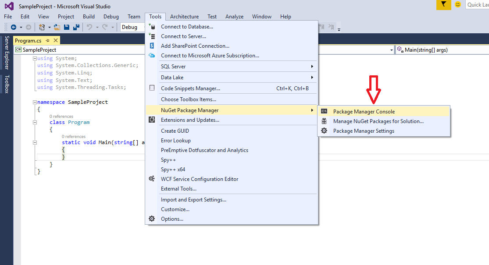

## **Встановлення Aspose.PSD для .NET через NuGet**
NuGet є найпростішим способом завантаження та встановлення API Aspose для .NET. Відкрийте Microsoft Visual Studio та менеджер пакетів NuGet. Виконайте пошук "aspose", щоб знайти потрібне API Aspose. Натисніть на "Встановити", обране API буде завантажено та додано в ваш проект.

## **Встановлення або Оновлення Aspose.PSD за допомогою Консолі керування пакетами**
Ви можете виконати наступні кроки для посилання на [API Aspose.PSD](https://www.nuget.org/packages/Aspose.psd/) за допомогою консолі керування пакетами:

1. Відкрийте ваше рішення/проект у Visual Studio.
1. Виберіть Tools -> Library Package Manager -> Package Manager Console в меню, щоб відкрити консоль керування пакетами.

Введіть команду "**Install-Package Aspose.Psd**" та натисніть Enter, щоб встановити останню повну версію в своє додаток. Також ви можете додати суфікс "**-prerelease**" до команди, щоб вказати, що буде встановлена остання версія з усіма виправленнями помилок.

Ви побачите, що з'являється підказка **"Installing Aspose.PSD"** внизу вікна, що вказує на процес завантаження.

Після завантаження ви побачите наступні повідомлення підтвердження. Якщо ви не знайомі з [Aspose EULA](https://company.aspose.com/legal/eula), то варто прочитати ліцензію, на яку вказано у URL.

Ви повинні бачити, що Aspose.PSD був успішно доданий і посилений в ваш додаток.

В консолі керування пакетами ви також можете скористатися командою "**Update-Package Aspose.Psd**" і натисніть Enter, щоб перевірити наявність оновлень для пакету Aspose.Psd та встановити їх, якщо вони присутні. Ви також можете додати суфікс "-prerelease" для оновлення останньої версії.

## **Врахування при Роботі в Середовищі Робочого Сервера**
Рекомендується, щоб всі компоненти Aspose .NET працювали з встановленим набором дозволів Full Trust. Це через те, що іноді компонентам Aspose .NET потрібно отримувати доступ до налаштувань реєстру та файлів, що знаходяться в інших місцях, крім віртуального каталогу, наприклад, для читання шрифтів тощо. Крім того, компоненти Aspose .NET базуються на основних класах системи .NET, деякі з яких також потребують дозволів Full Trust для коректної роботи в деяких випадках.

Інтернет-провайдери, що господарюють багатьма додатками від різних компаній, часто використовують рівень безпеки середнього рівня. У випадку .NET 2.0 такий рівень безпеки може встановити обмеження, які можуть вплинути на здатність Aspose.Words до належного виконання.

- Дозвіл **RegistryPermission** недоступний. Це означає, що ви не можете звертатися до реєстру, що необхідно для переліку встановлених шрифтів під час рендерингу документів.
- Обмежений доступ **FileIOPermission**. Це означає, що ви можете звертатися лише до файлів у ієрархії віртуального каталогу вашого додатка. Це потенційно означає, що шрифти не можуть бути прочитані під час експорту.

З урахуванням вище зазначених причин рекомендується виконувати Aspose.PSD з дозволами Full Trust. Можливо, ви виявите, що деякі функції бібліотеки будуть працювати при виконанні різних завдань в Medium Trust, інші - ні (наприклад, рендеринг), що може бути пов'язане з викликами обробки зображень GDI+.

## **Робота з DLL-файлами .NET Core, встановленими за допомогою пакету MSI**

**Зверніть увагу:** якщо ви використовуєте DLL-файли .Net Standard, встановлені за допомогою пакету MSI, вам слід додати необхідні залежності для роботи з версією .Net Standard.

|**Скріншот залежностей Visual Studio**|**Фрагмент файлу CsProj:**|
| :- | :- |
||<ItemGroup>

`    `<PackageReference Include="System.Drawing.Common" Version="4.5.1" />

`    `<PackageReference Include="System.Text.Encoding.CodePages" Version="4.5.0" />

</ItemGroup>|## **Системні Вимоги**
### **Підтримувані Операційні Системи:**
- Microsoft Windows 2000 Professional і Server (рекомендується SP2)
- Microsoft Windows XP Professional та Home Edition
- Microsoft Windows 2003 Server
- Microsoft Windows Vista
- Microsoft Windows 2008 Server
- Microsoft Windows 2008 Server R2
- Microsoft Windows 7
- Microsoft Windows 8
- Microsoft Windows 10
- Microsoft Windows 11
### **Підтримувані Платформи:**
- Window forms
- Web forms
- Visual Studio 2005
- Visual Studio 2008
- Visual Studio 2010
- Visual Studio 2012
- Visual Studio 2013
- Visual Studio 2015
- Visual Studio 2017
- Visual Studio 2019
- Visual Studio 2022

Aspose.PSD працює як для x86, так і для x64 версій перелічених вище операційних систем.
### **Підтримувані Фреймворки:**
Aspose.PSD для .NET підтримує такі версії .NET framework:

- .NET Framework версії 2.0 або вище
- .NET Standard 2.0
