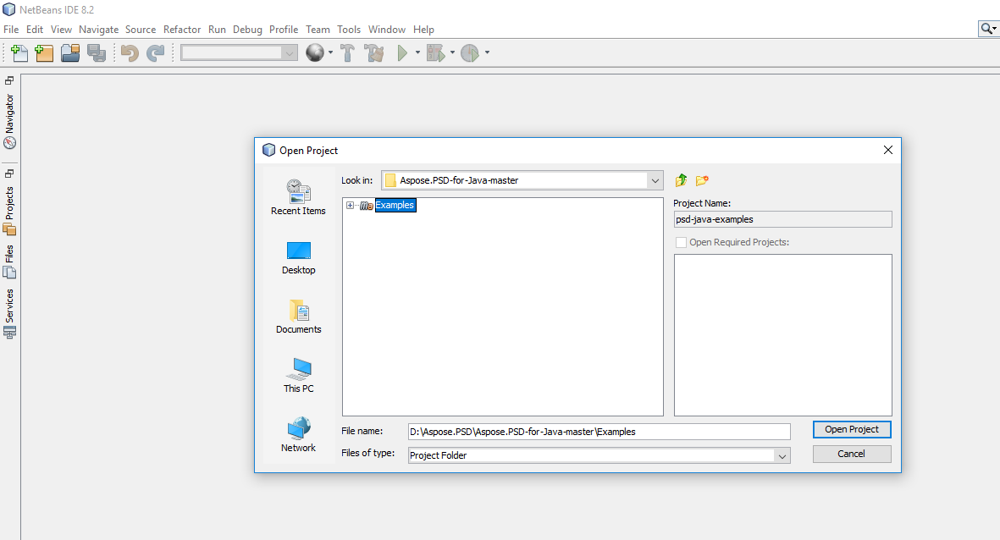

## **Tải từ GitHub**
Tất cả các ví dụ của Aspose.PSD cho Java được lưu trữ trên [Github](https://github.com/aspose-psd/Aspose.PSD-for-Java). Bạn có thể sao chép kho lưu trữ bằng cách sử dụng Github client hoặc tải file ZIP từ [đây](https://github.com/aspose-psd/Aspose.PSD-for-Java/archive/master.zip).

Giải nén nội dung của file ZIP trên máy tính của bạn. Bạn sẽ tìm thấy thư mục **Examples**. Tất cả các ví dụ đều nằm trong thư mục **Examples**.

Bạn có thể chạy/ thực thi các ví dụ này với bất kỳ IDE nào bạn chọn, tuy nhiên, cho mục đích trình diễn, chúng tôi đang sử dụng **NetBeans**. Sử dụng tùy chọn **File -> Open Project** để nhập ví dụ bạn chọn và chỉ định đường dẫn.

Thêm các tập tin jar cần thiết (Libraries) vào dự án.

Thư mục **Resources** chứa các tài liệu/tập tin đầu vào được sử dụng trong ví dụ.

{}

Bạn cũng có thể nhập các ví dụ trực tiếp từ kho lưu trữ GitHub.

{}

## **Đóng góp**
Nếu bạn muốn thêm hoặc cải thiện một ví dụ, chúng tôi khuyến khích bạn đóng góp vào dự án. Tất cả các ví dụ và dự án trình diễn trong kho lưu trữ này là mã nguồn mở và bạn có thể sử dụng chúng một cách miễn phí trong ứng dụng của riêng bạn.

Để đóng góp, bạn có thể fork kho lưu trữ, chỉnh sửa mã nguồn và tạo một yêu cầu kéo (pull request). Chúng tôi sẽ xem xét các thay đổi và bao gồm chúng vào kho lưu trữ nếu được tìm thấy hữu ích.
