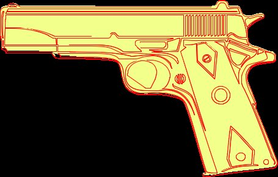

Aspose.PSD là một SDK Định dạng PSD, cũng có thể chuyển đổi tệp AI sang Jpg. Bạn có thể chuyển đổi Tệp Adobe Illustrator thành tệp Jpg. Để xuất Ai, bạn cần sử dụng đoạn mã sau:

Mã mẫu được cung cấp dưới đây thể hiện cách xuất tệp AI sang Jpg với [API Thao tác Định dạng Tệp](/vi/psd/net/manipulate-different-image-file-formats/)



Bạn có thể chỉ định chất lượng Định dạng Tệp Jpeg, Lỗi Mất Mát Được Phép của Jpeg.

Dưới đây là ví dụ về việc xuất sang Jpeg:

|**Xuất Ai với trọng số đường dẫn khác nhau**|**Chuyển đổi Ai với ví dụ đường viền phức tạp**|
| :- | :- |
||

 
|
